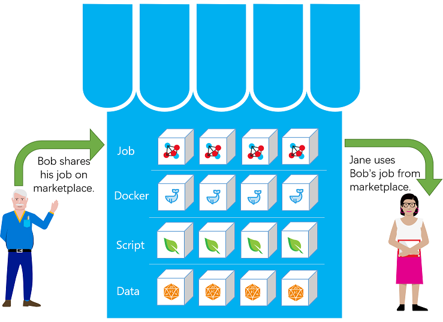
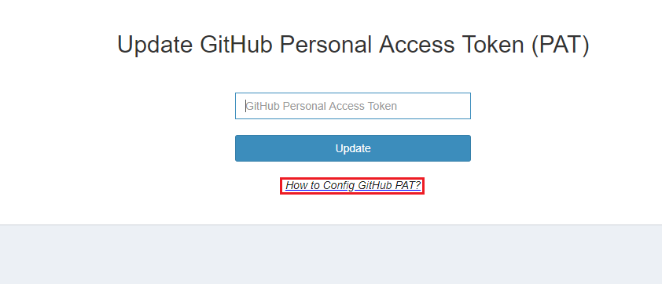
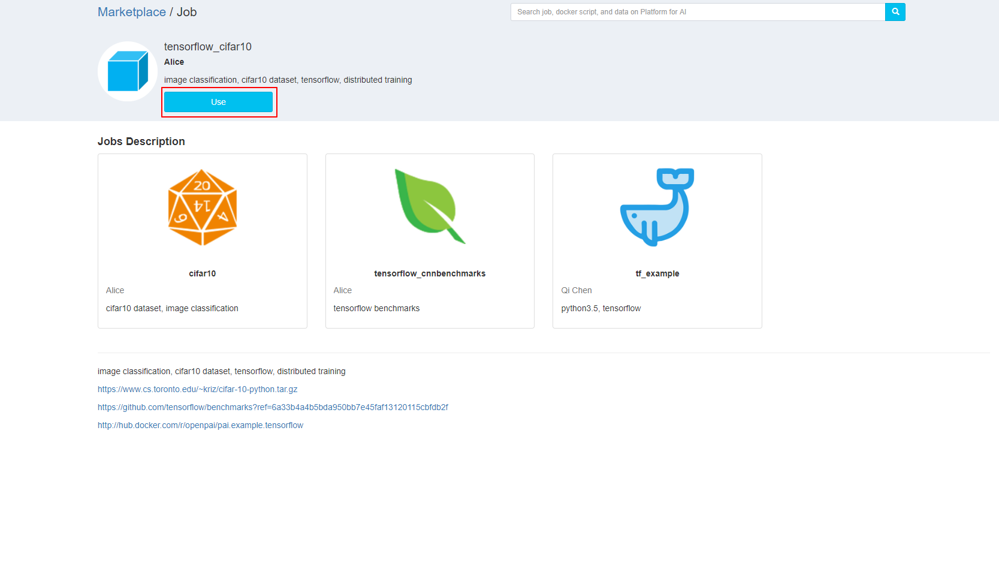
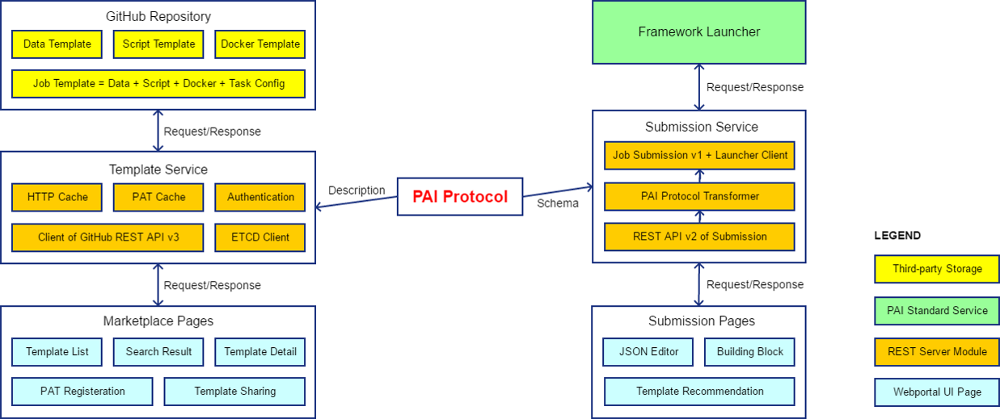

# 市场以及如何提交 Job v2

市场和 Job v2 的设计目标是实现可重现的 AI。 It helps to reuse machine learning asset across projects or teams: job template sharing and reuse for docker images, data, code, job configuration and etc.

## Table of Contents

1. [Marketplace and Submit job V2 Overview](#marketplace-and-submit-job-v2-overview)
2. [When to consider marketplace and submit job v2](#when-to-consider-marketplace-and-submit-job-v2)
3. [How to use](#how-to-use)
4. [System design](#system-design)
5. [Resource](#resource)

## Marketplace and Submit job V2 Overview

In fact, OpenPAI's job configuration can be composed by tasks, docker images, script and data.

When writing a job configuration, you can create new components(tasks, data, script and docker images) or use existing ones.


And you can share the script, data, docker images or whole job configuration on the marketplace, and other people can reuse it easily.



## When to consider marketplace and submit job v2

1. When you want to try different models on your collected/downloaded data.
2. When you want to use your model to train or predict on different data.
3. When you want to share your data, model, docker images, job template with others.
4. When you just want to try OpenPAI.

## How to use

### Configure GitHub PAT

1. At PAI home page, click the top right corner to **login**

2. Click your username at the top right corner, and then click "Change Github PAT"


3. Enter your github personal Access Token, and click update. If you don't know how to get it, click the "How to config Github PAT" to see details.



### Run a job from marketplace

1. At PAI home page, click the top right corner to **login** (Ignore this step if you are already logged in).
2. At the left sidebar, click "marketplace"


3. Then choose a job template, for example: tensorflow_cifar10


4. In job details page, click the "use" button, then it will go to the submit page(v2 version).
    
    

5. Click "Submit" button at the bottom, If you successfully submitted the job, you will see a success message.


### Introduction to yaml file

In submit job v2, we use **yaml** to describe the job configuration.

Below is an example for tensorflow image classification :

```yaml
protocol_version: v2
name : tensorflow_serving_mnist
type : job
version : 1.0.0
contributor : Qi chen
description : image classification, mnist dataset, tensorflow, serving
retryCount: -2

tasks :

  - role : worker
    dockerimage : tf_serving_example
    resource:
      instances : 1
      resourcePerInstance: {cpu: 4, memoryMB: 8192, gpu: 1}
      portList: [{label: model_server, beginAt: 0, portNumber: 1}]
    command:
      - bazel-bin/tensorflow_serving/example/mnist_saved_model /tmp/mnist_model
      - while :; do tensorflow_model_server --port=$PAI_CONTAINER_HOST_model_server_PORT_LIST --model_name=mnist --model_base_path=/tmp/mnist_model; done

prerequisites :

  - protocol_version : v2
    name : tf_serving_example
    type : dockerimage
    version : 1.0.0
    contributor : Qi chen
    description: python3.5, tensorflow
    uri : openpai/pai.example.tensorflow-serving
```

For more examples, please refer to [marketplace directory](https://github.com/Microsoft/pai/tree/master/marketplace).

### Submit job V2

1. At PAI home page, click the top right corner to **login** (Ignore this step if you are already logged in).

2. At the left sidebar, click "Submit Job V2"
    
    

3. In submit job(v2) page, there are two ways to configure your job.
    
    Firstly, you can import your template from yaml file


​ Or you can add you job components by web UI:


For example, when you click the add docker image button, you can fill the table or choose a docker image which from marketplace.


4. After import or add some job components, you can edit or delete a task/docker/script/data by web UI. Furthermore, you can edit the yaml directly to change the components.
    
    

5. Then click "Submit" button at the bottom, if your job configuration is right you will see a success message.

## System design



The system architecture is illustrated above.

## Resource

- [Marketplace template source](https://github.com/Microsoft/pai/tree/master/marketplace)