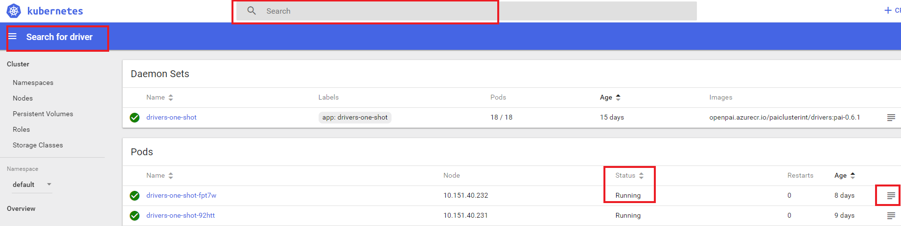

<!--
  Copyright (c) Microsoft Corporation
  All rights reserved.

  MIT License

  Permission is hereby granted, free of charge, to any person obtaining a copy of this software and associated
  documentation files (the "Software"), to deal in the Software without restriction, including without limitation
  the rights to use, copy, modify, merge, publish, distribute, sublicense, and/or sell copies of the Software, and
  to permit persons to whom the Software is furnished to do so, subject to the following conditions:
  The above copyright notice and this permission notice shall be included in all copies or substantial portions of the Software.

  THE SOFTWARE IS PROVIDED *AS IS*, WITHOUT WARRANTY OF ANY KIND, EXPRESS OR IMPLIED, INCLUDING
  BUT NOT LIMITED TO THE WARRANTIES OF MERCHANTABILITY, FITNESS FOR A PARTICULAR PURPOSE AND
  NONINFRINGEMENT. IN NO EVENT SHALL THE AUTHORS OR COPYRIGHT HOLDERS BE LIABLE FOR ANY CLAIM,
  DAMAGES OR OTHER LIABILITY, WHETHER IN AN ACTION OF CONTRACT, TORT OR OTHERWISE, ARISING FROM,
  OUT OF OR IN CONNECTION WITH THE SOFTWARE OR THE USE OR OTHER DEALINGS IN THE SOFTWARE.
-->

## Validate Deployment

### Index:

- [1 Drivers](#gpu_check)

    - [1.1 Check Drivers service's log](#drivers_log)

    - [2.1 Check Drivers version](#drivers_version)

- [2 Data path check](#datapath_check)

- [3 Admin Account in Webportal](#admin_check)

- [4 Troubleshooting OpenPAI services](#troubleshooting_4)

    - [4.1 Diagnosing the problem](#troubleshooting_4.1)

    - [4.2 Fix problem](#troubleshooting_4.2)

    - [4.3 Reboot service](#troubleshooting_4.3)

- [5 Troubleshooting Kubernetes Clusters](#troubleshooting_5)

- [6 Getting help](#troubleshooting_6)

### 1 Check Drivers <a name="gpu_check"></a>

#### 1.1 Check Drivers service's log <a name="drivers_log"></a>

Dashboard:

    http://<master>:9090


search driver, view driver status



view driver logs, this log shows driver in health status


#### 1.2 Check Drivers version <a name="drivers_version"></a>

```bash
# (1) find driver container at server
~$ sudo docker ps | grep driver

daeaa9a81d3f        aiplatform/drivers                                    "/bin/sh -c ./inst..."   8 days ago          Up 8 days                                    k8s_nvidia-drivers_drivers-one-shot-d7fr4_default_9d91059c-9078-11e8-8aea-000d3ab5296b_0
ccf53c260f6f        gcr.io/google_containers/pause-amd64:3.0              "/pause"                 8 days ago          Up 8 days                                    k8s_POD_drivers-one-shot-d7fr4_default_9d91059c-9078-11e8-8aea-000d3ab5296b_0

# (2) login driver container

~$ sudo docker exec -it daeaa9a81d3f /bin/bash

# (3) checker driver version

root@~/drivers# nvidia-smi
Fri Aug  3 01:53:04 2018
+-----------------------------------------------------------------------------+
| NVIDIA-SMI 384.111                Driver Version: 384.111                   |
|-------------------------------+----------------------+----------------------+
| GPU  Name        Persistence-M| Bus-Id        Disp.A | Volatile Uncorr. ECC |
| Fan  Temp  Perf  Pwr:Usage/Cap|         Memory-Usage | GPU-Util  Compute M. |
|===============================+======================+======================|
|   0  Tesla K80           On   | 0000460D:00:00.0 Off |                    0 |
| N/A   31C    P8    31W / 149W |      0MiB / 11439MiB |      0%      Default |
+-------------------------------+----------------------+----------------------+

+-----------------------------------------------------------------------------+
| Processes:                                                       GPU Memory |
|  GPU       PID   Type   Process name                             Usage      |
|=============================================================================|
|  No running processes found                                                 |
+-----------------------------------------------------------------------------+

```

### 2 Data path check <a name="datapath_check"></a>

A configuration in ```service-configuration.yaml```'s ```cluster.commmon.data-path```. The default value is ```/datastorage```

```bash
<br />#SSH to the master machine

~$ ls /datastorage

hadooptmp  hdfs  launcherlogs  prometheus  yarn  zoodata

```

### 3 Admin Account in Webportal <a name="admin_check"></a>

Dashboard:

    http://<master>:9286/virtual-clusters.html


try to login:


Note: The username and password are configured in the ```service-configuraiton.yaml```'s ```rest-server``` field.

### 4 Troubleshooting OpenPAI services <a name="troubleshooting_4"></a>

#### 4.1 Diagnosing the problem <a name="troubleshooting_4.1"></a>

- Monitor

    From kubernetes webportal:

Dashboard:

    http://<master>:9090


    From OpenPAI watchdog:

[OpenPAI watchdog](../../alerting/watchdog-metrics.md)

- Log

    From kubernetes webportal:


    From each node container / pods log file:

View containers log under folder:

```bash
ls /var/log/containers
```

View pods log under folder:

```bash
ls /var/log/pods
```

- Debug

As OpenPAI services are deployed on kubernetes, please refer [debug kubernetes pods](https://kubernetes.io/docs/tasks/debug-application-cluster/debug-pod-replication-controller/)

#### 4.2 Fix problem <a name="troubleshooting_4.2"></a>

- Update OpenPAI Configuration

Check and refine 4 yaml files:

        - layout.yaml
        - kubernetes-configuration.yaml
        - k8s-role-definition.yaml
        - serivices-configuration.yaml


- Customize config for specific service

If user want to customize single service, you could find service config file at [src](../../../../src) and find image dockerfile at [src](../../../../src).

- Update Code & Image

    - Customize image dockerfile or code

User could find service's image dockerfile at [src](../../../../src) and customize them.

- Rebuild image

User could execute the following cmds:

Build docker image

```bash
    paictl.py image build -p /path/to/configuration/ [ -n image-x ]
```

Push docker image

```bash
    paictl.py image push -p /path/to/configuration/ [ -n image-x ]
```

If the `-n` parameter is specified, only the given image, e.g. `rest-server`, `webportal`, `watchdog`, etc., will be build / push.

#### 4.3 Reboot service <a name="troubleshooting_4.3"></a>

1.     Stop single or all services.

```bash
python paictl.py service stop \
  [ -c /path/to/kubeconfig ] \
  [ -n service-list ]
```

If the -n parameter is specified, only the given services, e.g. rest-server, webportal, watchdog, etc., will be stopped. If not, all PAI services will be stopped.

2.     Boot up single all OpenPAI services.

Please refer to this [section](./distributed-deploy.md#c-step-5) for details.

### 5 Troubleshooting Kubernetes Clusters <a name="troubleshooting_5"></a>

Please refer [Kubernetes Troubleshoot Clusters](https://kubernetes.io/docs/tasks/debug-application-cluster/debug-cluster/)

### 6 Getting help <a name="troubleshooting_6"></a>

- [StackOverflow:](../../stackoverflow.md) If you have questions about OpenPAI, please submit question at Stackoverflow under tag: openpai
- [Report an issue:](https://github.com/Microsoft/pai/wiki/Issue-tracking) If you have issue/ bug/ new feature, please submit it at Github