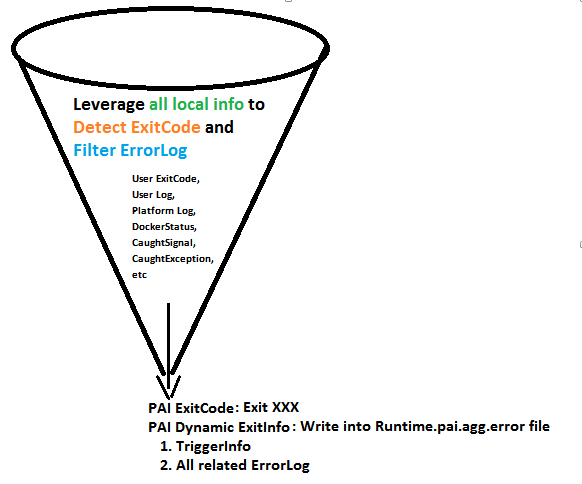

# PAI Runtime Exit Spec

1. It is **PAI Dynamic Exit Info**, see **PAI Static Exit Info** in [PAI Job Exit Spec User Manual](../../../src/job-exit-spec/config/user-manual.md)

## PAI Runtime as Error Funnel

PAI Runtime is the **only interface** to interact with PAI Container.

So, it is also **the one and the only one to produce** the **right** and **final** PAI Container ExitCode and Dynamic ExitInfo.

(*Upper layer centralized service generally should not do the error detection based on Runtime's return, to produce another ExitCode, anymore*)

For example,

if other components need to kill Container, it need to **notify Runtime to kill** the Container along with the **kill reason, etc, instead if kill the Container by itself.**

Similarly, Runtime need to **take the responsibility to execute the kill action**, and then **forward the kill reason (see below)** to YARN by Dynamic ExitInfo, **instead of forwarding all local error logs as reason (see below)** to YARN.

However, it will also **try best to forward all local error logs as attachment**, and given **limited total size for Dynamic ExitInfo** (such as 4KB), it is **the only dictator to decide which error log file forward more, which forward less, forward which part of error log, tail or middle, etc**.

(*Such as during Runtime killing Container, the container itself may produce exiting error messaging which is generally not very helpful to explain error reason, so it is a good candidate to sacrifice for other error log*)

(*This cannot be achieved by change YARN code which only can collect all error log tail evenly, because YARN is not aware which error, so cannot decide which error log should forward more.*)

<p style="text-align: left;">
  
</p>

## Design

1. Write in User Understandable way
2. Write into `runtime.pai.agg.error` file which only contains the YAML object of Dynamic ExitInfo
3. Limit the size of `runtime.pai.agg.error` file
4. Write landmark lines around the schema object string, to help RestServer locate it

        [PAI_RUNTIME_ERROR_START]
        YAML String of PAI Runtime Exit Info
        [PAI_RUNTIME_ERROR_END]
        ```
    
    
    ## PAI Runtime Exit Info Schema
    

exitcode: reason: solution: trigger: originalUserExitCode: caughtSignal: caughtException: matchedUserLogString: dockerStatus: errorLogs: user: runtime: diskCleaner: ```

| field                     | description                                                                                                                                                  | example                                                                                                                                                                                                                                                                                                                                                                                                                            |
| ------------------------- | ------------------------------------------------------------------------------------------------------------------------------------------------------------ | ---------------------------------------------------------------------------------------------------------------------------------------------------------------------------------------------------------------------------------------------------------------------------------------------------------------------------------------------------------------------------------------------------------------------------------- |
| **exitcode**              | PAI ExitCode                                                                                                                                                 | 198, i.e. [CONTAINER_OOD_KILLED_BY_DISKCLEANER](../../../src/job-exit-spec/config/job-exit-spec.md)                                                                                                                                                                                                                                                                                                                            |
| **reason**                | Dynamic Reason                                                                                                                                               | Current Container is killed due to it used most disk space and all container disk usage exceeded platform limit.  
Current Container Disk Usage 30% (30GB), All Container Disk Usage 91% (91GB), Platform Disk Limit 90% (90GB).                                                                                                                                                                                                   |
| **solution**              | Dynamic Solution                                                                                                                                             | All Container overused 1GB disk, but current container only use 30% disk, please retry on another node later.                                                                                                                                                                                                                                                                                                                      |
| **trigger**               | Which error pattern triggered the error:  
Should be one of below field name                                                                                 | diskCleanerErrorLog                                                                                                                                                                                                                                                                                                                                                                                                                |
| **originalUserExitCode**  | Original user process exitcode  
Only for showing to user. Preserve it here instead of exit with it, in case it conflicts with Runtime's own ExitCode Spec.  | 1                                                                                                                                                                                                                                                                                                                                                                                                                                  |
| **caughtSignal**          | Caught Signal                                                                                                                                                | SIGKILL                                                                                                                                                                                                                                                                                                                                                                                                                            |
| **caughtException**       | Caught Exception                                                                                                                                             | TensorFlow StackTrace:...                                                                                                                                                                                                                                                                                                                                                                                                          |
| **matchedUserLogString**  | Matched user log string                                                                                                                                      | RunScripts.sh: line 58: [: -gt: unary operator expected                                                                                                                                                                                                                                                                                                                                                                            |
| **dockerStatus**          | Docker Status                                                                                                                                                | KILLED                                                                                                                                                                                                                                                                                                                                                                                                                             |
| **errorLogs**             | Runtime collect all local *.pai.error and error files, and redirect it to here. (This is best effort, because we have limit runtime.pai.agg.error file size) |                                                                                                                                                                                                                                                                                                                                                                                                                                    |
| **errorLogs.user**        | From user stderr                                                                                                                                             | 234346457 ERROR "get: `/dgfdg': No such file or directory"  
234346458 ERROR "Tensorflow failed to init, exiting…"                                                                                                                                                                                                                                                                                                                |
| **errorLogs.runtime**     | From runtime.pai.error                                                                                                                                       | 234346457 ERROR REASON "get: `/{user code dir}': No such file or directory"                                                                                                                                                                                                                                                                                                                                                       |
| **errorLogs.diskCleaner** | From diskCleaner.pai.error                                                                                                                                   | 234346457 ERROR ACTION "KILL"  
234346457 ERROR REASON "Current Container is killed due to it used most disk space and all container disk usage exceeded platform limit. Current Container Disk Usage 30% (30GB), All Container Disk Usage 91% (91GB), Platform Disk Limit 90% (90GB)."  
234346457 ERROR SOLUTION "All Container overused 1GB disk, but current container only use 30% disk, please retry on another node later." |