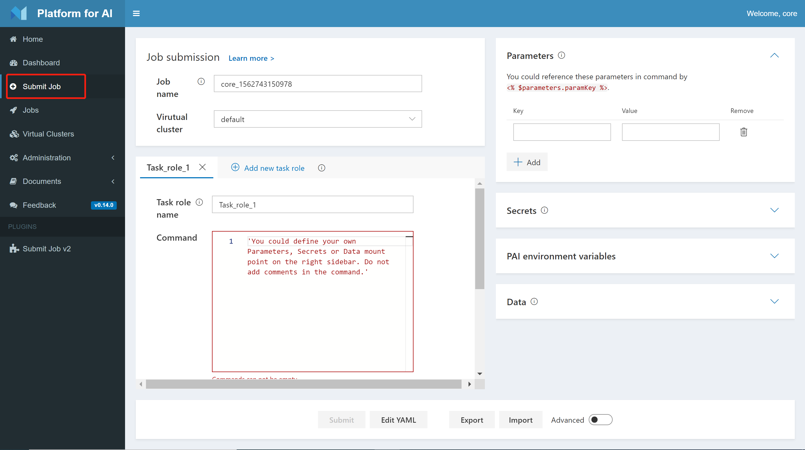

<!--
  Copyright (c) Microsoft Corporation
  All rights reserved.

  MIT License

  Permission is hereby granted, free of charge, to any person obtaining a copy of this software and associated
  documentation files (the "Software"), to deal in the Software without restriction, including without limitation
  the rights to use, copy, modify, merge, publish, distribute, sublicense, and/or sell copies of the Software, and
  to permit persons to whom the Software is furnished to do so, subject to the following conditions:
  The above copyright notice and this permission notice shall be included in all copies or substantial portions of the Software.

  THE SOFTWARE IS PROVIDED *AS IS*, WITHOUT WARRANTY OF ANY KIND, EXPRESS OR IMPLIED, INCLUDING
  BUT NOT LIMITED TO THE WARRANTIES OF MERCHANTABILITY, FITNESS FOR A PARTICULAR PURPOSE AND
  NONINFRINGEMENT. IN NO EVENT SHALL THE AUTHORS OR COPYRIGHT HOLDERS BE LIABLE FOR ANY CLAIM,
  DAMAGES OR OTHER LIABILITY, WHETHER IN AN ACTION OF CONTRACT, TORT OR OTHERWISE, ARISING FROM,
  OUT OF OR IN CONNECTION WITH THE SOFTWARE OR THE USE OR OTHER DEALINGS IN THE SOFTWARE.
-->

# 在 OpenPAI 上提交作业

- [在 OpenPAI 上提交作业](#submit-jobs-on-openpai) 
  - [提交 Hello World Job](#submit-a-hello-world-job)
  - [理解 Hello World Job](#learn-the-hello-world-job)
  - [Manage Your Data](#manage-your-data) 
    - [Make Use of Team-wise Storage](#make-use-of-team-wise-storage)
    - [Additional Data Sources](#additional-data-sources)
  - [Use Parameters and Secrets](#use-parameters-and-secrets)
  - [Advanced Mode](#advanced-mode)
  - [PAI Environment Variables](#pai-environment-variables)
  - [Export and Import Jobs](#export-and-import-jobs)
  - [Job Workflow](#job-workflow)
  - [Reference](#reference)

This document is a tutorial for job submission on OpenPAI (If you are using OpenPAI <= 0.13.0, please refer to [this document](./training.md)). Before learning this document, make sure you have an OpenPAI cluster already. 如果还没安装 OpenPAI 集群，参考[这里](../../../README_zh_CN.md#部署)进行部署。

There are several ways of submitting pai job, including webportal, [OpenPAI VS Code Client](https://github.com/microsoft/pai/tree/master/contrib/pai_vscode), and [python sdk](https://github.com/microsoft/pai/tree/master/contrib/python-sdk). And all the job configs follow [Pai Job Protocol](https://github.com/microsoft/pai/blob/master/docs/pai-job-protocol.yaml). Here we use webportal to submit a hello world job.

## 提交 Hello World Job

**Job** 在 OpenPAI 中定义了在指定的环境中如何执行命令。 作业可以在单个节点上运行，也可以以分布式方式运行。

The following process submits a model training job implemented by TensorFlow on CIFAR-10 dataset. It downloads data and code from internet and helps getting started with OpenPAI. [Next Section](#Learn-the-Hello-World-Job) include more details about this job config.

1. Login to OpenPAI web portal.

2. Click **Submit Job** on the left pane and reach this page.
  
    

3. Fill in the name of your virtual cluster, and give a name of your job and your task role. Then copy the following commands into the command box.

   ```bash
   apt update
   apt install -y git
   git clone https://github.com/tensorflow/models
   cd models/research/slim
   python download_and_convert_data.py --dataset_name=cifar10 --dataset_dir=/tmp/data
   python train_image_classifier.py --dataset_name=cifar10 --dataset_dir=/tmp/data --max_number_of_steps=1000
   ```

    Note: Please **Do Not** use # for comments or use \ for line continuation in the command box. These symbols may break the syntax and will be supported in the future.
    
    
    

4. Specify the resources you need. By default only gpu number could be set. Toggle the "custom" button if you need to customize CPU number and memory. Here we use the default setting which utilizes one GPU.

5. Specify the docker image. You can either use the listed docker images or take advantage of your own one. Here we use "openpai/tensorflow-py36-cu90" as the docker image. OpenPAI will pull images from the [official Docker Hub](https://hub.docker.com/). If you want to use your own Docker registry, please click the "Auth" button and fill in the required information.
  
    

6. Click **Submit** to kick off your first OpenPAI job!

## 理解 Hello World Job

The Hello World job is set to download the CIFAR-10 dataset and train a simple model with 1,000 steps. Here are some detailed explanations about configs on the submission page:

- **Job name** 是当前 Job 的名称。 在每个用户账号中，其必需是唯一的。 有意义的名称有助于管理 Job。

- **Task role name** defines names of different roles in a job.
  
    对于单机运行的 Job，在 taskRoles 中只有一个角色。
  
    对于分布式的 Job，taskRoles 中可能会有多个角色。 例如，在使用 TensorFlow 来运行分布式 Job 时，需要两个角色，包括参数服务器和工作节点。 There are two task roles in the corresponding job configuration. The names of task roles can be used in environment variables in distributed jobs.

- **Instances** is the number of instances of this task role. In single server jobs, it should be 1. 在分布式 Job 中，根据任务角色需要多少个实例来定。 例如，其在 TensorFlow 的工作阶段角色中为 8。 这表示 worker 角色会被实例化出 8 个 Docker 容器。

- **GPU count**, **CPU vcore count**, **Memory (MB)** are easy to understand. 它们指定了相应的硬件资源，包括 CPU 核数量，内存（MB），以及 GPU 数量。

- **Command** 是此任务角色要运行的命令。 支持多行。 例如，在 hello-world Job 中，命令会从 GitHub 中克隆代码，下载数据，然后执行训练过程。 If one command fails (exits with a nonzero code), the following commands will not be executed. This behavior may be changed in the future.

- **Docker 映像**
  
    OpenPAI uses [Docker](https://www.docker.com/why-docker) to provide consistent and independent environments. With Docker, OpenPAI can serve multiple job requests on the same server. The job environment depends significantly on the docker image you select.
  
    The hub.docker.com is a public Docker repository. In the hello-world example, it uses a TensorFlow image, *openpai/tensorflow-py36-cu90*. You can also set your own image from private repository by toggling custom button.
  
    If an appropriate Docker image isn't found, you could [build a Docker image](../job_docker_env.md) by your self.
  
    **Important Note: if you'd like to ssh to the docker within OpenPAI, make sure *openssh-server* and *curl* packages are included by the docker image.** If SSH is needed, a new Docker image can be built and includes *openssh-server* and *curl* on top of the existing Docker image. Please refer to [this tutorial](../job_docker_env.md#enable-ssh-for-your-image) for details.

## 管理数据

大多数模型训练以及其它类型的 Job 都需要在运行环境内外间传输文件。 这些文件包括数据集、代码、脚本、训练好的模型等等。

### 使用团队存储

OpenPAI admin can define Team-wise Storage through [Team-wise Storage Plugin](https://github.com/microsoft/pai/tree/master/contrib/storage_plugin). It can support multiple NAS file systems like NFS, Samba, HDFS, Azurefile and Azureblob.

Once your OpenPAI admin has set up Team-wise storage for your group, you can find your Team-wise storage settings in Data section. Check team-wise configs to mount NAS as local path in job container.


Note: Using Team-wise storage will inject code to commands with comments. Please do not modify the auto-generated codes.

### 其它数据源

Besides Team Storage, OpenPAI also supports local files, http/https files, git repository, and PAI HDFS as additional data sources. Click the button **Add data source** to choose one kind of data source and fill in the path information in the text box. For example, the following setting will copy the HDFS folder "/foo/bar" to "/pai_data/mydata". You can access the folder with "/pai_data/mydata/bar" in your commands.


## Use Parameters and Secrets

It is common to train models with different parameters. OpenPAI supports parameter definition and reference, which provides a flexible way of training and comparing models. You can define your parameters in the **Parameters** section and reference them by using <% $parameters.paramKey %> in your commands. For example, the following picture shows how to define the Hello World job using a "stepNum" parameter.


You can define batch size, learning rate, or whatever you want as parameters to accelerate your job submission.

In some cases, it is desired to define some secret messages such as password, token, etc. You can use the **Secrets** section for the information. The usage is the same as parameters except that secrets will not be displayed or recorded.

## Advanced Mode

You can set more detailed configs by enabling advanced mode. In the advanced mode, you could define ```retry time```, ```ports```, ```completion policy``` before submitting job. For more details about the fields, please refer to [Pai Job Protocol](../pai-job-protocol.yaml).

## PAI Environment Variables

Each task in a job runs in one Docker container. For a multi-task job, one task might communicate with others. So a task need to be aware of other tasks' runtime information such as IP, port, etc. The system exposes such runtime information as environment variables to each task's Docker container. For mutual communication, user can write code in the container to access those runtime environment variables. Those environment variables can also be used in the job config file.

Below we show a complete list of environment variables accessible in a Docker container:

| Category          | Environment Variable Name                                     | Description                                                                        |
|:----------------- |:------------------------------------------------------------- |:---------------------------------------------------------------------------------- |
| Job level         | PAI_JOB_NAME                                                | `jobName` in config file                                                           |
|                   | PAI_USER_NAME                                               | User who submit the job                                                            |
|                   | PAI_DEFAULT_FS_URI                                          | Default file system uri in PAI                                                     |
| Task role level   | PAI_TASK_ROLE_COUNT                                         | Total task roles' number in config file                                            |
|                   | PAI_TASK_ROLE_LIST                                          | Comma separated all task role names in config file                                 |
|                   | PAI_TASK_ROLE_TASK_COUNT\_`$taskRole`                   | Task count of the task role                                                        |
|                   | PAI_HOST_IP\_`$taskRole`\_`$taskIndex`                  | The host IP for `taskIndex` task in `taskRole`                                     |
|                   | PAI_PORT_LIST\_`$taskRole`\_`$taskIndex`\_`$portType` | The `$portType` port list for `taskIndex` task in `taskRole`                       |
|                   | PAI_RESOURCE\_`$taskRole`                                 | Resource requirement for the task role in "gpuNumber,cpuNumber,memMB,shmMB" format |
|                   | PAI_MIN_FAILED_TASK_COUNT\_`$taskRole`                  | `taskRole.minFailedTaskCount` of the task role                                     |
|                   | PAI_MIN_SUCCEEDED_TASK_COUNT\_`$taskRole`               | `taskRole.minSucceededTaskCount` of the task role                                  |
| Current task role | PAI_CURRENT_TASK_ROLE_NAME                                | `taskRole.name` of current task role                                               |
| Current task      | PAI_CURRENT_TASK_ROLE_CURRENT_TASK_INDEX                | Index of current task in current task role, starting from 0                        |


## Export and Import Jobs

In OpenPAI, all jobs are represented by [YAML](https://yaml.org/), a markup language. You can click the button **Edit YAML** below to edit the YAML definition directly. You can also export and import YAML files using the **Export** and **Import** button.

## Job Workflow

Once job configuration is ready, next step is to submit it to OpenPAI. Besides webportal, it's also recommended to use [Visual Studio Code Client](https://github.com/microsoft/pai/tree/master/contrib/pai_vscode) or [python sdk](https://github.com/microsoft/pai/tree/master/contrib/python-sdk) to submit jobs.

After receiving job configuration, OpenPAI processes it as below steps:

1. Wait for resource allocated. OpenPAI waits enough resources including CPU, memory, and GPU are allocated. If there is enough resource, the job starts very soon. If there is not enough resource, job is queued and wait on previous jobs completing and releasing resource.

2. Initialize Docker container. OpenPAI pulls the Docker image, which is specified in configuration, if the image doesn't exist locally. After that OpenPAI will initialize the Docker container.

3. run the command in configuration. During the command is executing, OpenPAI outputs [stdout and stderr](troubleshooting_job.md) near real-time. Some metrices can be used to [monitor workload](troubleshooting_job.md#how-to-check-job-log).

4. Finish job. Once the command is completed, OpenPAI use latest exit code as signal to decide the job is success or not. 0 means success, others mean failure. Then OpenPAI recycles resources for next jobs.

When a job is submitted to OpenPAI, the job's status changes from waiting, to running, then succeeded or failed. The status may display as stopped if the job is interrupted by user or system.

## 参考

- [调研 Job 错误](troubleshooting_job.md)