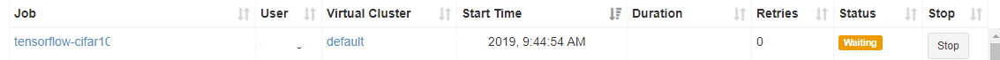
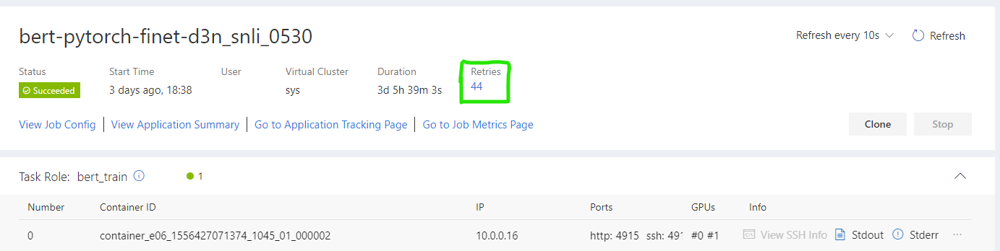
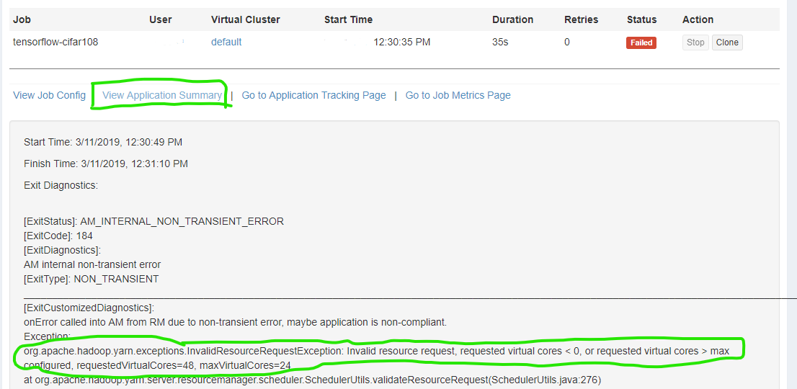
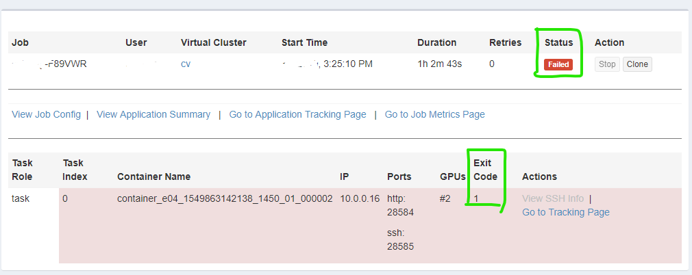
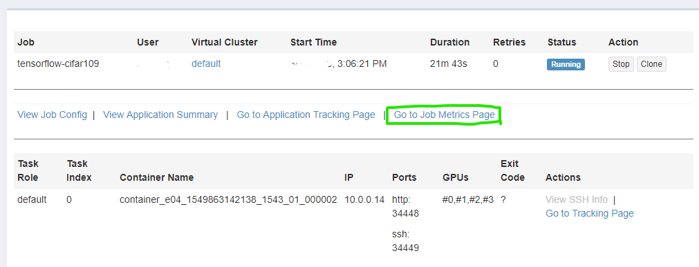
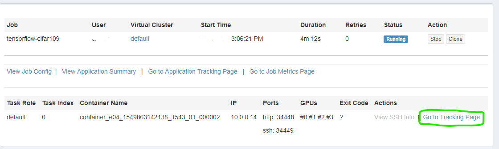
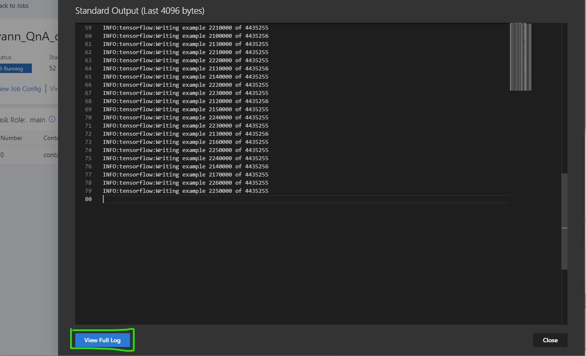
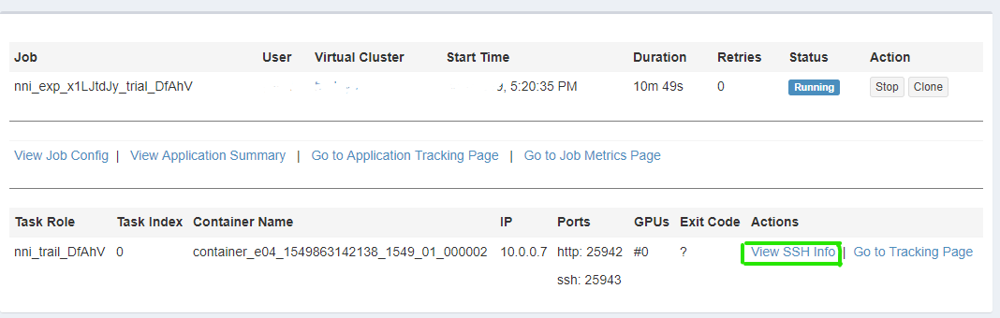
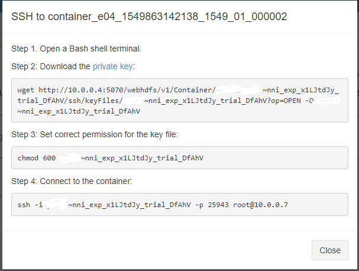

<!--
  Copyright (c) Microsoft Corporation
  All rights reserved.

  MIT License

  Permission is hereby granted, free of charge, to any person obtaining a copy of this software and associated
  documentation files (the "Software"), to deal in the Software without restriction, including without limitation
  the rights to use, copy, modify, merge, publish, distribute, sublicense, and/or sell copies of the Software, and
  to permit persons to whom the Software is furnished to do so, subject to the following conditions:
  The above copyright notice and this permission notice shall be included in all copies or substantial portions of the Software.

  THE SOFTWARE IS PROVIDED *AS IS*, WITHOUT WARRANTY OF ANY KIND, EXPRESS OR IMPLIED, INCLUDING
  BUT NOT LIMITED TO THE WARRANTIES OF MERCHANTABILITY, FITNESS FOR A PARTICULAR PURPOSE AND
  NONINFRINGEMENT. IN NO EVENT SHALL THE AUTHORS OR COPYRIGHT HOLDERS BE LIABLE FOR ANY CLAIM,
  DAMAGES OR OTHER LIABILITY, WHETHER IN AN ACTION OF CONTRACT, TORT OR OTHERWISE, ARISING FROM,
  OUT OF OR IN CONNECTION WITH THE SOFTWARE OR THE USE OR OTHER DEALINGS IN THE SOFTWARE.
-->

# 诊断调试 Job

与其它远程平台一样，OpenPAI 中 Job 失败的诊断和调试上需要更多精力。 本文有助于诊断 OpenPAI 上发生的问题。

- [诊断调试 Job](#诊断调试-job) 
  - [最佳实践](#最佳实践) 
    - [在本机修复问题](#在本机修复问题)
    - [编写易于理解的日志](#编写易于理解的日志)
    - [通过本机模拟验证 Job](#通过本机模拟验证-job)
    - [充分了解资源瓶颈](#充分了解资源瓶颈)
  - [诊断问题](#诊断问题) 
    - [Job 等待了数小时](#job-等待了数小时)
    - [Job 重试了很多次](#job-重试了很多次)
    - [Job 执行较慢](#job-执行较慢)
    - [Job 失败](#job-失败)
  - [指南](#指南) 
    - [查看 Job 指标](#查看-job-指标)
    - [查看 Job 日志](#查看-job-日志)
    - [使用 SSH 远程连接](#使用-ssh-远程连接)
    - [保留失败的 Docker 用于调试](#保留失败的-docker-用于调试)
    - [寻求帮助](#寻求帮助)

## 最佳实践

通过最佳实践，很多问题能被更早的发现，一些棘手的问题也能被更容易的解决。

### 在本机修复问题

远程诊断问题较困难，因此要考虑尽量在本机修复问题，而不是在远程服务器上就开始调研。

- 如果远程环境中发生了错误，首先要尝试在本地复现，然后再试着修复它。 这可能会在复现上花更多的时间，但大多数情况下，修复会更容易。
- 最大限度减少本地和远程代码逻辑的差异。 这样更多的逻辑问题能在本机找到。
- 某些问题可能是因为远程和本地环境的不同而造成的，因此无法在本地重现。 这时要尝试缩小发生问题的范围。 例如，用非常小的代码片段来重现问题。

### 编写易于理解的日志

在本地开发时，调试非常有用，但远程调试却很困难，而在生产环境中几乎无法进行调试。 日志可提供大量的信息，而且适用于各种环境。

要提高日志质量：

1. 更多的使用日志。 在开发阶段，更多的查看日志，避免调试或一次性的打印输出。 如果日志还没有足够的信息，就需要进一步改进。
2. 减少重复的日志。 重复的日志很容易将有用的信息掩盖住。 因此，重复的日志应该合并，或者完全禁用。
3. 不仅打印变量，还要讲故事。 查看日志的人可能永远不会看代码，或者已经忘记了代码逻辑。 除了打印变量值以外，日志还要解释变量在业务逻辑中的意义。 例如，日志应该说明为什么这个值被认为时异常值，它有多重要，如何修复。
4. 将相关日志关联起来。 在并行的情况下，并发线程、进程或服务都会同时保存日志。 需要用一个上下文的 ID 将日志关联起来。 如果是分布式的服务，还需要考虑时间的同步。
5. 什么应该在日志中？ 上文已经部分回答了这个问题。 如果某个内容对诊断问题，进一步分析有帮助，那就应该记录下来。 例如，完整的错误栈等等。

### 通过本机模拟验证 Job

一些问题可能只在运行 OpenPAI Job 的时候才会发生，所以代码可能在本机能很好的运行，但在 Job 中却会失败。 使用本机模拟器，就能在本机找到更多环境相关的问题。

OpenPAI Visual Studio Code Client 可以解析 OpenPAI Job 配置文件，并在本机的 Docker 容器中运行 Job。 这样的模拟可以找到很多与配置相关的问题，比如 Docker 映像和代码中需要的依赖不相匹配，命令行写错了，环境变量等等。

虽然这样的模拟能覆盖大部分远程运行的情况，但仍然有其局限。 例如：

- 例如，配置文件中的资源请求数量会被忽略掉，因为本机通常不会像远端 GPU 服务器那样强大。
- 在本地模拟运行代码时，可能会非常慢，或者内存不够。 这时候，需要修改一下代码或命令行来避免这类问题，并减少训练时间来更快的发现更多问题。

在使用模拟器之前，需要先安装 [Docker](https://www.docker.com/get-started)。 参考如何[安装 Visual Studio Code Client](../../../contrib/pai_vscode/VSCodeExt_zh_CN.md) 以及[运行模拟 Job](../../../contrib/pai_vscode/README_zh_CN.md#本机模拟)。

注意，由于 Docker 在 Windows上不支持 GPU，因此在本机模拟时 TensorFlow 需要使用 CPU 版本的 Docker 映像。

### 充分了解资源瓶颈

使用 OpenPAI 时，要说明需要的资源，包括 CPU、GPU 以及内存。 如果请求的资源太少， Job 可能会运行得非常慢或者出现内存不足的错误。 但如果给 Job 分配了过多的资源，就会被浪费掉。 因此，知道并理解资源瓶颈很重要。

OpenPAI 提供了 CPU、内存以及 GPU 的指标，可用来了解运行时的资源使用情况。 了解[如何查看 Job 指标](#查看-job-指标)。

## 诊断问题

### Job 等待了数小时

通常，OpenPAI 中的 Job 处于 Waiting 状态不会超过 1 分钟。 但如果没有足够的资源，Job 可能会长时间处于 Waiting 状态。 当其它 Job 完成后，等待的 Job 就有机会获得资源。

可以通过减少请求的资源来缩短 Job 等待的时间。

注意，Web 界面上可能会显示出有较多的空闲资源，但这些资源分布在不同的服务器上。 因此，每台服务器可能都无法同时满足 CPU、内存和 GPU 的资源要求。 因此，在这种情况下，Job 仍会等待资源。

### Job 重试了很多次

如果 Job 因为系统的问题而失败，OpenPAI 会尝试重新运行 Job。例如，Job 运行时系统进行了升级。 如果 Job 重试了多次，并且不是因为这个原因，管理员可能需要检查发生了什么问题。

### Job 执行较慢

Job 运行快慢是主观的，因此在试着“修复”这个问题前，需要通过数据来衡量。 下面是一些可能会造成 Job 在 OpenPAI 上较慢的原因。

1. 没有用上 GPU。 有些框架，如 TensorFlow，需要安装 GPU 版本才能使用上 GPU 的算力。 通常情况下，可以通过日志来查看是否用上了 GPU。 像 PyTorch 这样的框架，需要显式的写代码才能用上 GPU。 通过[查看 Job 日志](#查看-job-日志)来确认。

2. 资源瓶颈。 不仅是计算资源有可能成为瓶颈，有时 IO 和内存容量也会是瓶颈。 指标可用来分析瓶颈。 参考[如何查看 Job 指标](#查看-job-指标)来了解详情。

### Job 失败

Job 失败的原因很多。 一般根据它发生的阶段，将其归为两种类型。

1. **运行之前的失败**，例如，请求的资源超过了限制。 如果 Job 请求的资源超过了集群可提供的，Job 很快就会失败。 例如，如果服务器只有 24 个 CPU 内核，但 Job 配置中请求了 48 个内核，就会造成 Job 失败。
  
  这种系统级的失败，错误类型为 *System Error*。
  
  
  
  点击 *application summary* 可看到如下的错误详情。 这里解释了哪项资源超出了限制。
  
  

2. **Job 运行时的失败**。 如果错误类型是 *User Error*，标准输出 stdout 和 stderr 可提供失败的更多细节。 通过[查看 Job 日志](#查看-job-日志)来了解更多细节。
  
  注意，OpenPAI 通过 Task 实例的退出代码来决定 Job 是否运行成功。 退出代码通常是 Job 配置中由用户所编写的 command 返回的。 但偶尔也会是 OpenPAI 的系统错误代码。
  
  错误代码的意义取决于具体的命令。 Linux 的系统命令，可参考[退出代码规范](http://www.tldp.org/LDP/abs/html/exitcodes.html)。
  
  

## 指南

### 查看 Job 指标

- 点击 Job 详情页面的 *Go to Job Metrics Page*。

- 将打开如下新页面并显示 Job 的指标。

- *memory usage* 和 *disk bandwidth* 使用的是绝对值。 这些值很容易理解。
- *network traffic* 的值不能作为精确值对待，因为收集指标的方法为性能进行了优化。 如果数据连接只活跃了很短时间，就有可能不会被统计到。
- *CPU* 的 100% 表示一个虚拟内核使用了 100%。 因此，此值可能会超过 100%。 例如，300% 表示 3 个虚拟核心被完全使用。
- *GPU Utilization* 和 *GPU memory* 是总数，与 *CPU* 不相同。 例如，如果一个环境上分配了 4 块 GPU 卡，50% 表示的是 GPU 卡的平均使用率。
- 对于分布式 Job，这些值都是所有 Task 实例的平均值。 如果一个 Task Role 有多个实例，这也是平均值。

用户界面是由 [Grafana](https://grafana.com/) 实现，可查看其网站了解更多详情。

### 查看 Job 日志

- 点击 Job 详情页面的 *stdout* 或 *stderr*。
  
  

- 会显示如下内容，包含了最新的 4096 字节。 它每 10 秒会自动刷新。
  
  如果需要查看完整日志，点击 *View Full Log*。
  
  
  
  *stderr* 和 *stdout* 都是 Task 实例的屏幕输出。 所有输出到屏幕的内容都会近实时的显示在这里。 大多数 Job 运行时的错误都能在这两个文件中找到。

注意，如果 Task 实例还被未分配资源，就不会有日志文件。

### 使用 SSH 远程连接

通过 SSH，可以在环境中运行任何命令，这也为终端用户提供了熟悉的使用方法。

如果正在运行的 Task 实例支持 SSH，点击 *View SSH Info*。

会显示如下信息。 按照其中的步骤可连接到正在运行的 Docker 容器。

对于分布式 Job，可以通过环境变量从一个容器连接到另一个容器。 例如，`ssh $PAI_CURRENT_TASK_ROLE_NAME-$PAI_CURRENT_TASK_ROLE_CURRENT_TASK_INDEX` 在 Docker 容器中会被解析为 `ssh worker-0`。

注意，**以下情况无法使用 SSH**：

- Task 实例还未准备好或没有运行。
- Task 实例已经完成，环境已被回收。 从 v0.11.0 开始，可保留 Task 实例用于调试，参考[保留失败的 Docker 用于调试](#保留失败的-docker-用于调试)。
- Docker 映像不支持 SSH 连接。 要支持 SSH 连接，必须在 Docker 映像中安装好 *openssh-server* 和 *curl*。

### 保留失败的 Docker 用于调试 （已废弃）

**重要** 改功能在新的Job提交页面已经被移除(v.14.0)。为开发和调试作业，用户可以参考[远程开发和调试](../../user/remote_development.md)

要保留失败的 Docker 容器用于调试，需要在 jobEnv 字段中设置下列属性。 如果 Job 因为 command 字段的命令失败，容器默认可以保留一周。 时间周期可由管理员进行配置。 如果 Job 成功执行，容器不会被保留。

参考[这里](../job_tutorial.md)来在 Job 配置中支持 isDebug。

**注意**，Job 启用调试后，Job 所用的资源也会被保留。 为了节省资源，此功能应该只被有限制的使用，而且不应默认开启。 一般调试完成，要手动停止 Job 来释放资源。

### 寻求帮助

如果本文无法解决问题，可寻找 OpenPAI 集群管理员的帮助。

如果管理员无法修复此问题，或者你就是管理员，欢迎[提交问题或建议](../../../README_zh_CN.md#寻求帮助)。