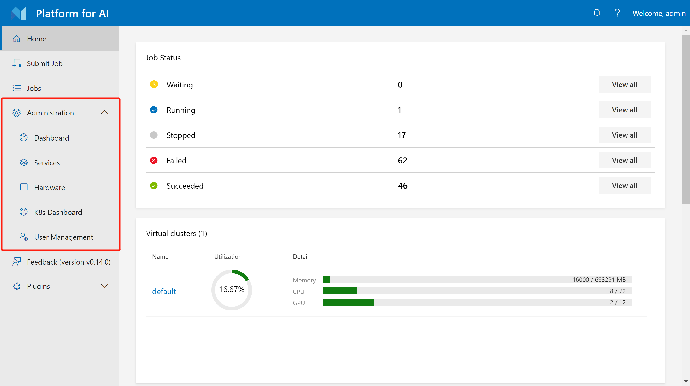
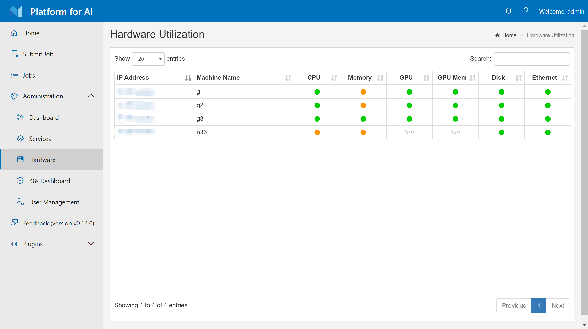

# 基础管理操作

## 在前端界面上的管理操作

Webportal提供了一些基本的管理功能。 如果您以管理员身份登录，则您可以在左侧栏上找到几个有关管理的按钮，如下图所示：

    

这些功能大多数都很容易理解。 在本节中，我们将快速介绍它们。

### 硬件利用页面

硬件页面显示集群中每个节点的CPU，GPU，内存，磁盘和网络的利用率。 不同的利用率以不同的颜色显示。 如果将鼠标悬停在这些彩色圆圈上，则页面会显示确切的利用率百分比。

   

### <div id="services-page">服务页面</div>

服务页面显示了Kubernetes中部署的OpenPAI服务。 这些服务是守护程序集，部署集或有状态集。

   


### <div id="user-management">用户管理</div>

您可以在用户管理页面创建，修改和删除用户。 用户有两种类型：非管理员用户和管理员用户。 您可以选择要创建的类型。 仅在以基础认证模式（基础认证模式为默认的认证模式）部署OpenPAI时才显示此页面。 如果您的集群使用[AAD](./how-to-manage-users-and-groups.md#users-and-groups-in-aad-mode) 来管理用户，则此页面将不可用。

   


### 异常任务

主页上为管理员提供了`abnormal jobs`部分。 如果任务运行超过5天或GPU使用率低于10％，则将其视为异常任务。 如果需要，您可以选择停止一些异常任务。

   

### <div id="access-kubernetes-dashboard">访问Kubernetes仪表盘</div>

Webportal上有一个k8s仪表板的快捷方式，如下图所示。

   

要使用它，您首先应该为OpenPAI设置`https`访问（使用`http://<ip>`会使访问无效）。 然后，在dev box机器上，按照以下步骤操作：

**步骤 1.** 将以下Yaml文本另存为`admin-user.yaml`

```yaml
apiVersion: v1
kind: ServiceAccount
metadata:
  name: admin-user
  namespace: kube-system
---
apiVersion: rbac.authorization.k8s.io/v1
kind: ClusterRoleBinding
metadata:
  name: admin-user
roleRef:
  apiGroup: rbac.authorization.k8s.io
  kind: ClusterRole
  name: cluster-admin
subjects:
- kind: ServiceAccount
  name: admin-user
  namespace: kube-system
```

**步骤 2.** 运行 `kubectl apply -f admin-user.yaml`

**步骤 3.** 运行 `kubectl -n kube-system describe secret $(kubectl -n kube-system get secret | grep admin-user | awk '{print $1}')`。 它将会打印出用来访问dashboard的token。

## <div id="pai-service-management-and-paictl">PAI服务管理和Paictl</div>

一般而言，PAI服务是指运行在Kubernetes上的PAI系统创建的守护程序集，部署或状态集。您可以在[k8s仪表板](#access-kubernetes-dashboard)和[服务页面](#services-page)上找到它们。例如，`webportal`是提供前端页面的PAI服务，而`rest-server`是用于后端API的另一个服务。这些服务都是可配置的。如果您遵循[安装指南](./installation-guide.md)，则可以在dev box机器上的文件夹`~/pai-deploy/cluster-cfg`中找到两个文件：`layout.yaml`和`services-configuration.yaml`。这两个文件是默认的服务配置。

`paictl`是一个CLI工具，可帮助您管理集群配置和PAI服务。要使用它，我们建议您利用我们的`dev box` Docker 镜像来避免与环境相关的问题。首先，登录`dev box`机器，通过以下方式启动`dev box`容器。

```bash
sudo docker run -itd \
        -e COLUMNS=$COLUMNS -e LINES=$LINES -e TERM=$TERM \
        -v /var/run/docker.sock:/var/run/docker.sock \
        -v ${HOME}/pai-deploy/cluster-cfg:/cluster-configuration  \
        -v ${HOME}/pai-deploy/kube:/root/.kube \
        --pid=host \
        --privileged=true \
        --net=host \
        --name=dev-box \
        openpai/dev-box:<openpai version tag>
```

您应将`<openpai version tag>`替换为和您当前的OpenPAI相符的版本，例如`v1.0.0`。在命令中，我们将`${HOME}/pai-deploy/kube`挂载到容器中的`/root/.kube`中，因此容器具有正确的配置文件来访问Kubernetes。另外，我们在容器中将`${HOME}/pai-deploy/cluster-cfg`（由安装创建的配置）挂载到`/cluster-configuration`中。

要使用`paictl`，请通过以下方式进入容器：

```bash
sudo docker exec -it dev-box bash
```

然后，转到文件夹`/pai`，尝试检查您的集群ID：

```bash
cd /pai
./paictl.py config get-id
```

如果一切正常，那么该命令会显示您的集群ID。

以下是`paictl`的一些基本用法示例：

```bash
# 获取集群ID
./paictl.py config get-id

# 将集群中正在使用的设置拉取到一个文件夹中
# 集群设置包含两个文件： layout.yaml 和 services-configuration.yaml
# 如果 <config-folder>中已经有这两个文件了，老的文件将会被覆盖
./paictl.py config pull -o <config-folder>

# 将文件夹中的配置上传到集群内
# 只有被成功上传的配置才会被应用
./paictl.py config push -p <config-folder> -m service

# 停止所有PAI服务
./paictl.py service stop

# 启动所有PAI服务
./paictl.py service start

# 停止某些PAI服务
./paictl.py service stop -n <service-name-1> <service-name-2>

# 启动某些PAI服务
./paictl.py service start -n <service-name-1> <service-name-2>
```

如果要更改某些服务的配置，请按照`服务停止`、`上传配置`、`服务启动`的步骤进行。

例如，如果要自定义Webportal，则应修改`services-configuration.yaml`中的`webportal`部分。 然后使用以下命令来上传配置并重新启动`Webportal`：

```bash
./paictl.py service stop -n webportal
./paictl.py config push -p <config-folder> -m service
./paictl.py service start -n webportal
```

另一个示例是重新启动整个集群：

```bash
# restart cluster
./paictl.py service stop
./paictl.py service start
```

您可以使用`exit`离开dev-box容器，并使用`sudo docker exec -it dev-box bash`重新进入它。如果您不再需要它，请使用`sudo docker stop dev-box`和`sudo docker rm dev-box`删除Docker容器。