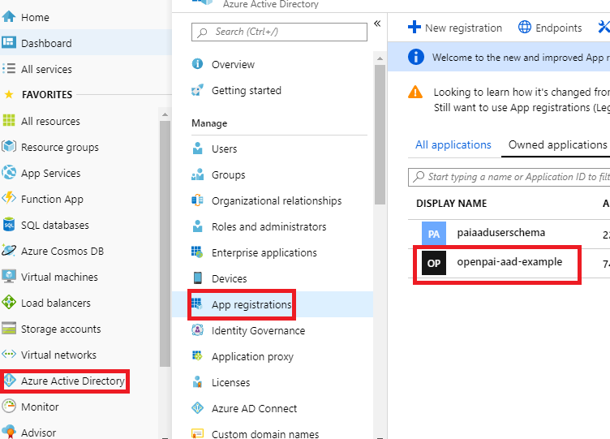

# 如何管理用户和用户组

OpenPAI支持2种身份验证模式来管理用户和组：

- 基础认证模式
- AAD模式

## 基础认证模式

在默认情况下，OpenPAI使用基础认证模式。
基础认证模式中的用户组是和虚拟集群直接绑定的（关于如何设置虚拟集群，请参考[这个文档](./how-to-set-up-virtual-clusters.md)）。
此外，OpenPAI默认有两个用户组：`default`和`admingroup`，它们在OpenPAI部署完成时就已经创建好了。所有用户都属于`default`用户组，并且有`default`虚拟集群的访问权限。所有管理员属于`admingroup`用户组，有所有虚拟集群的访问权限。假设您创建了一个`test-vc`虚拟集群，并且管理员把这个集群授权给了某个用户。那么这个用户就会在`test-vc`用户组中了。

例如，您若在[Webportal](./basic-management-operations.md#user-management)上添加了一个管理员，那么这个管理员就会在`default`和`admingroup`组中。如果添加的是非管理员，那么他一开始只会在`default`组中。假设管理员给了这个新用户（非管理员）`new-vc`的访问权限，那么他就会在`default`和`new-vc`两个组中。

在用户资料页，用户可以看到他所在的用户组。想要查询的话，点击页面右上角的`View my profile`。

   

接着用户的组就会被显示出来了（参考下面图片中的红框）:

   

对于用户管理，请转到`Administration` -> `User Management`。 

## AAD模式

[Microsoft Azure 目录服务 (Azure Active Directory, AAD)](https://docs.microsoft.com/en-us/azure/active-directory/fundamentals/active-directory-whatis) 是Microsoft的基于云的身份和访问管理服务。
可以将OpenPAI配置为使用AAD模式进行用户身份验证。
在AAD模式下，您可以使用AAD身份验证token登录OpenPAI群集。

在本节中，我们将逐步介绍如何设置AAD认证模式。 

### Preparation

- 如果您在基础认证模式下已经设置过一些用户，您需要手动将他们迁移至AAD。一旦AAD认证设置成功，您将不能使用原先的基础认证。
- 要设置AAD，请先按照[这里](./basic-management-operations.md#how-to-set-up-https)的说明为OpenPAI设置HTTPS访问。

### 设置AAD

- 登录 [Azure Web portal](https://ms.portal.azure.com/), 依次选择 Azure Acive Directory -> App registrations -> New registration
  <div align="center">
  
  </div>
- 为您的应用设置一个名称，并完成注册。
  <div align="center">
  
  </div>
- 找到您刚刚注册的应用并打开。
  <div align="center">
  
  </div>
- Authentication: 设置OpenPAI的跳转URI。跳转URI应该是 `https:/pylon_address/rest-server/api/v1/authn/oidc/return`
<div align="center">

</div>
- Certificates & secrets: 创建一个新的client serect。 将secret value记为 `${secret_value}`. 
**复制新的client secret值。执行其他操作或离开此页面后，您将无法再获取它。** 
  <div align="center">
  
  </div>
  <div align="center">
  
  </div>
  <div align="center">
  
  </div>
- API permissions: 请如下图所示添加权限。如果Azure AD是由您刚刚创建的，那么您可以自己设置权限，否则需要让您的管理员进行设置。
  <div align="center">
  
  </div>
- Quickstart: 记住下面的值
    - Application (client) ID： 记为`${app_id}`
    - Directory (tenant) ID， 记为`${tenant_id}`
    - 在endpoints' view中， 找到OpenID Connect metadata 文档，记为`${well_known}`
  <div align="center">
  
  </div>

### 服务配置

根据下面的示例，修改 `services-configuration.yaml`. 

```yaml
authentication:
  OIDC: true
  OIDC-type: AAD
  AAD:
   wellKnownURL: ${well_known}
   tenantID: ${tenant_id}
   clientID: ${app_id}
   clientSecret: ${secret_value}
   nonceLifetime: null
   nonceMaxAmount: 10
   clockSkew: null

  group-manager:
    group-data-source: ms-graph

    # Admin group name and its user list
    admin-group:
      # The group name showed in the OpenPAI system.
      groupname: admingroup
      description: "admin's group"
      # The group alias (groupname) in Azure Active directory
      externalName: "team_alias_a"

    # Group for default vc.
    default-group:
      groupname: default
      description: "group for default vc"
      externalName: "team_alias_b"
    # If you cluster you have configured several other VCs, except default VC (it has been created in the default-group), you should configure group for each VC in the following list
    grouplist:
    - groupname: forexample1
      description: forexample1
      externalName: "team_alias_c"
    - groupname: forexample2
      description: forexample2
      externalName: "team_alias_d"
```

### 清除旧数据

请删除老的用户数据（即基础认证模式中的用户登录信息）。在AAD模式中，老用户数据已经用不到了。

```bash 
./paictl.py service delete -n rest-server
```

### 更新配置并重启集群

完成上述所有步骤之后，请更新配置并重新启动所有OpenPAI服务： 

```bash
./paictl.py service stop
./paictl.py config push -p <config-folder> -m service
./paictl.py service start
```

### 验证

在rest-server启动后，您可以根据下面的步骤检查AAD是否被成功设置。

- 在K8S中，namespace `pai-group`和`pai-user-v2`被成功创建了。
  <div align="center">
  
  </div>

- 在配置中的用户组被成功创建，它们被保存在`pai-group`namespace下的secret里。
  <div align="center">
  
  </div>

- 每个组都有一个`acls`字段。
  <div align="center">
  
  
  </div>

- 请登录OpenPAI的Webportal，检查您的用户数据是否在`pai-user-v2` namespace下的secret里。
  <div align="center">
  
  </div>

- 请检查用户的数据。它们应该有一个空的extension字段，和一个非空的grouplist字段。
  <div align="center">
  
  </div>

- 在默认虚拟集群中提交一个任务, 在其他虚拟集群中也提交一个任务。

- 请检查管理员可以访问管理员页面。
  <div align="center">
  
  </div>

- 请重新配置一个新的虚拟集群，对应的用户组也会被创建。
  <div align="center">
  
  </div>

  <div align="center">
  
  </div>

- 管理员用户可以在主页中看到新创建的VC。
  <div align="center">
  
  </div>

- 请删除新集群，对应的用户组会被删除。
  <div align="center">
  
  </div>

- 删除虚拟集群后, 相应的组会从 `pai-group` secrets中移除.
  <div align="center">
  
  </div>

### 故障排除

如果验证失败的话，您可以尝试去删除rest server服务，然后重启它再进行尝试。
依旧不行的话，请[在Github上提交issue](https://github.com/microsoft/pai/issues/new/choose)，并提供相应的信息。
