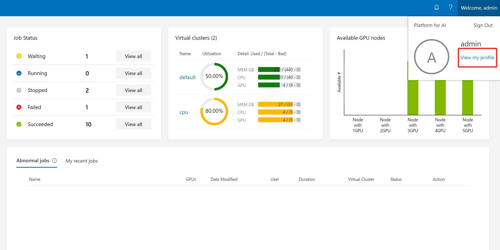
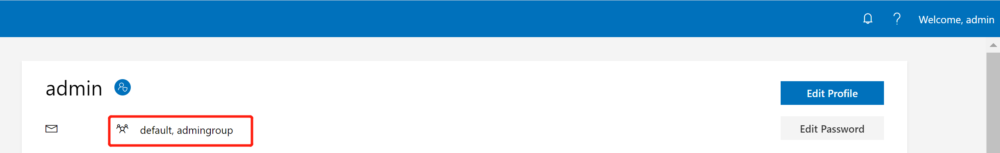
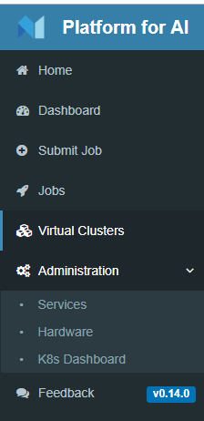
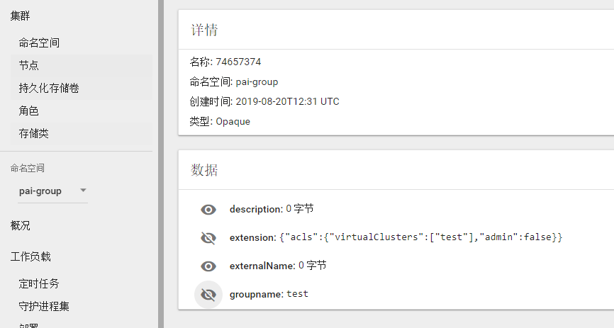

# 如何管理用户和用户组

## 基础认证模式下的用户和用户组

在默认情况下，OpenPAI使用基础认证模式。基础认证模式中的用户组是和虚拟集群直接绑定的（关于如何设置虚拟集群，请参考[这个文档](./how-to-set-up-virtual-clusters.md)）。此外，OpenPAI默认有两个用户组：`default`和`admingroup`，它们在OpenPAI部署完成时就已经创建好了。所有用户都属于`default`用户组，并且有`default`虚拟集群的访问权限。所有管理员属于`admingroup`用户组，有所有虚拟集群的访问权限。假设您创建了一个`test-vc`虚拟集群，并且管理员把这个集群授权给了某个用户。那么这个用户就会在`test-vc`用户组中了。

例如，您若在[Webportal](./basic-management-operations.md#user-management)上添加了一个管理员，那么这个管理员就会在`default`和`admingroup`组中。如果添加的是非管理员，那么他一开始只会在`default`组中。假设管理员给了这个新用户（非管理员）`new-vc`的访问权限，那么他就会在`default`和`new-vc`两个组中。

在用户资料页，用户可以看到他所在的用户组。想要查询的话，点击页面右上角的`View my profile`。

   

接着用户的组就会被显示出来了（参考下面图片中的红框）:

   


## <div id="users-and-groups-in-aad-mode">AAD认证模式下的用户和用户组</div>

除了基础认证方式外，OpenPAI还可以使用Microsoft Azure AD（简称AAD）作为用户认证方式。在AAD认证模式下，您可以使用AAD认证token登录OpenPAI集群。

### 如何设置AAD

在这一部分，我们将会分步骤介绍如何设置AAD认证模式。

#### 注意

如果您在基础认证模式下已经设置过一些用户，您需要手动将他们迁移至AAD。一旦AAD认证设置成功，您将不能使用原先的基础认证。要设置AAD，请先按照[这里](./basic-management-operations.md#how-to-set-up-https)的说明为OpenPAI设置HTTPS访问。


#### 设置AAD

##### 1. 创建 Azure Active Directory

- 登录Azure Web portal
- 依次选取 Azure Acive Directory -> App registrations -> New registration

<div  align="center">

</div>

- 为您的应用设置一个名称，并完成注册。

<div  align="center">

</div>

- 找到您刚刚注册的应用

<div  align="center">

</div>

- 依次打开 app -> Authentication，设置OpenPAI的跳转URI。跳转URI应该是```https://pylon_address/rest-server/api/v1/authn/oidc/return```

<div  align="center">

</div>

- 依次打开 app -> Certificates & secrets，创建一个新的client serect。 将secret value记为```${secret_value}```。

<div  align="center">

</div>

<div  align="center">

</div>

<div  align="center">

</div>

- 依次打开app -> API permissions，请如下图所示添加权限。如果Azure AD是由您刚刚创建的，那么您可以自己设置权限，否则您让您的管理员进行设置。

<div  align="center">

</div>

- 依次打开 app -> quickstart， 然后记住下面的值
    - Application (client) ID： 记为```${app_id}```
    - Directory (tenant) ID， 记为```${tenant_id}```
    - 在endpoints' view中， 找到OpenID Connect metadata 文档，记为```${well_known}```

<div  align="center">

</div>

##### 修改services-configuration.yaml中的authentication部分

根据下面的示例，修改 `services-configuration.yaml`：

```yaml
authentication:
  OIDC: true
  OIDC-type: AAD
  AAD:
   wellKnownURL: ${well_known}
   tenantID: ${tenant_id}
   clientID: ${app_id}
   clientSecret: ${secret_value}
   nonceLifetime: null
   nonceMaxAmount: 10
   clockSkew: null

  group-manager:
    group-data-source: ms-graph

    # 管理员用户组和相应的用户
    admin-group:
      # 管理员用户组在OpenPAI中显示的名称
      groupname: admingroup
      description: "admin's group"
      # AAD中的group alias（group name）
      externalName: "team_alias_a"

    # 默认用户组
    default-group:
      # 该用户组在OpenPAI中显示的名称
      groupname: default
      description: "group for default vc"
      # AAD中的group alias（group name）
      externalName: "team_alias_b"

    grouplist:
    # 该用户组在OpenPAI中显示的名称
    - groupname: forexample1
      description: forexample1
    # AAD中的group alias（group name）
      externalName: "team_alias_c"
    # 该用户组在OpenPAI中显示的名称
    - groupname: forexample2
      description: forexample2
    # AAD中的group alias（group name）
      externalName: "team_alias_d"
```

##### 清除旧数据

请删除老的用户数据（即基础认证模式中的用户登录信息）。在AAD模式中，老用户数据已经用不到了。

```bash 
./paictl.py service delete -n rest-server
```

##### 更新配置并重启集群

```bash
./paictl.py service stop
./paictl.py config push -p <config-folder> -m service
./paictl.py service start
```

#### 验证

##### 验证方法

在rest-server启动后，您可以根据下面的步骤检查AAD是否被成功设置。

- 在K8S中，namespace ```pai-group```和```pai-user-v2```被成功创建了。

<div  align="center">

</div>

- 您在配置的用户组被成功创建了，它们被保存在```pai-group``` namespace下的secret里。

<div  align="center">

</div>

- 每个组都有一个`acls`字段。

<div  align="center">


</div>

- 请登录OpenPAI的Webportal，检查您的用户数据是否在`pai-user-v2` namespace下的secret里。

<div  align="center">

</div>

- 请检查用户的数据。它们应该有一个空的extension字段，和一个非空的grouplist字段。

<div  align="center">

</div>

- 请检查管理员是否可以访问管理员页面。

<div  align="center">

</div>

- 请重新配置一个新的虚拟集群，并检查对应的用户组是否被创建了。

<div  align="center">

</div>

- 请删除新集群，并检查对应的用户组是否会被删除。

<div  align="center">

</div>

##### 如果验证失败

如果验证失败的话，您可以尝试去删除rest server服务，然后重启它再进行尝试。依旧不行的话，请在Github上提交issue，并提供相应的信息。