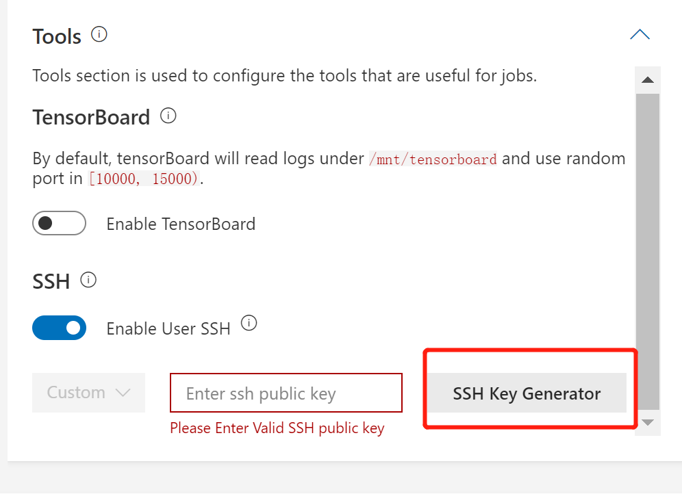
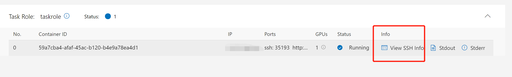
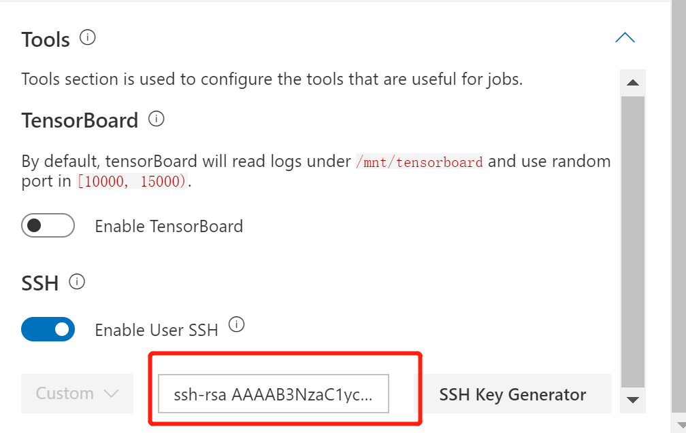
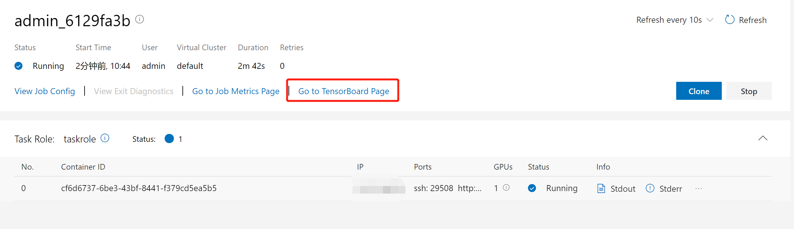
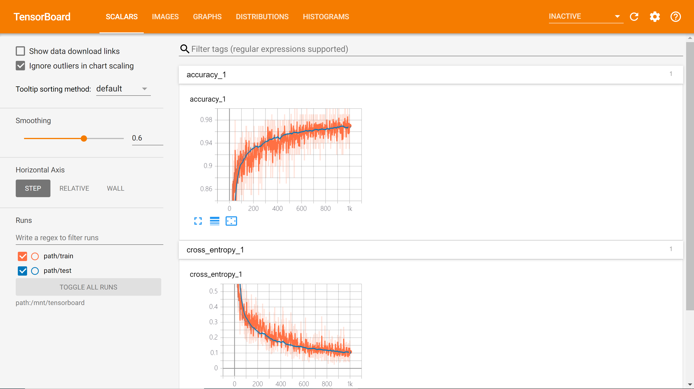

# 如何调试任务

本文档介绍了如何使用SSH和TensorBoard插件调试任务。

**注:** 当IP地址用户可访问时（不是用户无法访问的集群内部IP），这两个插件才能正常工作。 因此，如果PAI部署在某些云环境（例如Azure）中，则这两个插件将无法工作。

## 如何使用SSH

OpenPAI提供SSH插件来帮助您连接到任务容器。 要使用SSH，您可以创建一个SSH密钥对，或使用自己预先生成的密钥。

**选项1.创建SSH密钥对**

提交任务时，可以先创建一个新的SSH密钥对。 首先，打开`Tools`面板，启用SSH插件，然后单击`SSH Key Generator`：

   

生成器将为您生成一个公钥和一个私钥。 请下载SSH私钥，然后单击`Use Public Key`按钮以在您的任务容器中使用此密钥对。 


   

提交作业后，您可以凭借之前下载的私钥通过容器IP和SSH端口登录容器。 `View SSH Info`按钮将为您提供相应的命令：


   

在SSH Info中，您应该参考`Use a pre-downloaded SSH private key`部分。如果您使用的是Windows，则以下命令适用于您：

```bash
ssh -p <ssh-port> -i <your-private-key-file-path> root@<container-ip>
```

在类Unix系统上，命令为：

```bash
chmod 400 <your-private-key-file-path> && ssh -p <ssh-port> -i <your-private-key-file-path> <container-ip>
```

**选项2.使用您自己的密钥**

如果您熟悉SSH身份验证机制，那么您可能已经在文件夹`C:\Users\<your-user-name>\.ssh`中生成了一个公共密钥和一个私有密钥（在类Unix的系统上，对应的文件夹是`~/.ssh/`）。该文件夹中有一个id_rsa.pub文件和一个id_rsa文件，分别是公钥和私钥。

要使用它们，请打开 `id_rsa.pub`并将其内容复制到SSH插件，然后提交任务。不要使用上述密钥生成器。

   

提交后，您可以使用`ssh -p <ssh-port> root@<container-ip>`直接连接到作业容器。

## 如何使用TensorBoard插件

[TensorBoard](https://www.tensorflow.org/guide/summaries_and_tensorboard) 是一个提供TensorFlow程序运行日志可视化的Web程序。

我们利用一个示例向您展示如何在OpenPAI中使用TensorBoard。首先，打开任务提交页面，在`Command`框中输入以下命令：

```bash
git clone https://github.com/microsoft/pai.git
cd pai
git reset --hard dd08930431d05ed490cf7ceeecd262e473c187cd
cd docs/user/samples/
python minist_tensorboard.py --data_dir ./data --log_dir /mnt/tensorboard
sleep 30m
```

然后，请选择`TensorFlow 1.15.0 + Python 3.6 with GPU, CUDA 10.0`作为您的Docker镜像。 最后，在`Tools`部分中点击`Enable TensorBoard`按钮。

   

提交后，您将在任务页面上看到一个`Go To TensorBoard Page`按钮。

   

点击该按钮可转到TensorBoard页面。 您可能需要等待几分钟，直到日志准备就绪：

   

一般来说，要使用TensorBoard插件，您应该：

  1. 将您的TensorFlow Summary文件保存到`/mnt/tensorboard`。
  2. 确保您使用的Docker镜像中已安装`tensorboard`。
  3. 如果您想在任务完成后使用TensorBoard，请使用`sleep`命令来延长任务时间。
