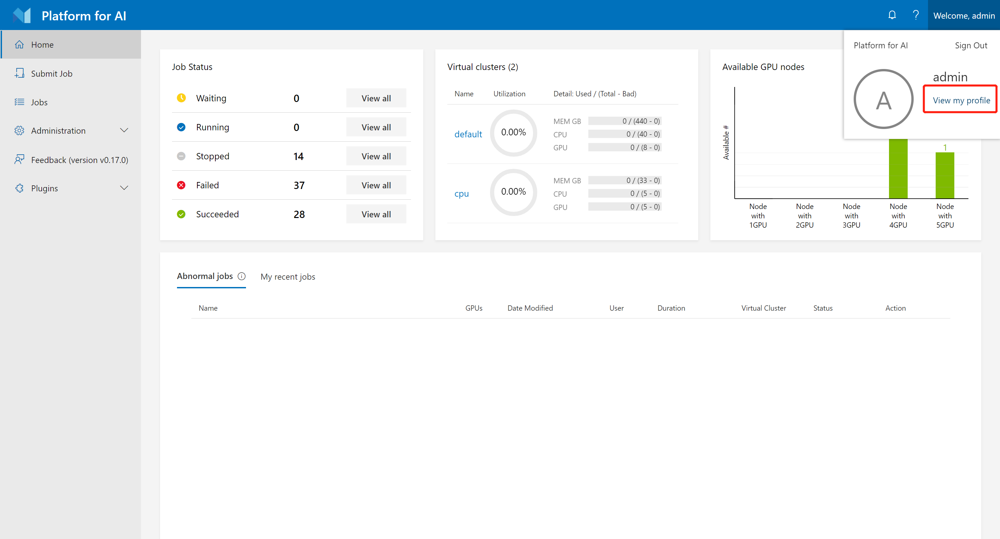
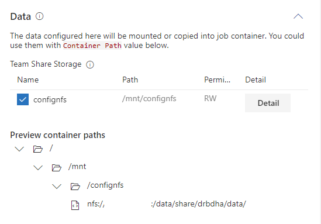

# 如何使用数据

## 获得数据存储

首先，在OpenPAI中，您需要一块被授权的存储来使用数据。要查看被授权的存储空间，首先，进入您的个人资料页面:



然后所有您有权限访问的空间将被显示为:


如果您没有发现任何存储，请联系集群的管理员。

## 上传数据

存储有多种类型。作为示例，我们将介绍如何将数据上传到`NFS`，`AzureBlob`和`AzureFile`存储。

### 上传数据到NFS服务器

#### 在Ubuntu（16.04或以上）中上传数据到NFS服务器

对于Ubuntu用户。要将数据上载到`NFS`存储，请先运行以下命令来安装nfs依赖项。

```bash
sudo apt-get update
sudo apt-get install --assume-yes nfs-common
```

然后您可以将nfs mount到您的机器中:
```bash
sudo mkdir -p MOUNT_PATH
sudo mount -t nfs4 NFS_SERVER:/NFS_PATH MOUNT_PATH
```

`NFS_SERVER`和`NFS_PATH`可以在个人信息页面的存储部分中找到。

您可以将数据复制到`MOUNT_PATH`，这样数据就被上传到`NFS`服务器了。

#### 在Windows中上传数据到NFS服务器

如果满足以下任一条件，您就可以通`Windows文件资源管理器`直接访问`NFS`数据:

  - 集群管理员通过`storage-manager`设置`NFS`，`storage-manager`将提供一个`samba`服务器。 
  - 集群管理员自行配置`samba`服务器和`NFS`服务器。

要访问它，请在`Windows文件资源管理器`输入文件位置`\\NFS_SERVER_ADDRESS`。它将提示您输入用户名和密码:

  - 如果OpenPAI处于基本身份验证模式（此时，您使用用户名/密码登录到OpenPAI Webportal），则可以通过samba的用户名和密码访问nfs数据。请注意，它与您用来登录OpenPAI的密码不同。如果管理员使用`storage-manager`，则NFS的默认用户名/密码为`smbuser`和` smbpwd`。 
  - 如果OpenPAI处于AAD身份验证模式，则可以通过用户域名和密码访问nfs数据。

如果以上步骤无效，请确保`network discovery`已打开，或与管理员联系以寻求帮助。

如果您不能使用`Windows文件资源管理器`直接访问，请尝试将NFS挂载到Windows或使用Linux VM上传数据。

###上传数据到Azure Blob或Azure File

对于Azure Blob，可以在信息页面上获取`存储帐户名`和`容器名`。

对于Azure文件，可以在信息页面上获取`存储帐户名`和`文件共享名`。

要将数据上传到Azure Blob或Azure File，请执行以下操作：

1. 下载 [Azure Storage Explorer](https://azure.microsoft.com/en-us/features/storage-explorer/)
2. 如果您使用AAD登录到PAI，则管理员应该已经向您授予访问存储空间的权限。 您可以在个人信息页面上获取存储帐户名称，容器名称和文件共享名称。 请使用它们访问Azure存储资源管理器中的存储空间。 有关更多详细信息，请参阅[这里](https://docs.microsoft.com/en-us/azure/vs-azure-tools-storage-manage-with-storage-explorer?tabs=windows#add-a-resource-via-azure-ad)。
3. 如果您使用基本身份验证（用户名/密码）登录到PAI门户。 请向管理员询问存储空间的`访问密钥`。 然后，您可以通过`访问密钥`和`存储帐户名`添加存储。 有关更多详细信息，请参阅[这里](https://docs.microsoft.com/en-us/azure/vs-azure-tools-storage-manage-with-storage-explorer?tabs=windows#use-a-name-and-key)。

## 在任务中使用数据

### 通过Data的UI界面 

您可以使用任务提交页面上的`Data`部分来选择所需的存储：



如图所示，相应的存储将被挂载到`/mnt/confignfs`文件夹中。

### 通过任务配置

您也可以在[任务配置文件](./how-to-use-advanced-job-settings.md#job-protocol-export-and-import-jobs)中的`extras.storages`部分中指定存储名称，以下为相应部分：

```yaml
extras:
    storages:
    - name: confignfs
      mountPath: /data
    - name: azure-file-storage
```

每个存储都有两个字段，`name`和`mountPath`。 `name`是指存储名称，而`mountPath`是任务容器内的mount路径。 `mountPath`的默认值为`/mnt/${name}`。

如果`storages`设置为空（如下），将使用当前用户的默认存储。

```yaml
extras:
    storages: []
```


