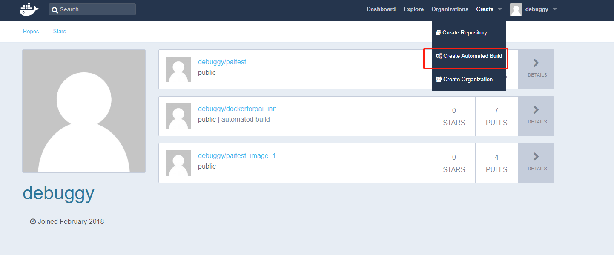
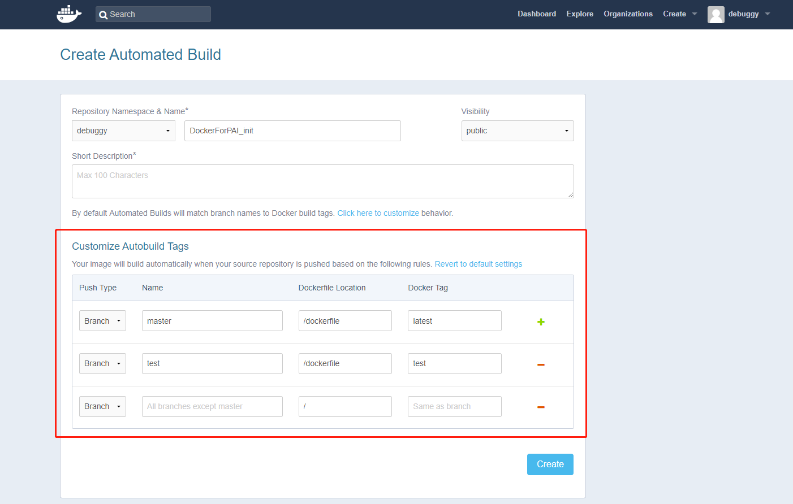
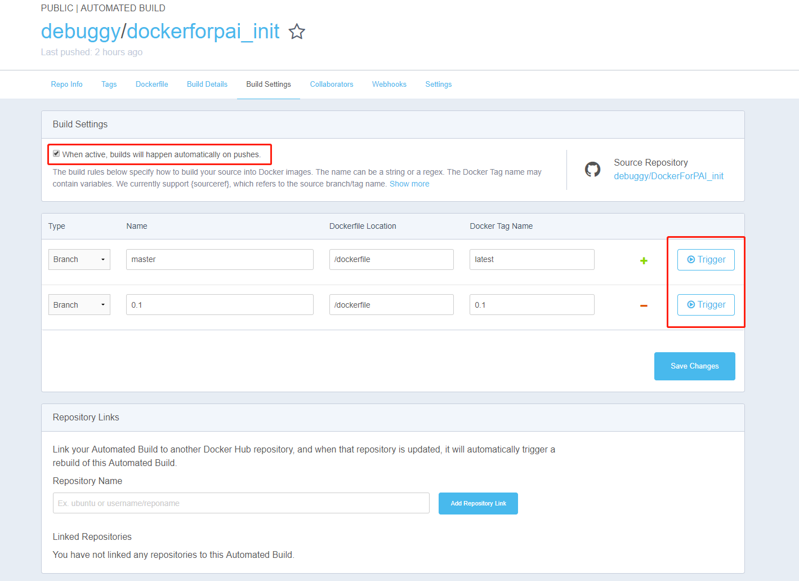
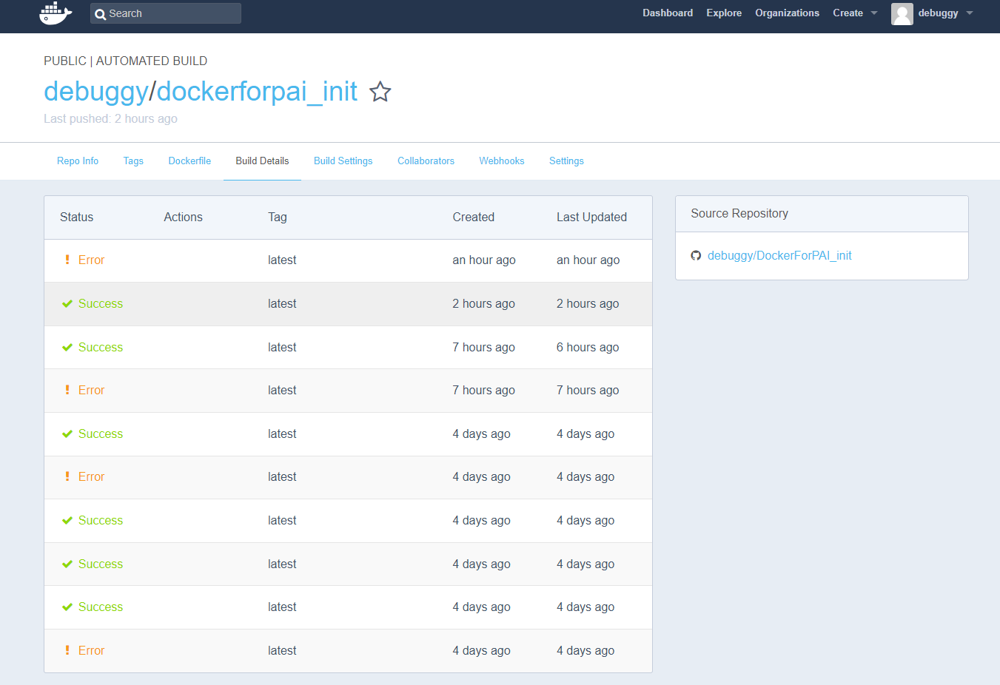

# How to maintain docker image by using dockerfile 

When submitting jobs to [Microsoft OpenPAI](https://github.com/Microsoft/pai), a docker image in [dockerhub](https://hub.docker.com/) is required in the job config. This tutorial aims to demonstrate how to maintain a docker image for OpenPAI by using dockerfile.

## Table of Content

- [ Prerequisites ](#Prerequisites)
- [ Write Your Own Dockerfile ](#Write-your-own-dockerfile)
- [ Push Dockerfile to Github](#Push-Dockerfile-to-Github)
- [ Create Autobuild Repository in Dockerhub ](#Create-Autobuild-Repository-in-Dockerhub)
- [ Use Autobuild Docker Image in OpenPAI ](#Use-Autobuild-Docker-Image-in-OpenPAI)

## Prerequisites
- An account in dockerhub. You can register a free account in dockerhub to push, update and share your own docker image. the account is nessesary if you want to build your own docker image in OpenPAI.

- An account in github. You will use github account to create a new repo for dockerfile.

## Write Your Own Dockerfile
- Write your own dockerfile to build docker image. Here is the official [dockerfile reference](https://docs.docker.com/engine/reference/builder/), you might use on of the [OpenPAI images](https://hub.docker.com/u/openpai/) as base image.

## Push Dockerfile to Github 
- Create a new github repo to maintain the dockerfile and others files needed during docker image build process.

- Use this repo to maintain dockerfile as a source control.

## Create Autobuild Repository in Dockerhub
- Use your dockerhub account to create an autobuild image repo for your docker image and link the github repo created in the previous step. Here is an [official guide](https://docs.docker.com/docker-cloud/builds/automated-build/) for how to create a autobuild image. Below images illustrate an example process. You need to link your github account to this dockerhub account first.

- In the butobuild settings, you can triger a docker image build process manually, or auto build everytime when the github repo updates. 

- You can check the build details whether the docker image build process succeeds or fails.

- After setting the auto build repo, you can focus on the dockerfile in github. And the docker image will built automatically based on the dockerfile.

## Use Autobuild Docker Image in OpenPAI
- Use this autobuild docker image as OpenPAI job docker image. And this docker image will updated whenever the dockerfile changed.