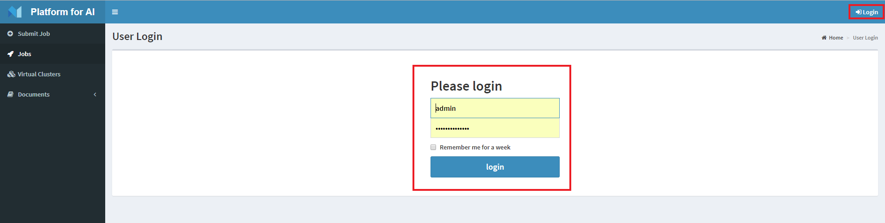
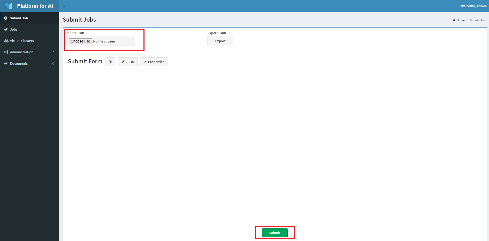
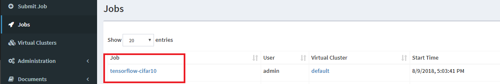

# OpenPAI Job Examples

## Table of Contents
- [Off-the-shelf examples](#off-the-shelf-examples)
- [List of customized job template](#list-of-customized-job-template)
- [Contributing](#contributing)
  

## Off-the-shelf examples

Examples which can be run by submitting the json straightly without any modification.

### How to write a OpenPAI job:

####  (1) Login PAI job webportal

Enter username and password:



####  (2) Write a job json file

- Full example for Cifar10 tensorflow training on OpenPAI: 

```json
{
  "jobName": "tensorflow-cifar10",
  "image": "openpai/pai.example.tensorflow",
  "dataDir": "/tmp/data",
  "outputDir": "/tmp/output",
  "taskRoles": [
    {
      "name": "cifar_train",
      "taskNumber": 1,
      "cpuNumber": 8,
      "memoryMB": 32768,
      "gpuNumber": 1,
      "command": "git clone https://github.com/tensorflow/models && cd models/research/slim && python download_and_convert_data.py --dataset_name=cifar10 --dataset_dir=$PAI_DATA_DIR && python train_image_classifier.py --batch_size=64 --model_name=inception_v3 --dataset_name=cifar10 --dataset_split_name=train --dataset_dir=$PAI_DATA_DIR --train_dir=$PAI_OUTPUT_DIR"
    }
  ]
}
```

- Copy these content to a file, named cifar10.json

- Other items introduction please refer [docs/job_tutorial.md](../docs/job_tutorial.md)


####  (3) Submit job json file

- Click choose file.
- Select cifar10.json.
- Click Submit.



- Show success.


- Click job tab, view job progress:




### List of off-the-shelf examples

* [tensorflow.cifar10.json](./tensorflow/tensorflow.cifar10.json): Single GPU trainning on CIFAR-10 using TensorFlow.
* [serving.tensorflow.json](./serving/serving.tensorflow.json): TensorFlow model serving.
* [pytorch.mnist.json](./pytorch/pytorch.mnist.json): Single GPU trainning on MNIST using PyTorch.
* [pytorch.regression.json](./pytorch/pytorch.regression.json): Regression using PyTorch.
* [mxnet.autoencoder.json](./mxnet/mxnet.autoencoder.json): Autoencoder using MXNet.
* [mxnet.image-classification.json](./mxnet/mxnet.image-classification.json): Image classification on MNIST using MXNet.

## List of customized job template

These user could customize and run these jobs over OpenPAI.

* [TensorFlow](./tensorflow/README.md): CIFAR-10 over Tensorflow
* [Keras](./keras/README.md): MNIST over keras.
* [Jupyter](./jupyter/README.md): MNIST over Jupyter Notebook.
* [Model Serving](./serving/README.md): MNIST model serving over Tensorflow
* [Scikit-learn](./scikit-learn/README.md): Text vectorizers over Scikit-learn
* [CNTK](./cntk/README.md): Grapheme-to-phoneme (letter-to-sound) conversion over CNTK
* [PyTorch](./pytorch/README.md): Regression / MNIST over PyTorch
* [MXNet](./mxnet/README.md): Image classification over MXNet
* [Open MPI](./mpi/README.md): CIFAR-10 over Tensorflow MPI


## Contributing

- If you want to contribute to run new workload on PAI or add more PAI examples, please open a new pull request.

- Prepare a folder under pai/examples folder, for example create pai/examples/caffe2/

- Prepare example dependencies:

Under [Caffe2 example](./caffe2/README.md) folder, user should prepare these files:

1.  README.md: Example's introductions
2.	Dockerfile: Example's dependencies
3.	Pai job json file: Example's OpenPAI job json template
4.	[Optional] Code file: Example's code file


