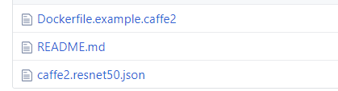

# OpenPAI Job Examples

- [OpenPAI Job Examples](#openpai-job-examples) 
  - [Quick start: submit a hello-world job](#quick-start-submit-a-hello-world-job)
  - [List of off-the-shelf examples ](#list-of-off-the-shelf-examples-a-name%22offtheshelf%22a)
  - [List of customized job template ](#list-of-customized-job-template-a-name%22customize%22a)
  - [What if the example is failed ](#what-if-the-example-is-failed-a-name%22debug%22a)
  - [Contributing](#contributing)

## Quick start: submit a hello-world job

Refer to [how to submit a hello-world job](../docs/user/training.md#submit-a-hello-world-job). It's a good start for beginners.

## List of off-the-shelf examples 

Examples which can be run by submitting the json straightly without any modification.

- [tensorflow.cifar10.json](./tensorflow/tensorflow.cifar10.json): Single GPU training on CIFAR-10 using TensorFlow.
- [pytorch.mnist.json](./pytorch/pytorch.mnist.json): Single GPU training on MNIST using PyTorch.
- [pytorch.regression.json](./pytorch/pytorch.regression.json): Regression using PyTorch.
- [mxnet.autoencoder.json](./mxnet/mxnet.autoencoder.json): Autoencoder using MXNet.
- [mxnet.image-classification.json](./mxnet/mxnet.image-classification.json): Image 
- [serving.tensorflow.json](./serving/serving.tensorflow.json): TensorFlow model serving. classification on MNIST using MXNet.

## List of customized job template 

These user could customize and run these jobs over OpenPAI.

- [TensorFlow](./tensorflow):
  
  1. [TensorFlow CIFAR-10 image classification](./tensorflow#tensorflow-cifar-10-image-classification)
  2. [TensorFlow ImageNet image classification](./tensorflow#tensorflow-imagenet-image-classification)
  3. [Distributed TensorFlow CIFAR-10 image classification](./tensorflow#distributed-tensorflow-cifar-10-image-classification)
  4. [TensorFlow Tensorboard](./tensorflow#tensorflow-tensorboard)

- [Keras](./keras):
  
  1. [MNIST training job over keras.](./keras/README.md)
- [Jupyter](./jupyter): 
  1. [MNIST over Jupyter Notebook. User can also treat this job as an example how to use Jupyter over OpenPAI](./jupyter/README.md)
- [Model Serving](./serving): 
  1. [MNIST model serving over Tensorflow](./serving/README.md)
- [Scikit-Learn](./scikit-learn): 
  1. [Scikit-Learn MNIST digit recognition](./scikit-learn/#scikit-learn-mnist-digit-recognition-example)
  2. [Scikit-Learn text-vectorizers](./scikit-learn/#scikit-learn-text-vectorizers-example)
- [CNTK](./cntk): 
  1. [CNTK grapheme-to-phoneme](./cntk/README.md)
- [PyTorch](./pytorch): 
  1. [PyTorch MNIST digit recognition](./pytorch/#pytorch-mnist-digit-recognition-examples)
  2. [PyTorch regression](./pytorch/#pytorch-regression-examples)
- [MXNet](./mxnet): 
  1. [MXNet autoencoder](./mxnet#mxnet-autoencoder-examples)
  2. [MXNet image classification](./mxnet#mxnet-image-classification-examples)
- [Open MPI](./mpi): 
  1. [Open MPI TensorFlow CIFAR-10](./mpi#open-mpi-tensorflow-cifar-10-example)
  2. [Open MPI CNTK grapheme-to-phoneme conversion](./mpi#open-mpi-cntk-grapheme-to-phoneme-conversion-example)

## What if the example is failed 

The example in the folder could be failed due to the following reasons:

      1. The format of json is incorrect. You may get error when you copy the json file to the webportal. It may due to version updating of webportal. You should refer to the latest version of it.
      2. The docker image is removed. You will find this error in your job tracking page. You should create an issue to report it, or you can build the image according to the dockerfile in the example's folder, then push it to another docker registry and modify the json file's image field. Just refer to the README or DOCKER in the folder of that example.
      3. If the example you submit contains a prepare.sh script shell, it may fail due to the source of the data or code changed or been unstable. You may get error in your job tracking page. Check and try to fix it.
      4. The version of the code, tools or library. You may get this error if you rebuild the docker image. Some example doesn't fix the version of its dependency, so, you should check the version.
    

## Contributing

If you want to contribute a job example that can be run on PAI, please open a new pull request.

- Prepare a folder under pai/examples folder, for example create pai/examples/caffe2/

- Prepare example files:
  
  Under [Caffe2 example](./caffe2) dir, user should prepare these files for an example's contribution PR:

1. README.md: Example's introductions
2. Dockerfile: Example's dependencies
3. Pai job json file: Example's OpenPAI job json template
4. [Optional] Code file: Example's code file