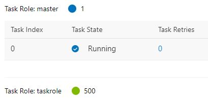
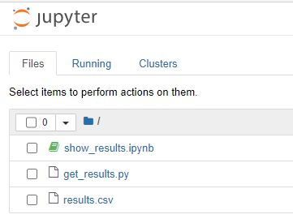
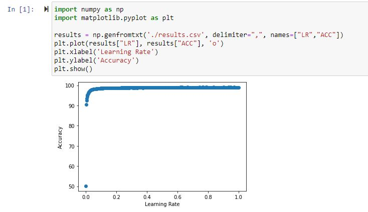

# Examples for OpenPAI (500Task)
Here we provide a CPU-only job with 500 tasks on a taskrole. The example use ConvNet model on the MNIST task. We look for the optimal learning rate in the range from 0.0001 to 0.9981(Take 500 values at equal intervals). 

## Experiment Results
| Network | Hardware | Time |GPU & CPU Utilization | Accuracy (Some Examples) | Yaml Example|
| :----:| :----: | :----: | :----: | :----: | :----: |
| ConvNet | CPU | 6h30m10s (500*5 epoch) | [Details](metrics/ConvNet_CPU_500Task.JPG) | 95.15% (lr: 0.0101)  98.53% (lr: 0.1001)  98.95% (lr: 0.9981)| [CPU_500Task_MNIST.yaml](yaml/CPU_500Task_MNIST.yaml) |

## Usage
Before running this example, you should first make sure that you have at least one permitted storage in OpenPAI. If you don’t know how to use storage, please refer to [our doc](https://openpai.readthedocs.io/).

Before submitting yaml file as mentioned above (in the yaml folder), you need to update the following commands with your own storage path:

`master` taskrole:
```
python get_results.py --number=500 --data_path /mnt/confignfs/mnist500_result/
-->
python get_results.py --number=500 --data_path <your own storage path>/mnist500_result/
```

`taskrole` taskerole:
```
mount -t nfs4 10.151.40.235:/data data
-->
mount -t nfs4 <NFS_SERVER:/NFS_PATH> data
```

Now you can submit the yaml file to try this example, and **don't forget** to select the storage you want to use in the `data` area on the right side of the page. 

## Visualization of results

When all instances in `taskrole` run successfully, you can view the visualized results through the running `master`. The following figure shows the final status of the successful job. It should be noted that the visualized results can only be viewed when the `master` is running. This taskrole will keep running until the user manually stops it.



You can access jupyter notebook by visiting `<master_IP>:8888` in the browser. Then, click on the file `show_results.ipynb`.



Run it and get the following visualized result.

