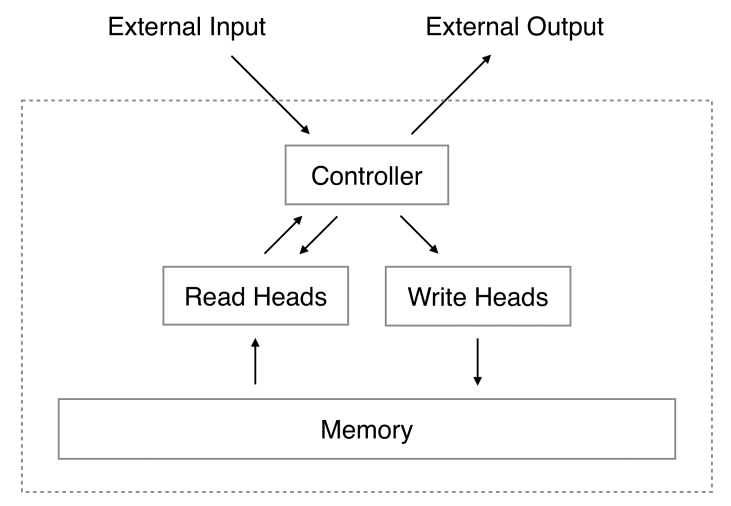
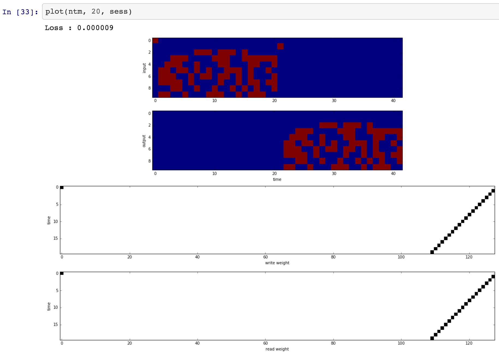

Neural Turing Machine in Tensorflow
===================================

Tensorflow implementation of [Neural Turing Machine](http://arxiv.org/abs/1410.5401). This implementation uses an LSTM controller. NTM models with multiple read/write heads are supported.

The referenced torch code can be found [here](https://github.com/kaishengtai/torch-ntm).

** 1. Loss sometimes goes to nan even with the gradient clipping ([#2](https://github.com/carpedm20/NTM-tensorflow/issues/2)).**
** 2. The code is very poorly design to support NTM inputs with variable lengths. Just use this code as a reference.**

Prerequisites
-------------

- Python 2.7 or Python 3.3+
- [Tensorflow 1.1.0](https://www.tensorflow.org/)
- NumPy

Usage
-----

To train a copy task:

    $ python main.py --task copy --is_train True

To test a *quick* copy task:

    $ python main.py --task copy --test_max_length 10

Results
-------

More detailed results can be found [here](ipynb/NTM\ Test.ipynb).

**Copy task:**

**Recall task:**

(in progress)

Author
------

Taehoon Kim / [@carpedm20](http://carpedm20.github.io/)

## License

MIT License