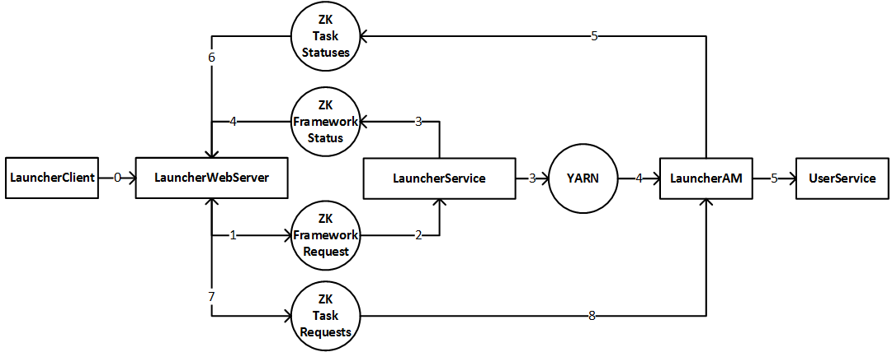

<!--
  Copyright (c) Microsoft Corporation
  All rights reserved.

  MIT License

  Permission is hereby granted, free of charge, to any person obtaining a copy of this software and associated
  documentation files (the "Software"), to deal in the Software without restriction, including without limitation
  the rights to use, copy, modify, merge, publish, distribute, sublicense, and/or sell copies of the Software, and
  to permit persons to whom the Software is furnished to do so, subject to the following conditions:
  The above copyright notice and this permission notice shall be included in all copies or substantial portions of the Software.

  THE SOFTWARE IS PROVIDED *AS IS*, WITHOUT WARRANTY OF ANY KIND, EXPRESS OR IMPLIED, INCLUDING
  BUT NOT LIMITED TO THE WARRANTIES OF MERCHANTABILITY, FITNESS FOR A PARTICULAR PURPOSE AND
  NONINFRINGEMENT. IN NO EVENT SHALL THE AUTHORS OR COPYRIGHT HOLDERS BE LIABLE FOR ANY CLAIM,
  DAMAGES OR OTHER LIABILITY, WHETHER IN AN ACTION OF CONTRACT, TORT OR OTHERWISE, ARISING FROM,
  OUT OF OR IN CONNECTION WITH THE SOFTWARE OR THE USE OR OTHER DEALINGS IN THE SOFTWARE.
-->

# Microsoft FrameworkLauncher User Manual

## <a name="Concepts">Concepts</a>

* Different **TaskRoles** compose a **Framework**
* Same **Tasks** compose a **TaskRole**
* A **User Service** executed by all **Tasks** in a **TaskRole**

## <a name="QuickStart">Quick Start</a>
1. **Prepare Framework**
    1. **Upload Framework Executable to HDFS**
    
       Upload the [Example Framework Executable](./example/ExampleFramework.sh) to HDFS:
       
            hadoop fs -mkdir -p /ExampleFramework/
            hadoop fs -put -f ExampleFramework.sh /ExampleFramework/
    2. **Write Framework Description File**
    
        Just use the [Example Framework Description File](./example/ExampleFramework.json).

            Example Framework Description Explanation:
            • The Example Framework with Version 1 contains 1 TaskRole named LRSMaster.
            • LRSMaster contains 2 Tasks and they will be executed for LRSMaster's TaskService.
            • LRSMaster's TaskService with Version 1 is defined by its EntryPoint, SourceLocations and Resource.
            • The EntryPoint and SourceLocations defines the Service's corresponding Executable which needs to be ran inside Containers. 
            • The Resource defines the Container Resource Guarantee / Limitation.

2. **Launch Framework**

    *Launcher Service need to be started before Launch Framework. See [README](../README.md) to Start Launcher Service.*

    *See [Root URI](#RootURI) to get {LauncherAddress}*

    HTTP PUT the Framework Description File as json to:

        http://{LauncherAddress}/v1/Frameworks/ExampleFramework

    For example, with [curl](https://curl.haxx.se/), you can execute below cmd line :

        curl -X PUT http://{LauncherAddress}/v1/Frameworks/ExampleFramework -d @ExampleFramework.json --header "Content-Type: application/json"

3. **Monitor Framework**

    *Below information may not be updated immediately, since all Launcher operations are asynchronous.*

    Check the Requested FrameworkNames by:

        http://{LauncherAddress}/v1/Frameworks

    Check ExampleFramework Request by:

        http://{LauncherAddress}/v1/Frameworks/ExampleFramework/FrameworkRequest

    Check ExampleFramework Status by:

        http://{LauncherAddress}/v1/Frameworks/ExampleFramework

## <a name="Architecture">Architecture</a>

  

**LauncherInterfaces**:
* RestAPI
* Submit Framework Description

**LauncherService**:
* One Central Service
* Manages all Frameworks for the whole Cluster.

**LauncherAM**:
* Per-Framework Service
* Manage Tasks for a single Framework by customized feature requirement

## <a name="Pipeline">Pipeline</a>

  

## <a name="RestAPI">RestAPI</a>
### <a name="Guarantees">Guarantees</a>
* All APIs are IDEMPOTENT and STATELESS, to allowed trivial Work Preserving Client Restart.
In other words, User do not need to worry about call one API multiple times by different Client instance (such as Client Restart, etc).
* All APIs are DISTRIBUTED THREAD SAFE, to allow multiple distributed Client instances to access.
In other words, User do not need to worry about call them at the same time in Multiple Threads/Processes/Nodes.

### <a name="RootURI">Root URI (LauncherAddress)</a>

Configure it as webServerAddress inside [LauncherConfiguration File](../conf/frameworklauncher.yml).

### <a name="BestPractices">Best Practices</a>
* LauncherService can only handle a finite, limited request volume. User should try to minimize its overall request frequency and payload, so that the LauncherService is not overloaded. To achieve this, User can centralize requests, space out requests, filter respond and so on.
* Completed Frameworks will ONLY be retained in recent FrameworkCompletedRetainSec, in case Client miss to delete the Framework after FrameworkCompleted. One exclusion is the Framework Launched by DataDeployment, it will be retained until the corresponding FrameworkDescriptionFile deleted in the DataDeployment. To avoid missing the CompletedFrameworkStatus, the polling interval seconds of Client should be less than FrameworkCompletedRetainSec. Check the FrameworkCompletedRetainSec by [GET LauncherStatus](#GET_LauncherStatus).

### <a name="Notes">Notes</a>
* Refer [Data Model](#DataModel) for the DataStructure of HTTP Request and Response.

### <a name="APIDetails">API Details</a>
#### <a name="PUT_Framework">PUT Framework</a>
**Request**

    PUT /v1/Frameworks/{FrameworkName}

Type: application/json

Body: [FrameworkDescriptor](../src/main/java/com/microsoft/frameworklauncher/common/model/FrameworkDescriptor.java)

**Description**

Add a NOT Requested Framework or Update a Requested Framework.
1. Add a NOT Requested Framework: Framework will be Added and Launched (Now it is Requested).
2. Update a Requested Framework:
    1. If FrameworkVersion unchanged:
        1. Framework will be Updated to the FrameworkDescription on the fly (i.e. Work Preserving).
        2. To Update Framework on the fly, it is better to use the corresponding PartialUpdate (such as [PUT TaskNumber](#PUT_TaskNumber)) than PUT the entire FrameworkDescription here. Because, partially update the FrameworkDescription can avoid the Race Condition (or Transaction Conflict) between two PUT Requests. Besides, the behaviour is undefined when change parameters in FrameworkDescription which is not supported by PartialUpdate.
    2. Else:
        1. Framework will be NonRolling Upgraded to new FrameworkVersion. (i.e. Not Work Preserving).
        2. NonRolling Upgrade can be used to change parameters in FrameworkDescription which is not supported by PartialUpdate (such as Framework Queue).
        3. NonRolling Upgrade should be triggered by change FrameworkVersion, instead of DELETE then PUT with the same FrameworkVersion.
3. User is responsible to specify FrameworkName explicitly.
4. After Accepted Response, FrameworkStatus may not be Initialized or Updated immediately. And only after FrameworkStatus is Initialized, the Framework is guaranteed to be scheduled.

**Response**

| HttpStatusCode | Body | Description |
|:---- |:---- |:---- |
| Accepted(202) | NULL | The Request has been recorded for backend to process, not that the processing of the Request has been completed. |
| BadRequest(400) | ExceptionMessage | The Request validation failed. So, Client is expected to not retry for this nontransient failure and then correct the Request. |
| TooManyRequests(429) | ExceptionMessage | The Request is rejected due to the New Total TaskNumber will exceed the Max Total TaskNumber if backend accepted it. So, the Client is expected to retry for this transient failure or migrate the whole Framework to another Cluster. |
| ServiceUnavailable(503) | ExceptionMessage | The Request cannot be recorded for backend to process. In our system, this only happens when target Cluster's Zookeeper is down for a long time. So, the Client is expected to retry for this transient failure or migrate the whole Framework to another Cluster. |

#### <a name="DELETE_Framework">DELETE Framework</a>
**Request**

    DELETE /v1/Frameworks/{FrameworkName}

**Description**

Delete a Framework, no matter it is Requested or not.
Notes:
1. Framework will be Stopped and Deleted (Now it is NOT Requested).
2. After Accepted Response, FrameworkStatus may not be Deleted immediately. And only after [FrameworkStatus](#GET_FrameworkStatus) is Deleted, the Framework is guaranteed to be Stopped completely.
3. Only recently completed Frameworks will be kept, if Client miss to DELETE the Framework after FrameworkCompleted. One exclusion is the Framework Launched by DataDeployment, it will be kept until the corresponding FrameworkDescriptionFile deleted in the DataDeployment.

**Response**

| HttpStatusCode | Body | Description |
|:---- |:---- |:---- |
| Accepted(202) | NULL | Same as [PUT Framework](#PUT_Framework) |
| ServiceUnavailable(503) | ExceptionMessage | Same as [PUT Framework](#PUT_Framework) |

#### <a name="GET_FrameworkStatus">GET FrameworkStatus</a>
**Request**

    GET /v1/Frameworks/{FrameworkName}/FrameworkStatus

**Description**

Get the FrameworkStatus of a Requested Framework
Recipes:
1. User Level RetryPolicy (Based on FrameworkState, ApplicationExitCode, ApplicationDiagnostic, applicationExitType)
2. Directly Monitor Underlay YARN Application by YARN CLI or RestAPI (Based on ApplicationId or ApplicationTrackingUrl)

**Response**

| HttpStatusCode | Body | Description |
|:---- |:---- |:---- |
| OK(200) | [FrameworkStatus](../src/main/java/com/microsoft/frameworklauncher/common/model/FrameworkStatus.java) | |
| NotFound(404) | ExceptionMessage | Specified Framework's Status does not exist. This may due to specified Framework is not Requested or the Framework Requested but the Status has not been initialized by backend (See [PUT Framework](#PUT_Framework)). So, the Client is expected to retry for the latter case. |
| ServiceUnavailable(503) | ExceptionMessage | Same as [PUT Framework](#PUT_Framework) |

#### <a name="GET_TaskRoleStatus">GET TaskRoleStatus</a>
**Request**

    GET /v1/Frameworks/{FrameworkName}/TaskRoles/{TaskRoleName}/TaskRoleStatus

**Description**

Get the TaskRoleStatus of a Requested Framework

**Response**

| HttpStatusCode | Body | Description |
|:---- |:---- |:---- |
| OK(200) | [TaskRoleStatus](../src/main/java/com/microsoft/frameworklauncher/common/model/TaskRoleStatus.java) | |
| NotFound(404) | ExceptionMessage | Same as [GET FrameworkStatus](#GET_FrameworkStatus) |
| ServiceUnavailable(503) | ExceptionMessage | Same as [PUT Framework](#PUT_Framework) |

#### <a name="GET_TaskStatuses">GET TaskStatuses</a>
**Request**

    GET /v1/Frameworks/{FrameworkName}/TaskRoles/{TaskRoleName}/TaskStatuses

**Description**

Get the TaskStatuses of a Requested Framework
Recipes:
1. ServiceDecovery (Based on TaskRoleName, ContainerHostName, ContainerIPAddress, ServiceId)
2. TaskLogForwarding (Based on ContainerLogHttpAddress)
3. MasterSlave and MigrateTask (Based on ContainerId)
4. DataPartition (Based on TaskIndex) (Note TaskIndex will not change after Task Restart, Migrated or Upgraded)

**Response**

| HttpStatusCode | Body | Description |
|:---- |:---- |:---- |
| OK(200) | [TaskStatuses](../src/main/java/com/microsoft/frameworklauncher/common/model/TaskStatuses.java) |  |
| NotFound(404) | ExceptionMessage | Same as [GET FrameworkStatus](#GET_FrameworkStatus) |
| ServiceUnavailable(503) | ExceptionMessage | Same as [PUT Framework](#PUT_Framework) |

#### <a name="PUT_TaskNumber">PUT TaskNumber</a>
**Request**

    PUT /v1/Frameworks/{FrameworkName}/TaskRoles/{TaskRoleName}/TaskNumber

Type: application/json

Body: [UpdateTaskNumberRequest](../src/main/java/com/microsoft/frameworklauncher/common/model/UpdateTaskNumberRequest.java)

**Description**

Update TaskNumber for a Requested Framework

**Response**

| HttpStatusCode | Body | Description |
|:---- |:---- |:---- |
| Accepted(202) | NULL | Same as [PUT Framework](#PUT_Framework) |
| BadRequest(400) | ExceptionMessage | Same as [PUT Framework](#PUT_Framework) |
| NotFound(404) | ExceptionMessage | Specified Framework does not exist. So, Client is expected to not retry for this non-transient failure and then PUT the corresponding Framework first. |
| TooManyRequests(429) | ExceptionMessage | Same as [PUT Framework](#PUT_Framework) |
| ServiceUnavailable(503) | ExceptionMessage | Same as [PUT Framework](#PUT_Framework) |

#### <a name="PUT_MigrateTask">PUT MigrateTask</a>
**Request**

    PUT /v1/Frameworks/{FrameworkName}/MigrateTasks/{ContainerId}

Type: application/json

Body: [MigrateTaskRequest](../src/main/java/com/microsoft/frameworklauncher/common/model/MigrateTaskRequest.java)

**Description**

Migrate a Task from current Container to another Container for a Requested Framework
And new Container and old Container will satisfy the AntiAffinityLevel constraint.
Notes:
1. User is responsible for implement Health/Perf Measurement of the Service based on Monitoring TaskStatuses or self-contained communication. And if found some Health/Perf degradations, User can migrate it by calling this API with corresponding ContainerId as parameter.
2. Currently, only support Any AntiAffinityLevel.

**Response**

| HttpStatusCode | Body | Description |
|:---- |:---- |:---- |
| Accepted(202) | NULL | Same as [PUT Framework](#PUT_Framework) |
| BadRequest(400) | ExceptionMessage | Same as [PUT Framework](#PUT_Framework) |
| NotFound(404) | ExceptionMessage | Same as [PUT TaskNumber](#PUT_TaskNumber) |
| ServiceUnavailable(503) | ExceptionMessage | Same as [PUT Framework](#PUT_Framework) |

#### <a name="PUT_ApplicationProgress">PUT ApplicationProgress</a>
**Request**

    PUT /v1/Frameworks/{FrameworkName}/ApplicationProgress

Type: application/json

Body: [OverrideApplicationProgressRequest](../src/main/java/com/microsoft/frameworklauncher/common/model/OverrideApplicationProgressRequest.java)

**Description**

Update ApplicationProgress for a Requested Framework
Notes:
1. If User does not call this API. Default ApplicationProgress is used, and it is calculated as CompletedTaskCount / TotalTaskCount.
2. User is responsible for implement Progress Measurement of the Service based on Monitoring Task logs or self-contained communication. And then feedback the Progress by calling this API to Override the default ApplicationProgress.

**Response**

| HttpStatusCode | Body | Description |
|:---- |:---- |:---- |
| Accepted(202) | NULL | Same as [PUT Framework](#PUT_Framework) |
| BadRequest(400) | ExceptionMessage | Same as [PUT Framework](#PUT_Framework) |
| NotFound(404) | ExceptionMessage | Same as [PUT TaskNumber](#PUT_TaskNumber) |
| ServiceUnavailable(503) | ExceptionMessage | Same as [PUT Framework](#PUT_Framework) |

#### <a name="GET_Frameworks">GET Frameworks</a>
**Request**

    GET /v1/Frameworks

**Description**

List all FrameworkNames of current Requested Frameworks.

**Response**

| HttpStatusCode | Body | Description |
|:---- |:---- |:---- |
| OK(200) | [RequestedFrameworkNames](../src/main/java/com/microsoft/frameworklauncher/common/model/RequestedFrameworkNames.java) | |
| ServiceUnavailable(503) | ExceptionMessage | Same as [PUT Framework](#PUT_Framework) |

#### <a name="GET_AggregatedFrameworkStatus">GET AggregatedFrameworkStatus</a>
**Request**

    GET /v1/Frameworks/{FrameworkName}
    GET /v1/Frameworks/{FrameworkName}/AggregatedFrameworkStatus

**Description**

Get the AggregatedFrameworkStatus of a Requested Framework

AggregatedFrameworkStatus = FrameworkStatus + all TaskRoles' (TaskRoleStatus + TaskStatuses)

**Response**

| HttpStatusCode | Body | Description |
|:---- |:---- |:---- |
| OK(200) | [AggregatedFrameworkStatus](../src/main/java/com/microsoft/frameworklauncher/common/model/AggregatedFrameworkStatus.java) | |
| NotFound(404) | ExceptionMessage | Same as [GET FrameworkStatus](#GET_FrameworkStatus) |
| ServiceUnavailable(503) | ExceptionMessage | Same as [PUT Framework](#PUT_Framework) |

#### <a name="GET_FrameworkRequest">GET FrameworkRequest</a>
**Request**

    GET /v1/Frameworks/{FrameworkName}/FrameworkRequest

**Description**

Get the FrameworkRequest of a Requested Framework

Current [FrameworkDescriptor](../src/main/java/com/microsoft/frameworklauncher/common/model/FrameworkDescriptor.java) for the Framework is included in FrameworkRequest and it can reflect latest updates.

**Response**

| HttpStatusCode | Body | Description |
|:---- |:---- |:---- |
| OK(200) | [FrameworkRequest](../src/main/java/com/microsoft/frameworklauncher/common/model/FrameworkRequest.java) | |
| NotFound(404) | ExceptionMessage | Same as [PUT TaskNumber](#PUT_TaskNumber) |
| ServiceUnavailable(503) | ExceptionMessage | Same as [PUT Framework](#PUT_Framework) |

#### <a name="GET_AggregatedFrameworkRequest">GET AggregatedFrameworkRequest</a>
**Request**

    GET /v1/Frameworks/{FrameworkName}/AggregatedFrameworkRequest

**Description**

Get the AggregatedFrameworkRequest of a Requested Framework

AggregatedFrameworkRequest = FrameworkRequest + all other feedback Request

**Response**

| HttpStatusCode | Body | Description |
|:---- |:---- |:---- |
| OK(200) | [AggregatedFrameworkRequest](../src/main/java/com/microsoft/frameworklauncher/common/model/AggregatedFrameworkRequest.java) | |
| NotFound(404) | ExceptionMessage | Same as [PUT TaskNumber](#PUT_TaskNumber) |
| ServiceUnavailable(503) | ExceptionMessage | Same as [PUT Framework](#PUT_Framework) |

#### <a name="GET_LauncherRequest">GET LauncherRequest</a>
**Request**

    GET /v1/LauncherRequest

**Description**

Get the LauncherRequest

**Response**

| HttpStatusCode | Body | Description |
|:---- |:---- |:---- |
| OK(200) | [LauncherRequest](../src/main/java/com/microsoft/frameworklauncher/common/model/LauncherRequest.java) | |
| ServiceUnavailable(503) | ExceptionMessage | Same as [PUT Framework](#PUT_Framework) |

#### <a name="GET_LauncherStatus">GET LauncherStatus</a>
**Request**

    GET /v1/LauncherStatus

**Description**

Get the LauncherStatus

Current [LauncherConfiguration](../src/main/java/com/microsoft/frameworklauncher/common/model/LauncherConfiguration.java) is included in LauncherStatus and it can reflect latest updates.

**Response**

| HttpStatusCode | Body | Description |
|:---- |:---- |:---- |
| OK(200) | [LauncherStatus](../src/main/java/com/microsoft/frameworklauncher/common/model/LauncherStatus.java) | |
| ServiceUnavailable(503) | ExceptionMessage | Same as [PUT Framework](#PUT_Framework) |

## <a name="DataModel">DataModel</a>
You can check the DataStructure, Specification and FeatureUsage inside Launcher Data Model:

    ../src/main/java/com/microsoft/frameworklauncher/common/model/*

For example:

A Framework is Defined and Requested by FrameworkDescriptor data structure. To find the feature usage inside FrameworkDescriptor, you can refer the comment inside [FrameworkDescriptor](../src/main/java/com/microsoft/frameworklauncher/common/model/FrameworkDescriptor.java).

## <a name="EnvironmentVariables">EnvironmentVariables</a>
Launcher sets up below EnvironmentVariables for each User Service to use:
1. Used to locate itself in the Cluster irrespective of any kinds of Migration and Restart.

| EnvironmentVariable | Description |
|:---- |:---- |
| LAUNCHER_ADDRESS | |
| FRAMEWORK_NAME | |
| FRAMEWORK_VERSION | |
| TASKROLE_NAME | |
| TASK_INDEX | |
| SERVICE_NAME | |
| SERVICE_VERSION | |

2. Used to get the allocated Resource by LauncherAM, only set when corresponding feature is enabled.

| EnvironmentVariable | Description |
|:---- |:---- |
| CONTAINER_IP | Only set when generateInstanceHostList is enabled. |
| CONTAINER_GPUS | Only set when gpuNumber is greater than 0. |

## <a name="ExitStatus_Convention">ExitStatus Convention</a>
You can check the all the defined ExitStatus by: [ExitType](../src/main/java/com/microsoft/frameworklauncher/common/model/ExitType.java), [RetryPolicyDescriptor](../src/main/java/com/microsoft/frameworklauncher/common/model/RetryPolicyDescriptor.java), [RetryPolicyState](../src/main/java/com/microsoft/frameworklauncher/common/model/RetryPolicyState.java), [DiagnosticsUtils](../src/main/java/com/microsoft/frameworklauncher/utils/DiagnosticsUtils.java).

Recipes:
1. Your LauncherClient can depend on the ExitStatus Convention
2. If your Service failed, the Service can optionally return the ExitCode of USER_APP_TRANSIENT_ERROR and USER_APP_NON_TRANSIENT_ERROR to help FancyRetryPolicy to identify your Service’s TRANSIENT_NORMAL and NON_TRANSIENT ExitType. If neither ExitCode is returned, the Service is considered to exit due to UNKNOWN ExitType.

## <a name="Notes">Notes</a>
1. The **Initial Working Directory** of your EntryPoint is the root directory of the EntryPoint.
Your Service can read data anywhere, however it can ONLY write data under the Initial Working Directory with the Service Directory excluded. And if the Source is a **ZIP file**, it will be uncompressed before starting your Service.
For example:

        EntryPoint=HbaseRS.zip/start.bat
        SourceLocations=hdfs:///HbaseRS.zip, hdfs:///HbaseCom <- HbaseRS.zip is a ZIP file

    The two Sources HbaseRS.zip and HbaseCom will be downloaded (and uncompressed) to local machine as below structure:

        ./   <- The Initial Working Directory
        ├─HbaseRS.zip <- Service Directory <- HbaseRS.zip is a directory uncompressed from original ZIP file
        └─HbaseCom <- Service Directory

2. Launcher will not restart the succeeded Task (i.e. the process started by EntryPoint ends with exit code 0) in any RetryPolicy. So, if you want to always restart Service on the same machine irrespective of its exit code, you need to **warp the original EntryPoint** by another script, such as:

        while true; do
            # call the original EntryPoint
        done

3. Increase the replication number your data and binary on target HDFS (Higher ReplicationNumber means faster downloading, higher availability and higher durability).

        hadoop fs -setrep -w <ReplicationNumber> <HDFS Path>

4. Do not modify your data and binary on target HDFS. To use new data and binary, upload them to a different HDFS Path and then change the FrameworkVersion and SourceLocations.