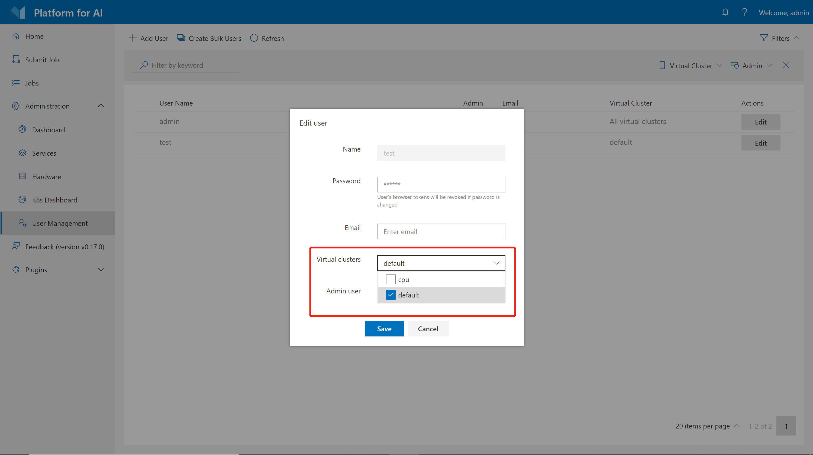

# How to Set Up Virtual Clusters

1. [Installation Guide](./installation-guide.md)
2. [Installation FAQs and Troubleshooting](./installation-faqs-and-troubleshooting.md)
3. [Basic Management Operations](./basic-management-operations.md)
4. [How to Manage Users and Groups](./how-to-manage-users-and-groups.md)
5. [How to Setup Kubernetes Persistent Volumes as Storage](./how-to-set-up-pv-storage.md)
6. [How to Set Up Virtual Clusters](./how-to-set-up-virtual-clusters.md) (this document)
    - [What is Hived Scheduler and How to Configure it](#what-is-hived-scheduler-and-how-to-configure-it)
    - [How to Set Up Virtuall Clusters](#how-to-set-up-virtuall-clusters)
    - [How to Grant VC to Users](#how-to-grant-vc-to-users)
    - [Different Hardwares in Worker Nodes](#different-hardwares-in-worker-nodes)
7. [How to Add and Remove Nodes](./how-to-add-and-remove-nodes.md)
8. [How to use CPU Nodes](./how-to-use-cpu-nodes.md)
9. [How to Customize Cluster by Plugins](./how-to-customize-cluster-by-plugins.md)
10. [Troubleshooting](./troubleshooting.md)
11. [How to Uninstall OpenPAI](./how-to-uninstall-openpai.md)
12. [Upgrade Guide](./upgrade-guide.md)

## What is Hived Scheduler and How to Configure it

HiveD is a standalone component of OpenPAI, designed to be a Kubernetes Scheduler Extender for Multi-Tenant GPU clusters. A multi-tenant GPU cluster assumes multiple tenants (teams) share the same GPU pool in a single physical cluster (PC) and provides some resource guarantees to each tenant. HiveD models each tenant as a virtual cluster (VC), so that one tenant can use its own VC as if it is a private cluster, while it can also use other VCs' free resource at lower priority.

Before we start, please read [this doc](https://github.com/microsoft/hivedscheduler/blob/master/doc/user-manual.md) to learn how to write hived scheduler configuration.

## How to Set Up Virtuall Clusters

In [`services-configuration.yaml`](./basic-management-operations.md#pai-service-management-and-paictl), there is a section for hived scheduler, for example:

```yaml
# service-configuration.yaml
……
hivedscheduler:
  config: |
    physicalCluster:
      skuTypes:
        DT:
          gpu: 1
          cpu: 5
          memory: 56334Mi
      cellTypes:
        DT-NODE:
          childCellType: DT
          childCellNumber: 4
          isNodeLevel: true
        DT-NODE-POOL:
          childCellType: DT-NODE
          childCellNumber: 3
      physicalCells:
      - cellType: DT-NODE-POOL
        cellChildren:
        - cellAddress: worker1
        - cellAddress: worker2
        - cellAddress: worker3
    virtualClusters:
      default:
        virtualCells:
        - cellType: DT-NODE-POOL.DT-NODE
          cellNumber: 3
……
```

If you have followed the [installation guide](./installation-guide.md), you would find similar setting in your [`services-configuration.yaml`](./basic-management-operations.md#pai-service-management-and-paictl). The detailed explanation of these fields are in the [hived scheduler document](https://github.com/microsoft/hivedscheduler/blob/master/doc/user-manual.md). You can update the configuration and set up virtual clusters. For example, in the above settings, we have 3 nodes, `worker1`, `worker2` and `worker3`. They are all in the `default` virtual cluster. If we want to create two VCs, one is called `default` and has 2 nodes, the other is called `new` and has 1 node, we can first modify `services-configuration.yaml`:

```yaml
# service-configuration.yaml
……
hivedscheduler:
  config: |
    physicalCluster:
      skuTypes:
        DT:
          gpu: 1
          cpu: 5
          memory: 56334Mi
      cellTypes:
        DT-NODE:
          childCellType: DT
          childCellNumber: 4
          isNodeLevel: true
        DT-NODE-POOL:
          childCellType: DT-NODE
          childCellNumber: 3
      physicalCells:
      - cellType: DT-NODE-POOL
        cellChildren:
        - cellAddress: worker1
        - cellAddress: worker2
        - cellAddress: worker3
    virtualClusters:
      default:
        virtualCells:
        - cellType: DT-NODE-POOL.DT-NODE
          cellNumber: 2
      new:
        virtualCells:
        - cellType: DT-NODE-POOL.DT-NODE
          cellNumber: 1
……
```

After modification, use the following commands to apply the settings:

```bash
./paictl.py service stop -n rest-server hivedscheduler
./paictl config push -p <config-folder> -m service
./paictl.py service start -n cluster-configuartion
./paictl.py service start -n hivedscheduler rest-server
```

You can now test the `default` VC and `new` VC, with any admin accounts in OpenPAI. [Next section](#how-to-grant-vc-to-users) will introduce how to grant VC access to non-admin users.

## How to Grant VC to Users

Admin users have access to all VCs. Thus, if you set up a new VC, you can use an admin account to test it. For non-admin users, administrators should grant VC access to them manually. The specific way depends on [authentication mode](./how-to-manage-users-and-groups.md) of your cluster.

### In Basic Authentication Mode

In basic authentication mode, administrators can grant VC access to users on the [`User Management` page](./basic-management-operations.md#user-management). First, click `Edit` on the page. Then you can configure VC access permission for each user as follows.

   

Please note you cannot revoke `default` VC from users.

### In AAD Mode

Users are grouped by the AAD service in AAD mode. You should assign VC access to each group.

First, find the following section in your [`services-configuration.yaml`](./basic-management-operations.md#pai-service-management-and-paictl):

```yaml
# services-configuration.yaml
……
group-manager:
    ...
    grouplist:
    - groupname: group1
        externalName: sg1
        extension:
          acls:
            admin: false
            virtualClusters: ["vc1"]
            storageConfigs: ["azure-file-storage"]
    - groupname: group2
        externalName: sg2
        extension:
          acls:
            admin: false
            virtualClusters: ["vc1", "vc2"]
            storageConfigs: ["nfs-storage"]
……
``` 

This should be self-explanatory. The `virtualClusters` field is used to manage VC access for different groups. Use the following commands to apply your configuration change:

```bash
./paictl.py service stop -n rest-server hivedscheduler
./paictl config push -p <config-folder> -m service
./paictl.py service start -n cluster-configuartion
./paictl.py service start -n hivedscheduler rest-server
```

## Different Hardwares in Worker Nodes

We recommend one VC should have the same hardware, which leads to one `skuType` of one VC in the hived scheduler setting. If you have different types of worker nodes (e.g. different GPU types on different nodes), please configure them in different VCs. Here is an example of 2 kinds of nodes:

```yaml
hivedscheduler:
  config: |
    physicalCluster:
      skuTypes:
        K80:
          gpu: 1
          cpu: 5
          memory: 56334Mi
        V100:
          gpu: 1
          cpu: 8
          memory: 80000Mi
      cellTypes:
        K80-NODE:
          childCellType: K80
          childCellNumber: 4
          isNodeLevel: true
        K80-NODE-POOL:
          childCellType: K80-NODE
          childCellNumber: 2
        V100-NODE:
          childCellType: V100
          childCellNumber: 4 
          isNodeLevel: true
        V100-NODE-POOL:
          childCellType: V100-NODE
          childCellNumber: 3
      physicalCells:
      - cellType: K80-NODE-POOL
        cellChildren:
        - cellAddress: k80-worker1
        - cellAddress: k80-worker2
      - cellType: V100-NODE-POOL
        cellChildren:
        - cellAddress: v100-worker1
        - cellAddress: v100-worker2
        - cellAddress: v100-worker3
    virtualClusters:
      default:
        virtualCells:
        - cellType: K80-NODE-POOL.K80-NODE
          cellNumber: 2
      V100:
        virtualCells:
        - cellType: V100-NODE-POOL.V100-NODE
          cellNumber: 3
```

In the above example, we set up 2 VCs: `default` and `v100`. The `default` VC has 2 K80 nodes, and `V100` VC has 3 V100 nodes. Every K80 node has 4 K80 GPUs and Every V100 nodes has 4 V100 GPUs.