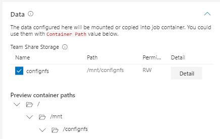

# How to Manage Data

1. [Quick Start](./quick-start.md)
2. [Work with Docker Images](./work-with-docker-images.md)
3. [How to Manage Data](./how-to-manage-data.md) (this document)
4. [How to Debug Jobs](./how-to-debug-jobs.md)
5. [Advanced Jobs](./advanced-jobs.md)
6. [Use Marketplace](./use-marketplace.md)
7. [Use VSCode Extension](./use-vscode-extension.md)
8. [Use Jupyter Notebook Extension](./use-jupyter-notebook-extension.md)

## Team-wise storage

### 1. Get permitted storage

User can get the permitted storage name in the user profile page. If you don't find any storage in the profile page, please contact the admin.


### 2. Use storage in the job

#### 2.1 Use job configuration file

To use one or more storage in job, user could specify storage names in `extras.storages` section in job configuration file:

```yaml
extras:
    storages:
    - name: confignfs
        mountPath: /data
    - name: azure-file-storage
```

Their are two fields for each storage, `name` and `mountPath`. `name` refers to storage name while `mountPath` is the mount path inside job container, which has default value `/mnt/${name}` and is optional.

```yaml
extras:
    storages: []
```

Setting it to an empty list will mount default storage for current user in the job.

#### 2.2 Use job submission page

User can also use job submission page to select desired storage:



***NOTICE: The generated protocol is different with above method. They are equivalent***