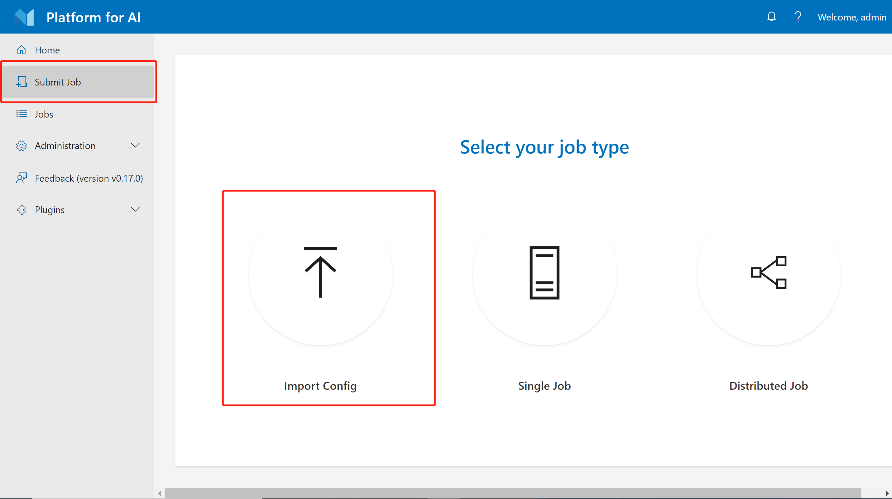
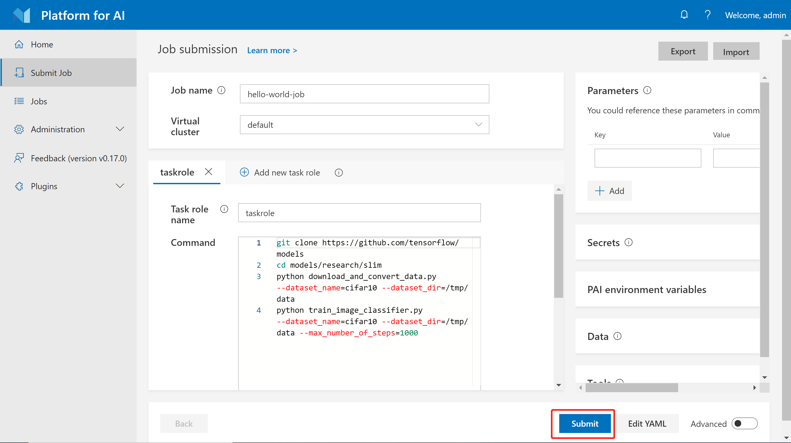
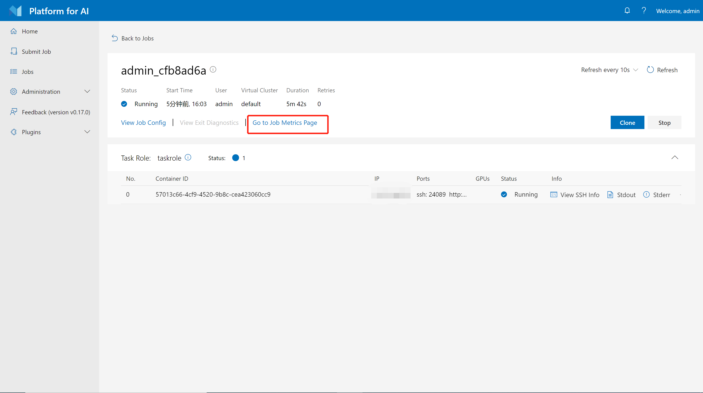
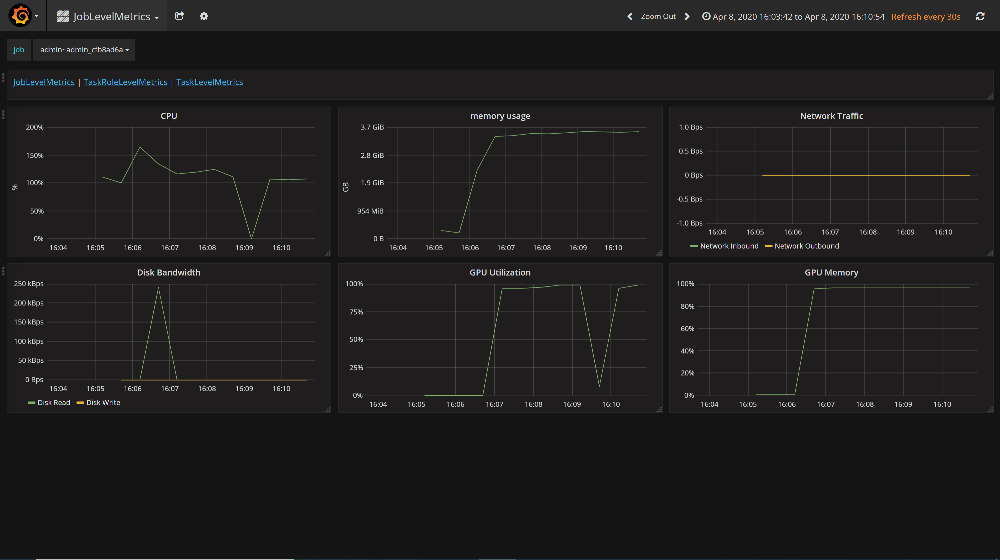
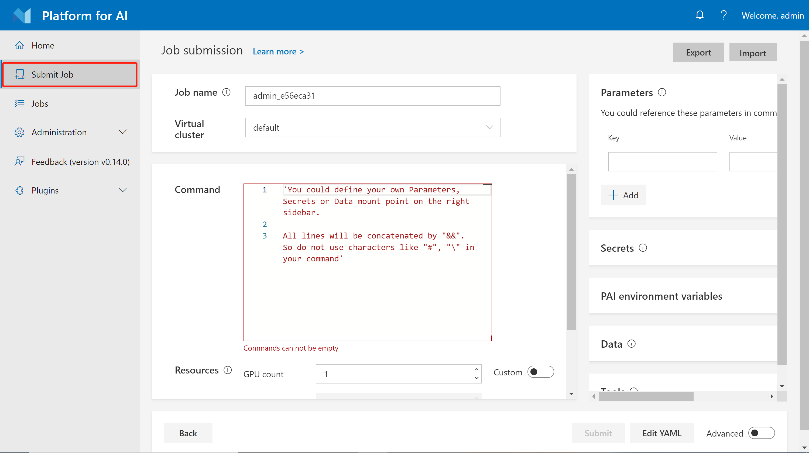
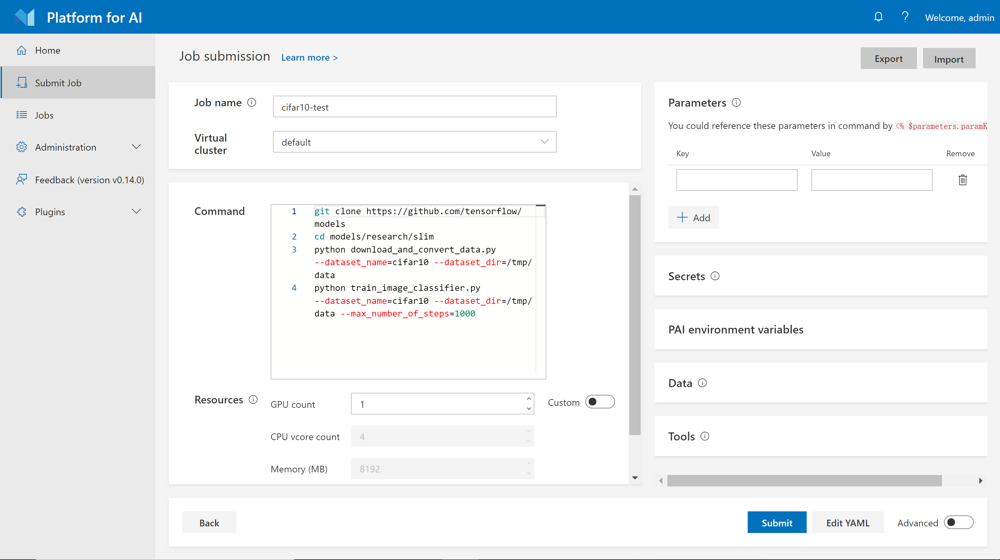
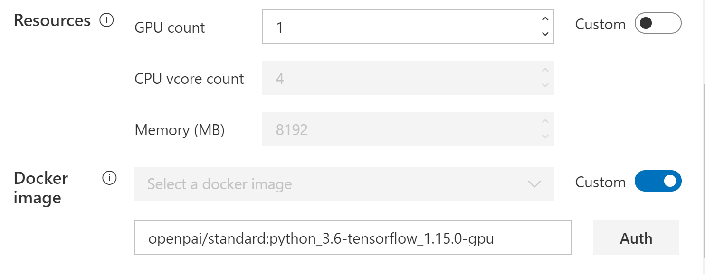

# Quick Start

1. [Quick Start](./quick-start.md) (this document)
    - [Submit a Hello World Job](#submit-a-hello-world-job)
    - [Browse Stdout, Stderr, Full Logs, and Metrics](#browse-stdout-stderr-full-logs-and-metrics)
    - [Submit a Hello World Job Step by Step](#submit-the-hello-world-job-step-by-step)
    - [Learn the Hello World Job](#learn-the-hello-world-job)
2. [Docker Images and Job Examples](./docker-images-and-job-examples.md)
3. [How to Manage Data](./how-to-manage-data.md)
4. [How to Debug Jobs](./how-to-debug-jobs.md)
5. [Advanced Jobs](./advanced-jobs.md)
6. [Use Marketplace](./use-marketplace.md)
7. [Use VSCode Extension](./use-vscode-extension.md)
8. [Use Jupyter Notebook Extension](./use-jupyter-notebook-extension.md)

## Submit a Hello World Job

The **job** of OpenPAI defines how to execute code(s) and command(s) in specified environment(s). It can be run on a single node or distributedly.

For a quick start, please download [`hello-world-job.yaml`](./examples/hello-world-job.yaml).

Then login to OpenPAI webportal, click `Submit Job` -> `Import Config`:



Select the downloaded `hello-world-job.yaml` file, and submit the job:



Now your first OpenPAI job has been kicked off!

## Browse Stdout, Stderr, Full logs, and Metrics

The hello world job is implemented by TensorFlow. It trains a simple model on CIFAR-10 dataset for 1,000 steps with downloaded data. You can monitor the job by checking its logs and running metrics on webportal.

Click `Stdout` and `Stderr` button to see the stdout and stderr logs for a job on the job detail page. If you want to see a merged log, you can click `...` on the right and then select `Stdout + Stderr`.


As shown in the following picture, we will only show last 16KB logs in the dialog. Click `View Full Log` for a full log.


On the job detail page, you can also see metrics by clicking `Go to Job Metrics Page`.



Then the CPU/GPU utilization and network will be shown in a new window:



## Submit the Hello World Job Step by Step

Instead of importing a job configuration file, you can submit the hello world job directly through the web page. The following is a step-by-step guide:

**Step 1.** Login to OpenPAI web portal.

**Step 2.** Click **Submit Job** on the left pane, then click `Single` to reach this page.



**Step 3.** Select your virtual cluster, and give a name for your job. Then copy the following commands into the command box.

```bash
git clone https://github.com/tensorflow/models
cd models/research/slim
python download_and_convert_data.py --dataset_name=cifar10 --dataset_dir=/tmp/data
python train_image_classifier.py --dataset_name=cifar10 --dataset_dir=/tmp/data --max_number_of_steps=1000
```

Note: Please **Do Not** use `#` for comments or use `\` for line continuation in the command box. These symbols may break the syntax and will be supported in the future.



**Step 4.** Specify the resources you need. By default only GPU number could be set. Toggle the `custom` button if you need to customize CPU number and memory. Here we use a customized setting: 1 GPU, 1 CPU, and 6500 MB memory.

**Step 5.** Specify the docker image. You can either use the listed docker images or take advantage of your own one. Here we select `TensorFlow 1.15.0 + Python 3.6 with GPU, CUDA 10.0`, which is a pre-built image. We will introduce more about docker images in [Docker Images and Job Examples](./docker-images-and-job-examples.md).

 

**Step 6.** Click **Submit** to submit the job.

## Learn the Hello World Job

Here are some detailed explanations about configurations on the submission page:

- **Job name** is the name of current job. It must be unique in each user account. A meaningful name helps manage jobs well.

- **Command** is the commands to run in this task role. It can be multiple lines. For example, in the hello-world job, the command clones code from GitHub, downloads data and then executes the training progress. If one command fails (exits with a nonzero code), the following commands will not be executed. This behavior may be changed in the future.

- **GPU count**, **CPU vcore count**, **Memory (MB)** are easy to understand. They specify corresponding hardware resources including the number of GPUs, the number of CPU cores, and MB of memory.

We will introduce more details about the job configuration in [`Advanced Jobs`](./advanced-jobs.md).