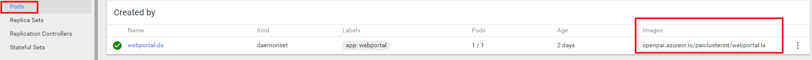
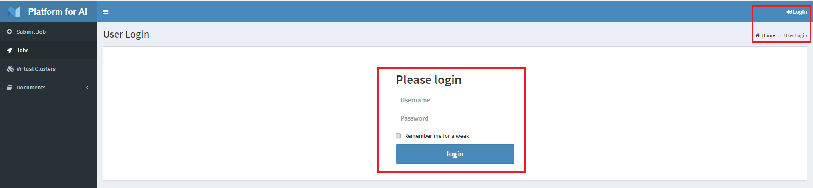

# OpenPAI Configuration Document

PAI configuration consists of 4 YAML files:

- [`cluster-configuration.yaml`](./how-to-write-pai-configuration.md#cluster_configuration) - Machine-level configurations. This file contains basic configurations of cluster, such as the login info, machine SKUs, labels of each machine, etc.
- [`kubernetes-configuration.yaml`](./how-to-write-pai-configuration.md#kubernetes_configuration) - Kubernetes-level configurations. This file contains basic configurations of Kubernetes, such as the version info, network configurations, etc.
- [`k8s-role-definition.yaml`](./how-to-write-pai-configuration.md#k8s_role_definition) - Kubernetes-level configurations. This file contains the mappings of Kubernetes roles and machine labels.
- [`serivices-configuration.yaml`](./how-to-write-pai-configuration.md#services_configuration) - Service-level configurations. This file contains the definitions of cluster id, docker registry, and those of all individual PAI services.

### Prerequisites:

Before deployment or maintenance, user should have the cluster configuration files ready.

You could find the example configuration files in [pai/cluster-configuration/](../../cluster-configuration).

Note: Please do not change the name of the configuration files. And those 4 files should be put in the same directory.

## Index

- Configure OpenPAI from scenarios
    - placement
      - [configure node placement of service](./how-to-write-pai-configuration.md#service_placement)
      - [configure install gpu driver on which server](./how-to-write-pai-configuration.md#gpu_driver)
    - scheduling
      - [configure virtual cluster capacity](./how-to-write-pai-configuration.md#configure_vc_capacity)
    - account
      - [configure customize docker repository](./how-to-write-pai-configuration.md#docker_repo)
      - [configure OpenPAI admin user account](./how-to-write-pai-configuration.md#configure_user_acc)
    - port / data folder etc.
      - [configure service entry](./how-to-write-pai-configuration.md#configure_service_entry) 
      - [configure HDFS data / OpenPAI temp data folder](./how-to-write-pai-configuration.md#data_folder)
    - component version 
      - [configure K8s component version](./how-to-write-pai-configuration.md#k8s_component)
      - [configure docker version](./how-to-write-pai-configuration.md#docker_repo)
      - [configure nvidia gpu driver version](./how-to-write-pai-configuration.md#driver_version)
    - HA
      - [Kubernetes High Availability Configuration](./how-to-write-pai-configuration.md#k8s-high-availability-configuration)

- [Configure OpenPAI from files](./how-to-write-pai-configuration.md)
  - Cluster related configuration: [configuration of cluster-configuration.yaml](./how-to-write-pai-configuration.md#cluster_configuration)
  - Kubernetes role related configuration: [configuration of k8s-role-definition.yaml](./how-to-write-pai-configuration.md#k8s_role_definition)
  - Kubernetes related configuration: [configuration of kubernetes-configuration.yaml](./how-to-write-pai-configuration.md#kubernetes_configuration)
  - Service related configuration: [configuration of services-configuration.yaml](./how-to-write-pai-configuration.md#services_configuration)

- [Configure OpenPAI services](./how-to-write-pai-service-configuration.md) [Note: This part is for advanced user who wants to customize OpenPAI each service]
    - [Kubernetes](./how-to-write-pai-service-configuration.md#kubernetes)
    - Webportal
      - [Webportal](./how-to-write-pai-service-configuration.md#webportal)
      - [Pylon](./how-to-write-pai-service-configuration.md#pylon)
    - FrameworkLauncher
      - [FrameworkLauncher](./how-to-write-pai-service-configuration.md#frameworklauncher)
      - [Rest-server](./how-to-write-pai-service-configuration.md#restserver)
    - Hadoop
      - [YARN / HDFS](./how-to-write-pai-service-configuration.md#hadoop)
      - [Zookeeper](./how-to-write-pai-service-configuration.md#zookeeper)
    - Monitor
      - [Prometheus / Exporter](./how-to-write-pai-service-configuration.md#prometheus) 
      - [Grafana](./how-to-write-pai-service-configuration.md#grafana)
- [Appendix: Default values in auto-generated configuration files](#appendix)

## Set up cluster-configuration.yaml <a name="cluster_configuration"></a>

An example cluster-configuration.yaml is available [here](../../cluster-configuration/cluster-configuration.yaml). In the following we explain the fields in the yaml file one by one.

### ```default-machine-properties```

```YAML
default-machine-properties:
  # A Linux host account with sudo permission
  username: username
  password: password
  sshport: port
```

Set the default value of username, password, and sshport in default-machine-properties. PAI will use these default values to access cluster machines. User can override the default access information for each machine in [machine-list](#m_list).

### ```machine-sku```

```YAML
machine-sku:

  NC24R:
    mem: 224
    gpu:
      type: teslak80
      count: 4
    cpu:
      vcore: 24
    #Note: Up to now, the only supported os version is Ubuntu16.04. Please do not change it here.
    os: ubuntu16.04

```

In this field, you could define several sku with different name. And in the machine list you should refer your machine to one of them.

| Configuration Property | File | Meaning |
| --- | --- | --- |
| mem|cluster-configuration.yaml| Memory|
| os|cluster-configuration.yaml| Now we only supported ubuntu, and pai is only tested on the version 16.04LTS.|
| gpu<a name="gpu_driver"></a>|cluster-configuration.yaml| If there is no gpu on this sku, you could remove this field.If user config gpu at sku, OpenPAI will label this node as type of gpu and will try to install gpu driver if no driver at this host.|

### how to check gpu driver

```check gpu driver:```:

Dashboard:

```
http://<master>:9090
```

search driver, view driver status


view driver logs, this log shows driver in health status


### ```machine-list``` <a name="m_list"></a>

### ```configure node placement of service```<a name="service_placement"></a>

```
machine-list:

    - hostname: hostname (echo `hostname`)
      hostip: IP
      machine-type: D8SV3
      etcdid: etcdid1
      #sshport: PORT (Optional)
      #username: username (Optional)
      #password: password (Optional)
      k8s-role: master
      dashboard: "true"
      zkid: "1"
      pai-master: "true"

    - hostname: hostname
      hostip: IP
      machine-type: D8SV3
      etcdid: etcdid2
      #sshport: PORT (Optional)
      #username: username (Optional)
      #password: password (Optional)
      k8s-role: master
      node-exporter: "true"

    - hostname: hostname
      hostip: IP
      machine-type: NC24R
      #sshport: PORT (Optional)
      #username: username (Optional)
      #password: password (Optional)
      k8s-role: worker
      pai-worker: "true"
```

User could config each service deploy at which node by labeling node with service tag as below:

| Configuration Property | File | Meaning |
| --- | --- | --- |
| ```hostname``` | cluster-configuration.yaml | Required. You could get the hostname by the command ```echo `hostname` ``` on the host.|
| ```hostip```| cluster-configuration.yaml |  Required. The ip address of the corresponding host.
| ```machine-type``` | cluster-configuration.yaml | Required. The sku name defined in the ```machine-sku```.|
| ```sshport, username, password```| cluster-configuration.yaml | Optional. Used if this machine's account and port is different from the default properties. Or you can remove them.|
| ```etcdid```| cluster-configuration.yaml | K8s-Master Required. The etcd is part of kubernetes master. If you assign the k8s-role=master to a node, you should set this filed. This value will be used when starting and fixing k8s.|
| ```k8s-role```| cluster-configuration.yaml | Required. You could set this value to ```master```, ```worker``` or ```proxy```. If you want to configure more than 1 k8s-master, please refer to [Kubernetes High Availability Configuration](#k8s-high-availability-configuration).|
| ```dashboard```| cluster-configuration.yaml | Select one node to set this field. And set the value as ``` "true" ```.|
| ```pai-master```| cluster-configuration.yaml | Optional. hadoop-name-node, hadoop-resource-manager, frameworklauncher, restserver, webportal, grafana, prometheus and node-exporter.|
| ```zkid```| cluster-configuration.yaml | Unique zookeeper id required by ```pai-master``` node(s). You can set this field from ```1``` to ```n```.|
| ```pai-worker```| cluster-configuration.yaml | Optional. hadoop-data-node, hadoop-node-manager, and node-exporter will be deployed on a pai-work|
 ```node-exporter```| cluster-configuration.yaml | Optional. You can assign this label to nodes to enable hardware and service monitoring.|

Note: To deploy PAI in a single box, users should set pai-master and pai-worker labels for the same machine in machine-list section, or just follow the quick deployment approach described in this [section](./cluster-bootup.md#singlebox).

### how to check

```check node labels:```:

Dashboard:
```
http://<master>:9090
```


```check service pod deployed on which node:```:

Dashboard:

```
http://<master>:9090
```


## Set up k8s-role-definition.yaml <a name="k8s_role_definition"></a>

An example k8s-role-definition.yaml file is available [here](../../cluster-configuration/k8s-role-definition.yaml).
The file is used to bootstrap a k8s cluster. It includes a list of k8s components and specifies what components should be include in different k8s roles (master, worker, and proxy).
By default, user does not need to change the file.

## Set up kubernetes-configuration.yaml <a name="kubernetes_configuration"></a>

An example kubernetes-configuration.yaml file is available [here](../../cluster-configuration/kubernetes-configuration.yaml). The yaml file includes the following fields.

### ```configure K8s component version``` <a name="k8s_component"></a>

Suggest user use the default configuration:
```
kubernetes:
  cluster-dns: IP
  load-balance-ip: IP
  service-cluster-ip-range: 10.254.0.0/16
  storage-backend: etcd3
  docker-registry: docker.io/openpai
  hyperkube-version: v1.9.4
  etcd-version: 3.2.17
  apiserver-version: v1.9.4
  kube-scheduler-version: v1.9.4
  kube-controller-manager-version:  v1.9.4
  # http://gcr.io/google_containers/kubernetes-dashboard-amd64
  dashboard-version: v1.8.3
```

### ```User *must* set the following fields to bootstrap a cluster ```

| Configuration Property | File | Meaning |
| --- | --- | --- |
| ```cluster-dns```|kubernetes-configuration.yaml| Find the nameserver address in  /etc/resolv.conf|
| ```load-balance-ip```|kubernetes-configuration.yaml| If the cluster has only one k8s-master, please set this field with the ip-address of your k8s-master. If there are more than one k8s-master, please refer to [k8s high availability configuration](#k8s-high-availability-configuration).|

### ```Some values could use the default value```

| Configuration Property | File | Meaning |
| --- | --- | --- |
|  ```service-cluster-ip-range```|kubernetes-configuration.yaml| Please specify an ip range that does not overlap with the host network in the cluster. E.g., use the 169.254.0.0/16 link-local IPv4 address according to [RFC 3927]|(https://tools.ietf.org/html/rfc3927), which usually will not overlap with your cluster IP.|
| ```storage-backend```|kubernetes-configuration.yaml| ETCD major version. If you are not familiar with etcd, please do not change it.|
| ```docker-registry```|kubernetes-configuration.yaml| The docker registry used in the k8s deployment. To use the official k8s Docker images, set this field to gcr.io/google_containers, the deployment process will pull Kubernetes component's image from ```gcr.io/google_containers/hyperkube```. You can also set the docker registry to openpai.docker.io (or docker.io/pai), which is maintained by pai.|
| ```hyperkube-version```|kubernetes-configuration.yaml| The version of hyperkube. If the registry is gcr, you could find the version tag [here](https://console.cloud.google.com/gcr/images/google-containers/GLOBAL/hyperkube?gcrImageListsize=50).|
| ```etcd-version```|kubernetes-configuration.yaml| The version of etcd. If you are not familiar with etcd, please do not change it. If the registry is gcr, you could find the version tag [here](https://console.cloud.google.com/gcr/images/google-containers/GLOBAL/etcd?gcrImageListsize=50).|
| ```apiserver-version```|kubernetes-configuration.yaml| The version of apiserver. If the registry is gcr, you could find the version tag [here](https://console.cloud.google.com/gcr/images/google-containers/GLOBAL/kube-apiserver?gcrImageListsize=50).|
| ```kube-scheduler-version```|kubernetes-configuration.yaml| The version of kube-scheduler. If the registry is gcr, you could find the version tag [here](https://console.cloud.google.com/gcr/images/google-containers/GLOBAL/kube-scheduler?gcrImageListsize=50)|
| ```kube-controller-manager-version```|kubernetes-configuration.yaml| The version of kube-controller-manager.If the registry is gcr, you could find the version tag [here](https://console.cloud.google.com/gcr/images/google-containers/GLOBAL/cloud-controller-manager?gcrImageListsize=50)|
| ```dashboard-version```|kubernetes-configuration.yaml| The version of kubernetes-dashboard. If the registry is gcr, you could find the version tag [here](https://console.cloud.google.com/gcr/images/google-containers/GLOBAL/kubernetes-dashboard-amd64?gcrImageListsize=50)|

### how to check 

```check kubernetes version:```:

```bash
~$ kubectl version
Client Version: version.Info{Major:"1", Minor:"10", GitVersion:"v1.10.3", GitCommit:"2bba0127", GitTreeState:"clean", BuildDate:"2018-05-21T09:17:39Z", GoVersion:"go1.9.3", Compiler:"gc", Platform:"linux/amd64"}
Server Version: version.Info{Major:"1", Minor:"9", GitVersion:"v1.9.4", GitCommit:"bee2d150", GitTreeState:"clean", BuildDate:"2018-03-12T16:21:35Z", GoVersion:"go1.9.3", Compiler:"gc", Platform:"linux/amd64"}
```

## Set up services-configuration.yaml <a name="services_configuration"></a>

An example services-configuration.yaml file is available [here](../../cluster-configuration/services-configuration.yaml). The following explains the details of the yaml file.

### ```configure customize docker repository``` <a name="docker_repo"></a>

```
cluster:

  clusterid: pai-example
  nvidia-drivers-version: 384.111
  docker-verison: 17.06.2
  data-path: "/datastorage"
  docker-registry-info:

    docker-namespace: your_registry_namespace
    docker-registry-domain: your_registry_domain
    # If the docker registry doesn't require authentication, please leave docker_username and docker_password empty
    docker-username: your_registry_username
    docker-password: your_registry_password

    docker-tag: your_image_tag

    # The name of the secret in kubernetes will be created in your cluster
    # Must be lower case, e.g., regsecret.
    secret-name: your_secret_name
```

| Configuration Property | File | Meaning |
| --- | --- | --- |
| ```clusterid```|services-configuration.yaml| The id of the cluster.|
| ```nvidia-drivers-version``` <a name="driver_version"></a>|services-configuration.yaml| Choose proper nvidia driver version for your cluster [here](http://www.nvidia.com/object/linux-amd64-display-archive.html).|
| ```docker-verison```|services-configuration.yaml| The Docker client used by hadoop NM (node manager) to launch Docker containers (e.g., of a deep learning job) in the host environment. |Choose a version [here](https://download.docker.com/linux/static/stable/x86_64/).|
| ```data-path```<a name="data_folder"></a>|services-configuration.yaml| The absolute path on the host in your cluster to store the data such as hdfs, zookeeper and yarn. Note: please make sure there is enough space in this path.|
| ```docker-namespace```|services-configuration.yaml| Your registry's namespace. If your choose DockerHub as your docker registry. You should fill this field with your username.|
| ```docker-registry-domain```|services-configuration.yaml| E.g., gcr.io. If public，fill docker_registry_domain with the word "public".|
| ```docker-username```|services-configuration.yaml| The account of the docker registry|
| ```docker-password```|services-configuration.yaml| The password of the account|
| ```docker-tag```|services-configuration.yaml| The image tag of the service. You could set the version here. Or just set latest here.|
| ```secret-name```|services-configuration.yaml| Must be lower case, e.g., regsecret. The name of the secret in Kubernetes will be created for your cluster.|

Note that we provide a read-only public docker registry on DockerHub for official releases. To use this docker registry, th `docker-registry-info` section should be configured as follows, leaving `docker-username` and `docker-password` commented:

```yaml
docker-registry-info:
  - docker-namespace: openpai
  - docker-registry-domain: docker.io
  #- docker-username: <n/a>
  #- docker-password: <n/a>
  - docker-tag: latest # or a specific version, i.e. 0.5.0.
  - secret-name: <anything>
```

### how to check 

```check docker OpenPAI public registry:```:

User can browse to https://hub.docker.com/r/openpai to see all the repositories in this public docker registry.

```check docker image tag:```:

Dashboard:

```
http://<master>:9090
```



```check data path:```:

```bash
~$ ls /datastorage

hadooptmp  hdfs  launcherlogs  prometheus  yarn  zoodata

```

```check docker version:```:

```bash
~$ sudo docker version
Client:
 Version:      17.09.0-ce
 API version:  1.32
 Go version:   go1.8.3
 Git commit:   afdb6d4
 Built:        Tue Sep 26 22:42:18 2017
 OS/Arch:      linux/amd64

Server:
 Version:      17.09.0-ce
 API version:  1.32 (minimum version 1.12)
 Go version:   go1.8.3
 Git commit:   afdb6d4
 Built:        Tue Sep 26 22:40:56 2017
 OS/Arch:      linux/amd64
 Experimental: false

```

```check driver version:```:

```bash
# (1) find driver container at server
~$ sudo docker ps | grep driver

daeaa9a81d3f        aiplatform/drivers                                    "/bin/sh -c ./inst..."   8 days ago          Up 8 days                                    k8s_nvidia-drivers_drivers-one-shot-d7fr4_default_9d91059c-9078-11e8-8aea-000d3ab5296b_0
ccf53c260f6f        gcr.io/google_containers/pause-amd64:3.0              "/pause"                 8 days ago          Up 8 days                                    k8s_POD_drivers-one-shot-d7fr4_default_9d91059c-9078-11e8-8aea-000d3ab5296b_0

# (2) login driver container 

~$ sudo docker exec -it daeaa9a81d3f /bin/bash

# (3) checker driver version

root@~/drivers# nvidia-smi
Fri Aug  3 01:53:04 2018
+-----------------------------------------------------------------------------+
| NVIDIA-SMI 384.111                Driver Version: 384.111                   |
|-------------------------------+----------------------+----------------------+
| GPU  Name        Persistence-M| Bus-Id        Disp.A | Volatile Uncorr. ECC |
| Fan  Temp  Perf  Pwr:Usage/Cap|         Memory-Usage | GPU-Util  Compute M. |
|===============================+======================+======================|
|   0  Tesla K80           On   | 0000460D:00:00.0 Off |                    0 |
| N/A   31C    P8    31W / 149W |      0MiB / 11439MiB |      0%      Default |
+-------------------------------+----------------------+----------------------+

+-----------------------------------------------------------------------------+
| Processes:                                                       GPU Memory |
|  GPU       PID   Type   Process name                             Usage      |
|=============================================================================|
|  No running processes found                                                 |
+-----------------------------------------------------------------------------+

```

### ```configure virtual cluster capacity``` <a name="configure_vc_capacity"></a>

```YAML
hadoop:
  # custom_hadoop_binary_path specifies the path PAI stores the custom built hadoop-ai
  # Notice: the name should be hadoop-{hadoop-version}.tar.gz
  custom-hadoop-binary-path: /pathHadoop/hadoop-2.9.0.tar.gz
  hadoop-version: 2.9.0
  virtualClusters:
    default:
      description: default queue for all users.
      capacity: 40
    vc1:
      description: VC for Alice's team.
      capacity: 20
    vc2:
      description: VC for Bob's team.
      capacity: 20
    vc3:
      description: VC for Charlie's team.
      capacity: 20
```

| Configuration Property | File | Meaning |
| --- | --- | --- |
| ```custom-hadoop-binary-path```|services-configuration.yaml| Please set a path here for paictl to build [hadoop-ai](../../hadoop-ai).|
| ```hadoop-version```|services-configuration.yaml| Please set this to ```2.9.0```.|
| ```virtualClusters```|services-configuration.yaml| Hadoop queue setting. Each VC will be assigned with (capacity / total_capacity * 100%) of resources. paictl will create the 'default' VC with 0 capacity, if it is not been specified. paictl will split resources to each VC evenly if the total capacity is 0. The capacity of each VC will be  set to 0 if it is a negative number.|

### how to check 

```check virtual cluster:```:

Dashboard:
```
http://<master>:9286/virtual-clusters.html
```


### ```configure service entry``` <a name="configure_service_entry"></a>

After [configure node placement of service](#service_placement), User define service's node ip.
User could also define service's entry port as follows configurations (note: webportal is OpenPAI's main page):

### ```frameworklauncher```

```
frameworklauncher:
  frameworklauncher-port: 9086
```

- ```frameworklauncher-port```: Launcher's port. You can use the default value.

### ```restserver```

```
restserver:
  server-port: 9186
  jwt-secret: your_jwt_secret
  default-pai-admin-username: your_default_pai_admin_username
  default-pai-admin-password: your_default_pai_admin_password
```

  ```configure OpenPAI admin user account``` <a name="configure_user_acc"></a>

| Configuration Property | File | Meaning |
| --- | --- | --- |
| ```server-port```|services-configuration.yaml| Port for rest api server. You can use the default value.|
| ```jwt-secret```|services-configuration.yaml| Secret for signing authentication tokens, e.g., "Hello PAI!"|
| ```default-pai-admin-username```|services-configuration.yaml| Database admin username, and admin username of pai.|
| ```default-pai-admin-password```|services-configuration.yaml| Database admin password|

### how to check 

```check admin user:```:

Dashboard:

```
http://<master>:9286/virtual-clusters.html
```

try to login:



### ```webportal```

```
webportal:
  server-port: 9286
```

- ```server-port```: Port for webportal, you can use the default value.

### ```grafana```

```
grafana:
  grafana-port: 3000
```

- ```grafana```: Port for grafana, you can use the default value.

### ```prometheus```

```
prometheus:
  prometheus-port: 9091
  node-exporter-port: 9100
```

| Configuration Property | File | Meaning |
| --- | --- | --- |
| ```prometheus-port```|services-configuration.yaml| Port for prometheus port, you can use the default value.|
| ```node-exporter-port```|services-configuration.yaml| Port for node exporter, you can use the default value.|

### ```pylon```

```
pylon:
  # port of pylon
  port: 80
```

- ```port```: Port of pylon, you can use the default value.

### how to check 

Users can browse to each service's dashboard:

```
http://<master>:port
```

## Kubernetes and High Availability (HA) <a name="k8s-high-availability-configuration"></a>

### ```Deploy Kubernetes on a Single Master Node (without HA)```

Single master mode does not have high availability.

- Only set one node's k8s-role as master
- Set this field ```load-balance-ip``` to your master's ip address

### ```Kubernetes with High Availability: The `proxy` Role```

There are 3 roles in [k8s-role-definition](../../cluster-configuration/k8s-role-definition.yaml). The ```master``` will start a k8s-master component on the specified machine. And the ```proxy``` will start a proxy component on the specified machine. In cluster-configuration.yaml,

- One or more than one nodes are labeled with ```k8s-role: master```
- One node should be labeled with ```k8s-role: proxy```
- Set the field ```load-balance-ip``` to your proxy node's ip address

Node: the proxy node itself is not in ha mode. How to configure the proxy node in ha mode is out of the scope of PAI deployment.

### ```Kubernetes with High Availability: External Load Balancer```

If your cluster has a reliable load-balance server (e.g. in a cloud environment such as Azure), you could set up a load-balancer and set the field ```load-balance-ip``` in the kubernetes-configuration.yaml to the load-balancer.

- Set the field ```load-balance-ip`` to the ip-address of your load-balancer.

## Appendix: Default values in auto-generated configuration files <a name="appendix"></a>

The `paictl` tool sets the following default values in the 4 configuration files:

| Configuration Property | Default value |
| --- | --- |
| ```master node``` | The first machine in the machine list will be configured as the master node. |
| ```SSH port``` | If not explicitly specified, the SSH port is set to `22`. |
| ```cluster DNS``` | If not explicitly specified, the cluster DNS is set to the value of the `nameserver` field in `/etc/resolv.conf` file of the master node. |
| ```IP range used by Kubernetes``` | If not explicitly specified, the IP range used by Kubernetes is set to `10.254.0.0/16`. |
| ```docker registry``` | The docker registry is set to `docker.io`, and the docker namespace is set to `openpai`. In another word, all PAI service images will be pulled from `docker.io/openpai` (see [this link](https://hub.docker.com/r/openpai/) on DockerHub for the details of all images). |
| ```Cluster id``` | Cluster id is set to `pai-example` |
| ```REST server's admin user``` | REST server's admin user is set to `admin`, and its password is set to `admin-password` |
| ```VC``` | There is only one VC in the system, `default`, which has 100% of the resource capacity. |