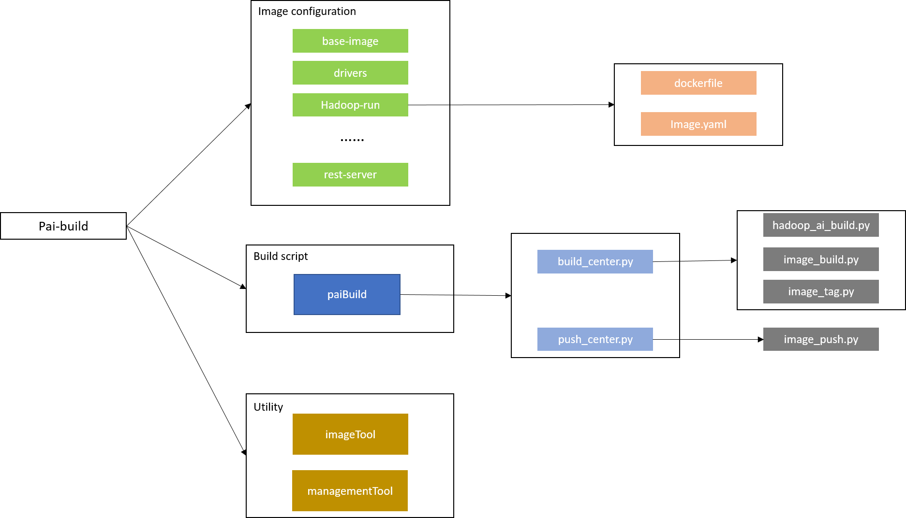

# Goal

Pai-build responsible for all service's image build as well as binary build if needed.

# Architecture

We have three main parts of Pai-build: `image configuration`, `build script`, and `utility`.

- **image configuration:** each service of pai have corresponding configuration folder put under `pai-management/src`. and the folder must contain **dockerfile** and **image.yaml** which is the configuration file for service build.
- **build script:** now all build script put under `pai-management/paiLibrary/paiBuild`. `build_center.py` responsible for image build and tag, in addition we also need to build `hadoop-ai` binary in this script. `push_center.py` responsible for push image to docker registry.
- **utility:** provides some common build-related function.


# Build

Build image by using ```paictl```.
### Build infrastructure image(s) <a name="Image_Build"></a>

```
python paictl.py image build -p /path/to/cluster-configuration/dir [ -n image-name ]
```

- If hadoop-ai binary is not up-to-date, we will build hadoop-ai binary first.
- Build and tag the image of the corresponding component.
- If the option `-n` is added, only the specified image will be built and tagged.

### Push infrastructure image(s) <a name="Image_Push"></a>

```
python paictl.py image push -p /path/to/cluster-configuration/dir [ -n image-name ]
```

- Push the tagged image to the docker registry which is configured in the ```cluster-configuration```.
- If the option `-n` is added, only the specified image will be pushed.

# Current pai build process

- Each component has a build directory under ```pai-management/src/``` folder, with the name identical to the component name.
- The component build directory contains three things
    - image definition:Dockerfile file.
    - build configuration:image.yaml file.
    - Files to be copied into the container image.
- Build script collects all images to be built by checking the ```pai-management/src/{component_name}/image.yaml``` exists or not.
- Build script prepares the Hadoop binary file.
- Build script builds the image for each component:
    - Parse build configuration defined in image.yaml.
    - Get the files in the copy list ready.
    - Call ```docker build``` command to build docker image.
    - Clean up generated files.

# How to add your own image

This chapter will teach you how to add your customized image to pai. After everything is done, paictl image command will build and push your image to the target docker registry.

If your service image could be pulled from a public docker registry, you could skip this step.

#### Prepare service dockerfile ####

There is no special restrictions on how to write the dockerfile. If you a new developer of docker, please refer to [this tutorial](https://docs.docker.com/develop/develop-images/dockerfile_best-practices/) and learn how to dockerfile.

#### Prepare the building context definition of each module ####

Everytime you wanna add a customized docker image into pai, you will have to prepare a image configuration first. This configuration should be named as ```image.yaml```, and be put into the directory of the image.

```yaml

### the file is the relative path which is set in the value of the key src.
### the copy will be placed in the relative path copied_file
### in the path pai-management/ to execute the command "cp -r src dst"

#copy-list:
#  - src: ../xxxxxx
#    dst: src/xxxxxx/copied_file
```

According to current design, the file only consists of ```copy-list``` field. If this module does not need to copy anything from other places, you can just ignore this field then provide an empty image.yaml .

- ```copy-list``` part:
    - This field tells paictl the path to copy files.
    - Command: ```cp -r pai/pai-management/$src pai/pai-management/$dst ```. ```src``` and ```dst``` is the value in this field.

#### Place the image directory into pai ####

 Note that the name of image's directory should be identical with the image name.

For example, now you wanna add a docker image "ownImage" into pai. You will first create a directory named "ownImage" under the path ```pai/pai-management/src/ownImage```. 

#### Build and push image with paictl ####

```
./paictl.py image build -p /path/to/your/cluster-configuration/dir -n [your-image-name]


./paictl.py image push -p /path/to/your/cluster-configuration/dir -n [your-image-name]

```

# TO-DO

- Remove build process from pai-management
- Redesign pai folder structure to make it clearer.
- Refine configuration file.
- Incremental build implementation.