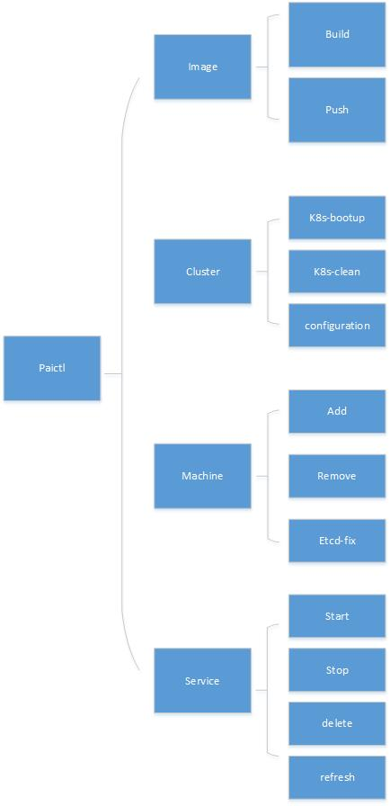
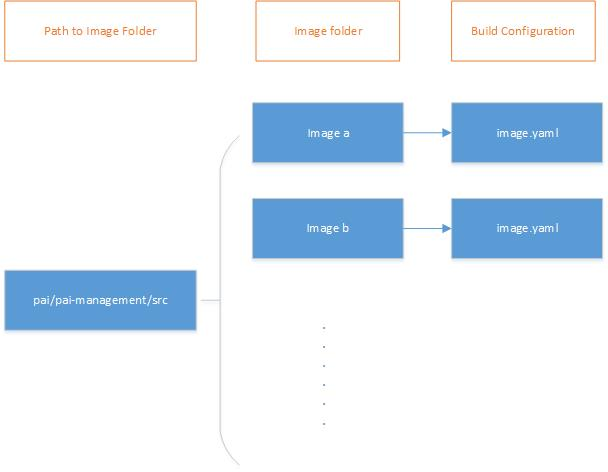

# paictl design


## Overview

<div  align="center">

</div>


## paictl image


- Paictl will iterate all directory on the path ```pai/pai-management/src```. If the directory contains ```image.yaml``` and ```dockerfile```, paictl will execute docker command to build the docker image.

<div  align="center">

</div>

- Paictl will solve the dependency relationship between different. If ```image A``` depends on ```image B```, paictl will build ```image B``` first.

- After the building process is finsihed, if the ```push``` command is executed, all image will be pushed to the target docker registry and be tagged with the target label. The docker registry and label is defined in the [service-configuration.yaml](../../cluster-configuration/service-configuration.yaml)

## paictl cluster


