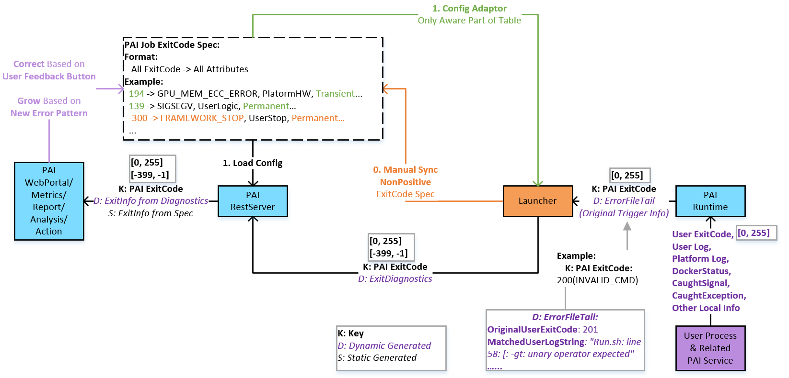

# PAI Job Exit Spec User Manual

## Spec
[job-exit-spec.md](job-exit-spec.md)

## Architecture
**ExitInfo Setup and Propagation**

  

## How to grow spec
### Add a new job exitcode
1. Add the spec of the exitcode into the spec section of [job-exit-spec.yaml](job-exit-spec.yaml)
2. Execute [update_markdown.py](update_markdown.py) to update [job-exit-spec.md](job-exit-spec.md)
3. Return the exitcode from Launcher or PAI Runtime
4. Redeploy PAI

### Add a new spec field
1. Add the field info into the schema section of [job-exit-spec.yaml](job-exit-spec.yaml)
2. Add the field for all necessary exitcodes into the spec section of [job-exit-spec.yaml](job-exit-spec.yaml)
3. Add the field generator into [update_markdown.py](update_markdown.py)
4. Execute [update_markdown.py](update_markdown.py) to update [job-exit-spec.md](job-exit-spec.md)
5. Redeploy PAI
