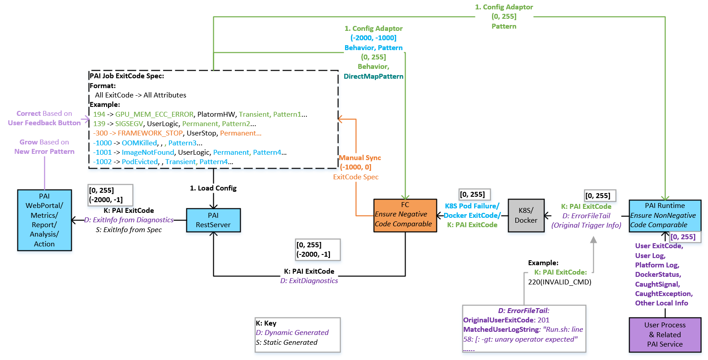

# PAI Job Exit Spec User Manual

## Architecture
**PAI Exit Info Setup and Propagation**

  

## Spec
[k8s-job-exit-spec.yaml](k8s-job-exit-spec.yaml)

## How to grow PAI Static Exit Info
### Add a new job exitcode
1. Add the spec of the exitcode into the spec section of [k8s-job-exit-spec.yaml](k8s-job-exit-spec.yaml)
2. Redeploy PAI

### Add a new spec field
1. Add the field info into the schema section of [k8s-job-exit-spec.yaml](k8s-job-exit-spec.yaml)
2. Add the field for all necessary exitcodes into the spec section of [k8s-job-exit-spec.yaml](k8s-job-exit-spec.yaml)
3. Redeploy PAI
