# Feature Demo

## Notes
1. [OpenPAI](https://github.com/microsoft/pai) is leveraged to show these end-to-end scheduling feature demos, but it is not a requisite for HiveD. All these features can also be reproduced with other platforms or even by [raw pods](../request/basic/request.yaml).
2. HiveD config and Job request may need to be adjusted according to your own cluster.

## VC Safety
### Description

HiveD guarantees **quota safety for all VCs**, in the sense that the requests to cells defined in each VC can always be satisfied.

VC's cells can be described by Hardware Quantity, [Topology](#VC-Safety), [Type](#GPU-Type), [Reservation](#Reservation), etc. To guarantee safety, HiveD never allows a VC to "invade" other VCs' cells. For example, to guarantee all VCs' topology, one VC's [guaranteed jobs](#Guaranteed-Job) should never make fragmentation inside other VCs:

Two DGX-2s, two VCs each owns one DGX-2 node. For normal scheduler, this will translate into two VCs each owning 16 GPUs. When user submits 16 1-GPU jobs to VC1, the user in VC2 might not be able to run a 16-GPU job, due to possible fragmentation issue caused by VC1. While HiveD can guarantee each VC always has one entire node reserved for its dedicated use.

### Reproduce Steps
1. Use [hived-config-1](file/hived-config-1.yaml).
2. Submit 2 jobs [itc-safety-1](file/itc-safety-1.yaml), [itc-safety-2](file/itc-safety-2.yaml) to the same VC, all tasks will always run within the same node (10.151.41.26).
   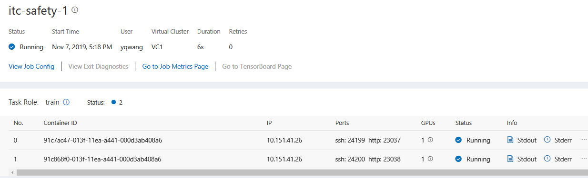
   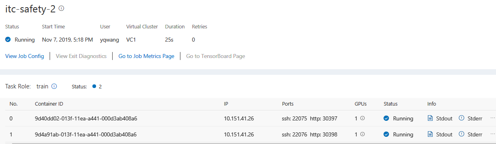

## Reservation
### Description
One VC contains two DGX-2 nodes. The VC admin would like to reserve one DGX-2 for dedicated use, i.e. without explicit `reservationId` specified, job will not run on the reserved DGX-2.

This is similar to [K8S Taints and Tolerations](https://kubernetes.io/docs/concepts/configuration/taint-and-toleration/#example-use-cases), but with [VC Safety](#VC-Safety) guaranteed.

### Reproduce Steps
1. Use [hived-config-1](file/hived-config-1.yaml).
2. Submit job [itc-reserve](file/itc-reserve.yaml) to VC2, all tasks in task role vc2rsv will be on node 10.151.41.25 (it is reserved), all tasks in task role vc2norsv will NOT be on node 10.151.41.25.
   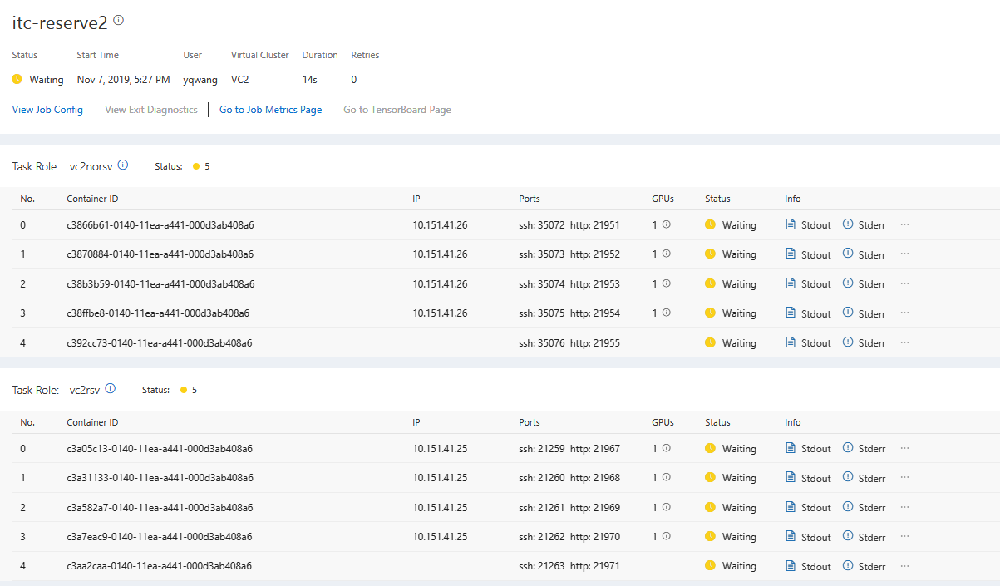

## GPU Type
### Description
If `gpuType` is specified in the job, only that type of GPU will be allocated to the job, otherwise, any type of GPU can be allocated.

This is similar to [K8S Labels and Selectors](https://kubernetes.io/docs/concepts/overview/working-with-objects/labels), but with [VC Safety](#VC-Safety) guaranteed.

### Reproduce Steps
#### `gpuType` specified
1. Use [hived-config-2](file/hived-config-2.yaml).
2. Submit job [itc-k80-type](file/itc-k80-type.yaml), it will be partially running (some tasks waiting because all the specified K80 GPUs are used).
   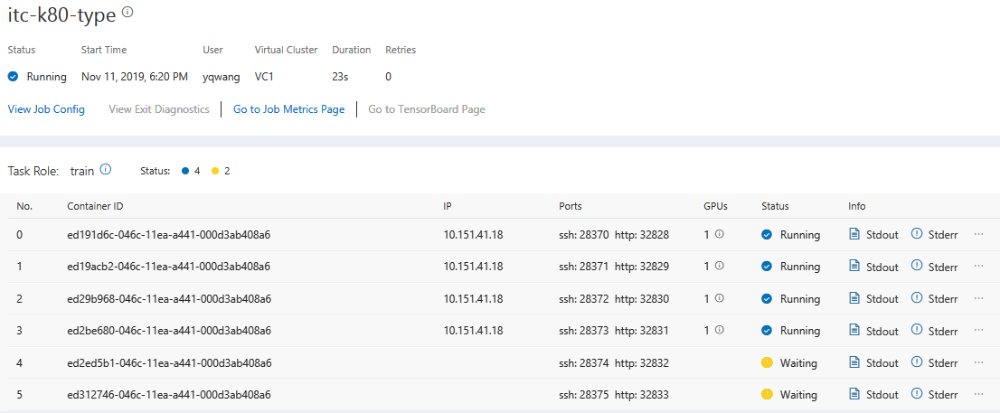

#### `gpuType` not specified
1. Use [hived-config-2](file/hived-config-2.yaml).
2. Submit job [itc-no-type](file/itc-no-type.yaml), it will be fully running, and some tasks are using K80 (10.151.41.18) while others are using M60 (10.151.41.26).
   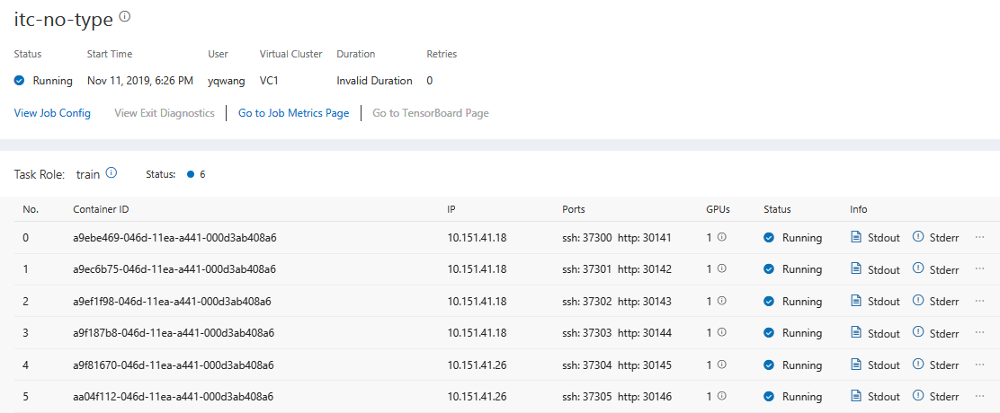

## Gang Scheduling
### Description
A set of pods is scheduled as a gang, i.e. in an all-or-nothing fashion.

The gang is treated as an `AffinityGroup`, the scheduling unit of HiveD.

A job can specify all its pods are in the same `AffinityGroup`, so the whole job is gang scheduled.

This is useful for jobs that cannot perform any useful work, such as making progress or serving, until all pods are running. A typical example in deep learning workloads is [distributed training](#TensorFlow-Distributed-Training).

### Reproduce Steps
#### Basic
1. Use [hived-config-2](file/hived-config-2.yaml).
2. Submit job [itc-gang](file/itc-gang.yaml), which requests for 6 single-GPU tasks. All tasks will be waiting without IP associated, because the VC only has 4 GPUs for the specified type.
3. Submit job [itc-gang4](file/itc-gang4.yaml), which requests for 4 single-GPU tasks, all tasks will be running, while [itc-gang](file/itc-gang.yaml) will be still waiting without IP associated. This also shows that there is no [head-of-line blocking](https://en.wikipedia.org/wiki/Head-of-line_blocking) by HiveD itself (i.e., [itc-gang](file/itc-gang.yaml) will not block [itc-gang4](file/itc-gang4.yaml)).
   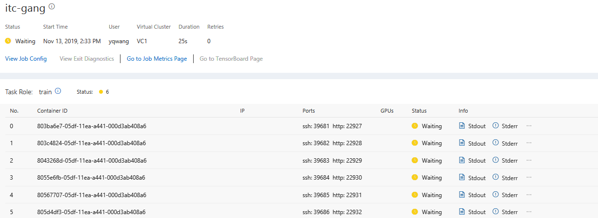
   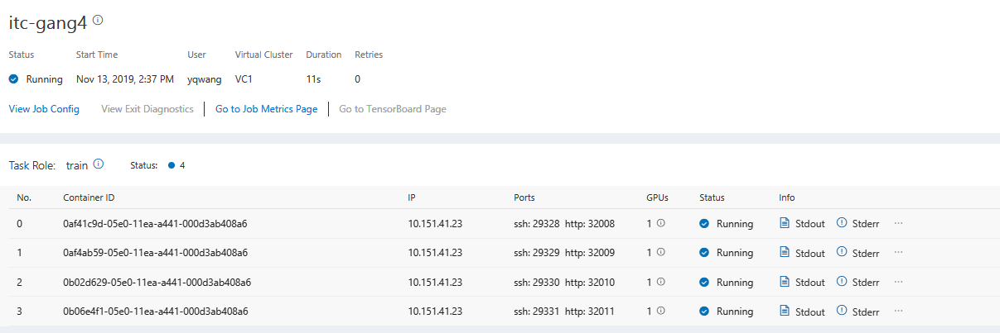

#### TensorFlow Distributed Training
1. Use [hived-config-1](file/hived-config-1.yaml).
2. Submit job [itc-dtf](file/itc-dtf.yaml) to VC2, it will success.
   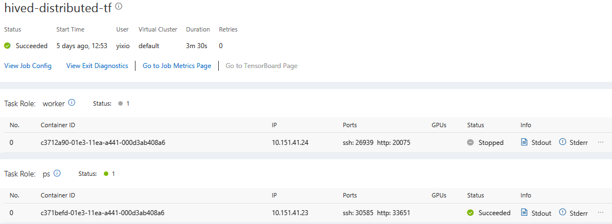

## Incremental Scheduling
### Description
A set of pods is scheduled regardless of each other, i.e. does not require [Gang Scheduling](#Gang-Scheduling).

A job can specify its pods in different `AffinityGroups`, so the whole job is incrementally scheduled (one `AffinityGroup` each time).

This is used for jobs that can still perform useful works, such as making progress or serving, even if only one pod is running.

### Reproduce Steps
1. Use [hived-config-1](file/hived-config-1.yaml).
2. Submit job [itc-elastic](file/itc-elastic.yaml) whose total request is larger than its VC quota, however, it can still partially run.
   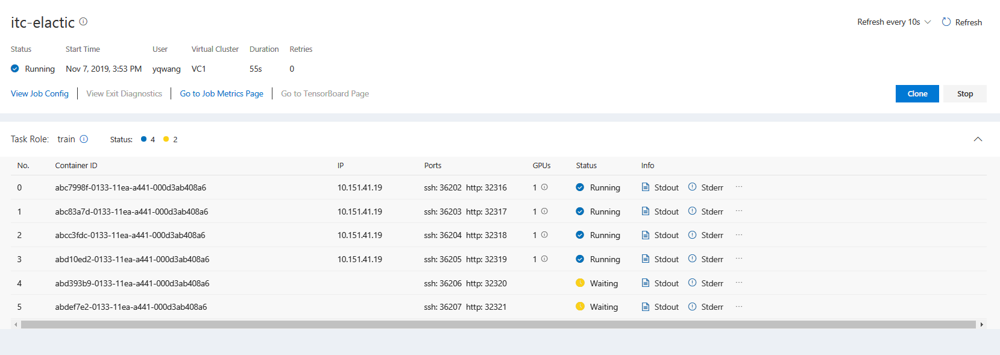

## Guaranteed Job
### Description
Guaranteed Job: Job whose priority is non-negative, it can only use its own VC's quota, however, once it is allocated, it will not be preempted by other VCs' jobs.

### Reproduce Steps
1. Use [hived-config-1](file/hived-config-1.yaml).
2. Submit job [itc-elastic](file/itc-elastic.yaml), it will not use more than one node.
   

## Opportunistic Job
### Description
Opportunistic Job: Job whose priority is -1, it can use other VCs' quota, however, once it is allocated, it may be preempted by other VCs' guaranteed jobs.

### Reproduce Steps
1. Use [hived-config-1](file/hived-config-1.yaml).
2. Submit job [itc-oppo](file/itc-oppo.yaml), it will use more than one node, even if its VC has only one node.
   

## Intra-VC Preemption
### Description
Within one VC, a high-priority job can preempt low-priority jobs.

### Reproduce Steps
#### Immediate Preemption
1. Use [hived-config-3](file/hived-config-3.yaml).
2. Submit [itc-intra-imd-preempt-test](file/itc-intra-imd-preempt-test.yaml), which requests for 4 M60 GPUs for VC1 with test (0) priority.
3. Submit [itc-intra-imd-preempt-prod](file/itc-intra-imd-preempt-prod.yaml), which also requests for 4 M60 GPUs for VC1 with prod (100) priority. The job will preempt the test job immediately, so the test job is retried and waiting for resource.
   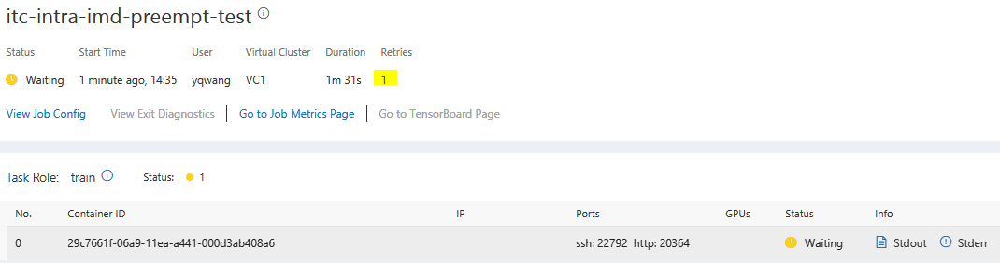
   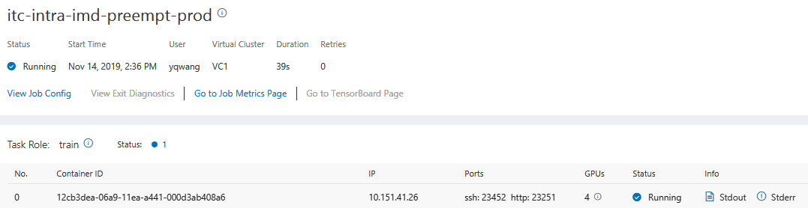

#### Lazy Preemption
1. Use [hived-config-3](file/hived-config-3.yaml).
2. Submit [itc-intra-lazy-preempt-test](file/itc-intra-lazy-preempt-test.yaml), which requests for 4 K80 GPUs for VC1 with test (0) priority.
3. Submit [itc-intra-lazy-preempt-prod](file/itc-intra-lazy-preempt-prod.yaml), which also requests for 4 K80 GPUs for VC1 with prod (100) priority. The job will just downgrade the test job to be [Opportunistic Job](#Opportunistic-Job), instead of preempting it immediately, because all jobs can still fit into the whole physical cluster.
4. Submit [itc-intra-lazy-preempt-prod2](file/itc-intra-lazy-preempt-prod2.yaml), which also requests for 3 * 4 K80 GPUs for default VC with prod (100) priority. The job will preempt the test job immediately, because all jobs cannot fit into the whole physical cluster.
   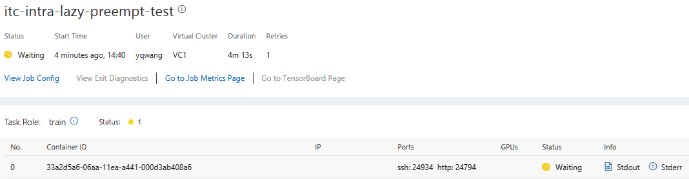
   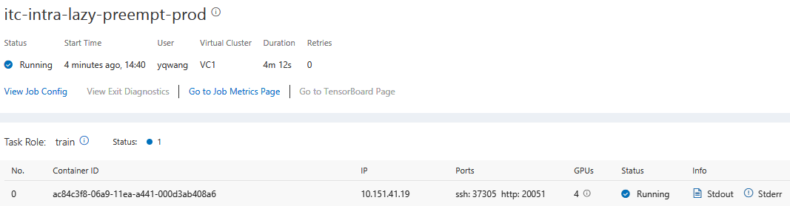
   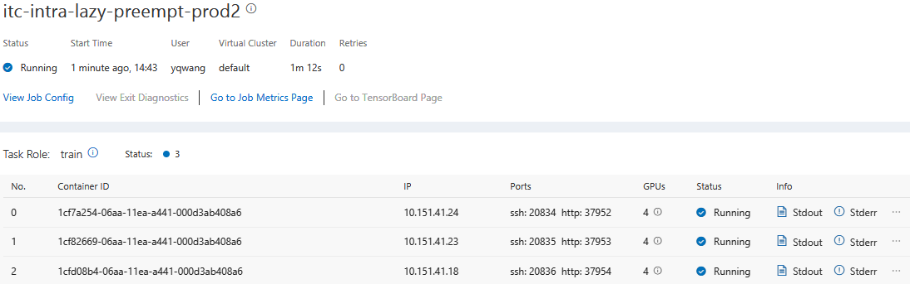

## Inter-VC Preemption
### Description
One VC's [Guaranteed Job](#Guaranteed-Job) can preempt other VCs' [Opportunistic Jobs](#Opportunistic-Job).

### Reproduce Steps
1. Use [hived-config-2](file/hived-config-2.yaml).
2. Submit [itc-inter-preempt-oppo](file/itc-inter-preempt-oppo.yaml), which requests for 2 * 4 K80 GPUs for VC1 with oppo (-1) priority.
3. Submit [itc-inter-preempt-prod](file/itc-inter-preempt-prod.yaml), which also requests for 3 * 4 K80 GPUs for default VC with prod (100) priority. The job will preempt the oppo job immediately.
   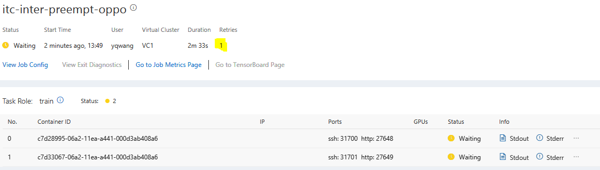
   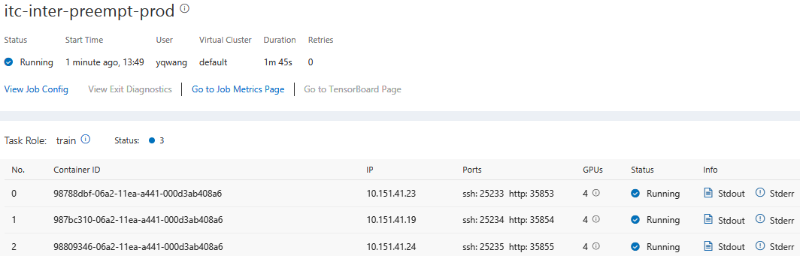

## Topology-Aware Intra-VC Scheduling
### Description
Within one VC, HiveD chooses nearest GPUs for one `AffinityGroup` in best effort.

### Reproduce Steps
1. Use [hived-config-2](file/hived-config-2.yaml).
2. Submit job [itc-buddy](file/itc-buddy.yaml), which requests for 2 single GPU tasks in the same `AffinityGroup`, tasks will be allocated to 2 buddy GPUs.

   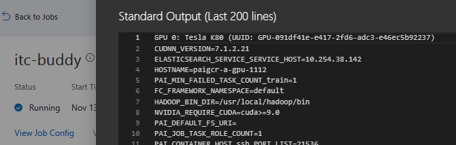
   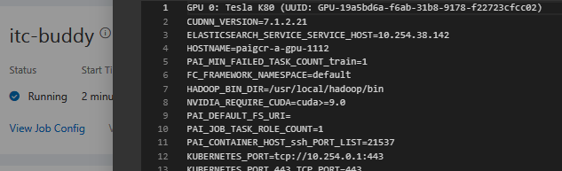
   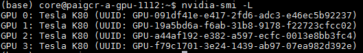

## Work-Preserving Reconfiguration
### Description
HiveD can be reconfigured without unnecessary user impacts, such as add/update/delete physical/virtual clusters, GPU types/topologies, etc.

### Reproduce Steps
#### PhysicalCluster Reconfig - Delete PhysicalCell
1. Use [hived-config-2](file/hived-config-2.yaml).
2. Submit job [itc-reconfig-1](file/itc-reconfig-1.yaml) which requests M60 `gpuType`. Wait until it is running.
3. Delete all M60 `gpuType` related PhysicalCells and VirtualCells from [hived-config-2](file/hived-config-2.yaml), i.e. becomes [hived-config-33](file/hived-config-33.yaml).
4. Use [hived-config-33](file/hived-config-33.yaml), and restart HiveD. 
5. The job will still run without any impact, but its M60 usage is ignored by HiveD.
   *However, normally, the job will still fail if the corresponding physical node is later deleted from K8S or unhealthy.*
   

#### PhysicalCluster Reconfig - Add PhysicalCell
1. Use [hived-config-33](file/hived-config-33.yaml).
2. Submit job [itc-k80-type](file/itc-k80-type.yaml) which requests K80 `gpuType`. Wait until it is running.
3. Add all M60 `gpuType` related PhysicalCells and VirtualCells into [hived-config-33](file/hived-config-33.yaml), i.e. becomes [hived-config-2](file/hived-config-2.yaml).
4. Use [hived-config-2](file/hived-config-2.yaml), and restart HiveD. 
5. The job will still run without any impact, and its K80 usage is still accounted by HiveD.
   

#### PhysicalCluster Reconfig - Update PhysicalCell - Add Node
1. Use [hived-config-2](file/hived-config-2.yaml).
2. Submit job [itc-reconfig-1](file/itc-reconfig-1.yaml) which requests M60 `gpuType`. Wait until it is running.
3. Add one M60 node into a PhysicalCell, then becomes [hived-config-4](file/hived-config-4.yaml).
4. Use [hived-config-4](file/hived-config-4.yaml), and restart HiveD. 
5. The job will still run without any impact, and its M60 usage is still accounted by HiveD.
6. To confirm the job is not impacted, such as [lazy preempted](#Lazy-Preemption). Submit job [itc-reconfig-2](file/itc-reconfig-2.yaml) which requests all M60 nodes and has the same priority as [itc-reconfig-1](file/itc-reconfig-1.yaml). The job will be waiting instead of preempting [itc-reconfig-1](file/itc-reconfig-1.yaml).
   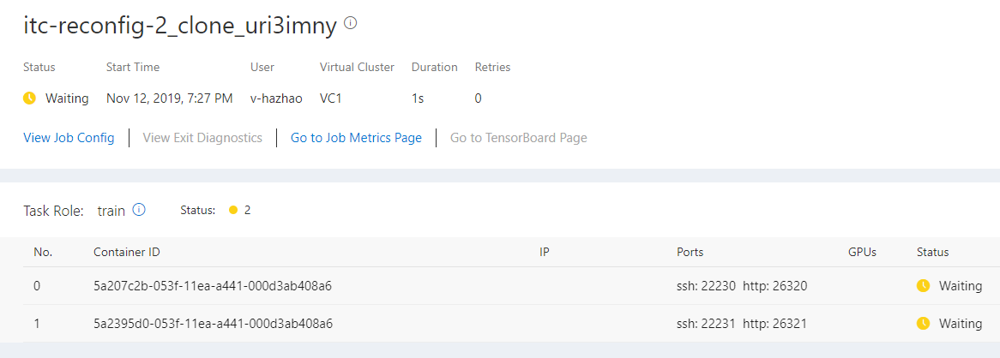

#### PhysicalCluster Reconfig - Update PhysicalCell - Delete Node
1. Use [hived-config-2](file/hived-config-2.yaml).
2. Submit job [itc-reconfig-3](file/itc-reconfig-3.yaml) which requests K80 `gpuType`. Wait until it is running.
3. Delete one K80 node used by [itc-reconfig-3](file/itc-reconfig-3.yaml) from a PhysicalCell, then becomes [hived-config-7](file/hived-config-7.yaml).
4. Use [hived-config-7](file/hived-config-7.yaml), and restart HiveD. 
5. The job will still run without any impact, but its deleted node usage is ignored by HiveD.
   *However, normally, the job will still fail if the corresponding physical node is later deleted from K8S or unhealthy.*
   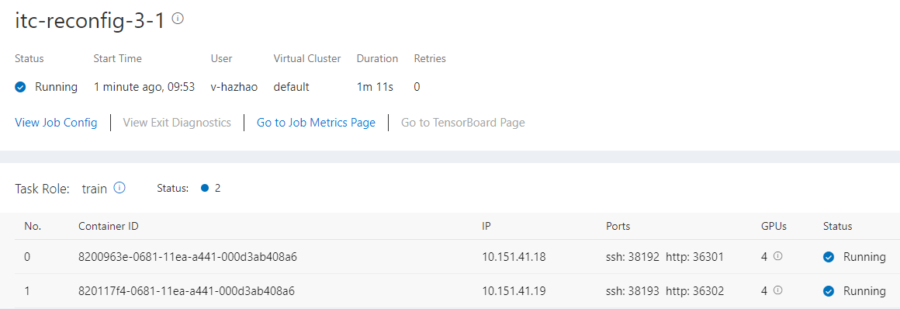

#### VirtualCluster Reconfig - Delete VirtualCluster
1. Use [hived-config-2](file/hived-config-2.yaml).
2. Submit job [itc-reconfig-3](file/itc-reconfig-3.yaml) to default VC. Wait until it is running.
3. Delete the default VC and move its quota to VC1, then becomes [hived-config-5](file/hived-config-5.yaml).
4. Use [hived-config-5](file/hived-config-5.yaml), and restart HiveD. 
5. The job will still run without any interruption but [lazy preempted](#Lazy-Preemption) by HiveD.
   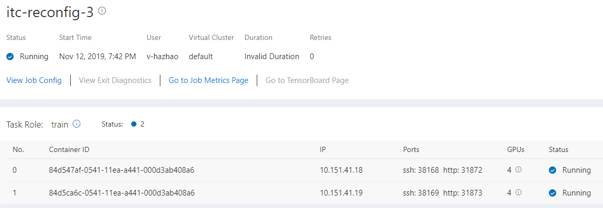
6. To confirm it is [lazy preempted](#Lazy-Preemption), submit job [itc-reconfig-4](file/itc-reconfig-4.yaml) to VC1 which requests all K80 nodes. The job will immediately preempt [itc-reconfig-3](file/itc-reconfig-3.yaml).
   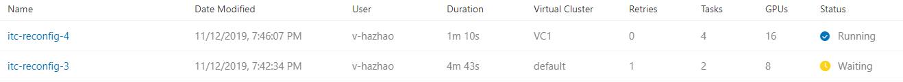

#### VirtualCluster Reconfig - Update VirtualCluster
1. Use [hived-config-2](file/hived-config-2.yaml).
2. Submit job [itc-reconfig-3](file/itc-reconfig-3.yaml) to default VC. Wait until it is running.
3. Move one K80-NODE cell from default VC to VC1, then becomes [hived-config-6](file/hived-config-6.yaml).
4. Use [hived-config-6](file/hived-config-6.yaml), and restart HiveD. 
5. The job will still run without any interruption but [lazy preempted](#Lazy-Preemption) by HiveD.
6. To confirm it is [lazy preempted](#Lazy-Preemption), submit job [itc-reconfig-5](file/itc-reconfig-5.yaml) to VC1 which requests all K80 nodes. The job will immediately preempt [itc-reconfig-3](file/itc-reconfig-3.yaml).
   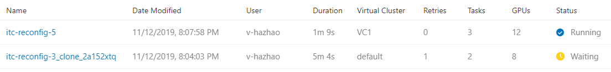

## Bad Hardware Awareness
### Description
Avoid scheduling pods to bad hardware.

### Reproduce Steps
1. Use [hived-config-2](file/hived-config-2.yaml).
2. Stop kubelet on 10.151.41.26 (the only M60 node) by `sudo systemctl stop kubelet`. Wait until this is detected by K8S.
    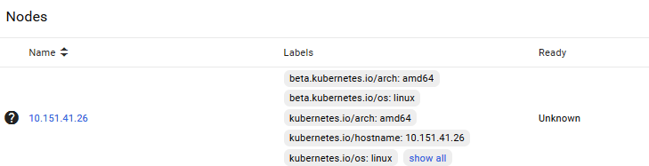
3. Submit job [itc-badnode50](file/itc-badnode50.yaml), which requests M60 node, it will be waiting without IP associated.
   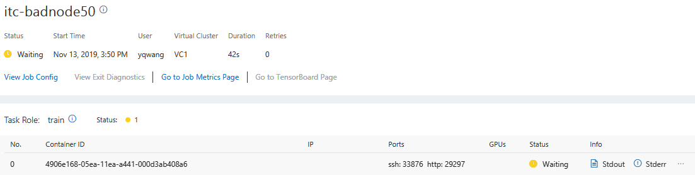
4. Bring back 10.151.41.26 by `sudo systemctl start kubelet`. Wait until this is detected by K8S.
5. The waiting job will start running, without any retries.
   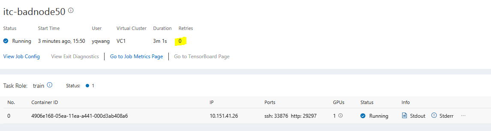

## Leverage K8S Default Scheduler
### Description
You can still leverage almost all scheduling features provided by your existing [K8S Default Scheduler](https://kubernetes.io/docs/concepts/scheduling/kube-scheduler) with HiveD, such as these [Filtering Policies](https://kubernetes.io/docs/concepts/scheduling/kube-scheduler/#filtering).

### Reproduce Steps
#### Leverage [Labels and Selectors](https://kubernetes.io/docs/concepts/overview/working-with-objects/labels)
1. Use [hived-config-2](file/hived-config-2.yaml).
2. Remove PAI worker label for 10.151.41.26 (the only M60 node).
3. Submit job [itc-no-worker-label](file/itc-no-worker-label.yaml), which requests M60 node, it will be waiting without IP associated.
   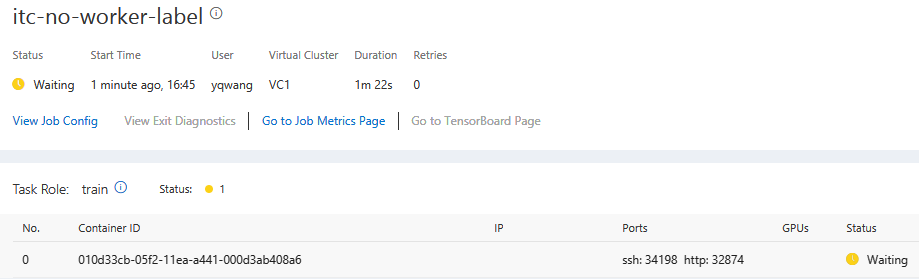
4. Add back PAI worker label for 10.151.41.26.
5. The waiting job will start running, without any retries.
   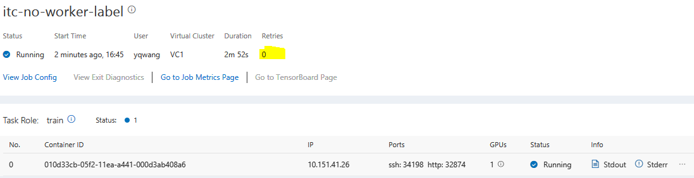
